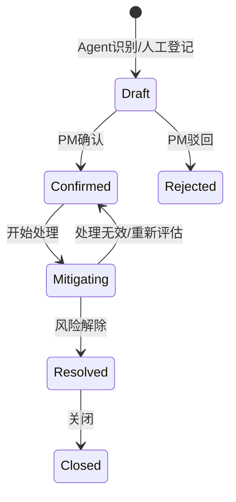
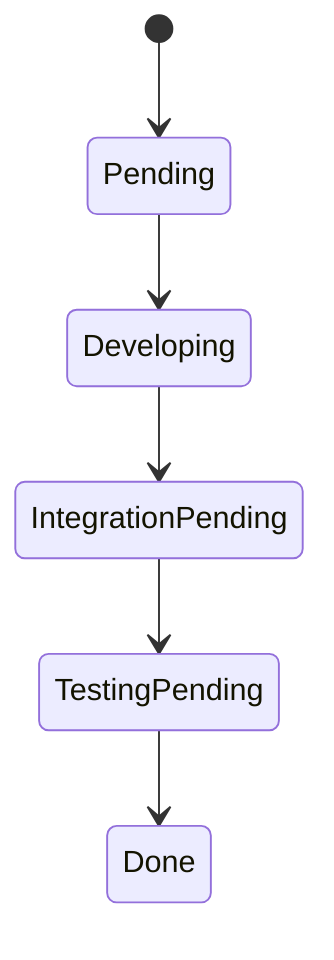

# PM-Agent Workflow Design Skill

## Trigger scenarios

Use this skill when the user asks for any of the following:

- Designing state transitions for projects, requirements, tasks, iterations, risks, or reports;
- Designing Agent-generated suggestions, human confirmation, and business actions after tool calls;
- Designing notifications, reminders, or in-app message flows;
- Producing or reviewing Mermaid flowcharts / state-machine diagrams;
- Deciding whether the first version needs approval workflows, a BPM engine, or complex process configuration;
- Analyzing abnormal branches, rollback rules, state logs, and acceptance criteria.

## Goal

Help Codex design clear, implementable, traceable business workflows and state machines so PM-Agent’s project management business and Agent automation have explicit boundaries. The first version uses lightweight state transitions only and must not introduce a full approval workflow or BPM engine.

---

## 1. Workflow design baseline

| Item | Decision |
|---|---|
| First-version process shape | State transitions only, not a full approval workflow |
| Approval workflow | Consider later as enterprise enhancement; not in MVP |
| BPM engine | Do not introduce Flowable / Camunda in v1 |
| Flow diagrams | Mermaid output is needed |
| Notification channel | In-app messages only in v1 |
| Agent high-risk actions | Must require human confirmation |

---

## 2. Core state transitions

### 2.1 Task states

Task states should be close to the development workflow:

```text
待处理 → 开发中 → 待联调 → 待测试 → 已完成
   │        │          │          │
   └────────┴──────────┴──────────┴──→ 已阻塞
```

Suggested codes:

| State | code | Description |
|---|---|---|
| 待处理 | `pending` | Created but not started |
| 开发中 | `developing` | Under development |
| 待联调 | `integration_pending` | Waiting for frontend/backend or system integration |
| 待测试 | `testing_pending` | Waiting for testing or self-test confirmation |
| 已完成 | `done` | Task closed |
| 已阻塞 | `blocked` | Cannot proceed due to dependency, resource, or external issue |
| 已取消 | `cancelled` | No longer executed |

### 2.2 Risk workflow

The Agent may identify risks, but risks must **not become effective directly**. A project manager must confirm them.



### 2.3 Weekly report workflow

A weekly report must be edited and confirmed by a human before publishing.

```text
生成草稿 → 人工编辑 → 确认发布 → 已发布
        ↘ 重新生成 / 放弃
```

---

## 3. Agent human-confirmation boundaries

The following operations are high-risk. The Agent may only suggest them or generate pending action cards; it must not execute them silently:

1. **Deletion / irreversible operations**: deleting projects, requirements, tasks, batch deletion, irreversible archive;
2. **Permission and member changes**: roles, permissions, project member removal, owner changes;
3. **External notification / publishing**: email, WeCom, DingTalk, externally visible reports, or anything leaving system boundaries;
4. **Agent-written business changes**: automatically changing task status, creating risks, generating and adopting decomposed tasks, and similar writes.

Minimum confirmation flow:

```text
Agent 生成建议 → 前端展示动作卡片 → 用户确认 / 拒绝 → Java 工具 API 执行 → 记录 Agent Trace 和业务状态日志
```

This is “human confirmation”, not a full approval workflow. Do not introduce approval orders, approval nodes, countersign, transfer, or other complex concepts in the first version.

---

## 4. State logs and notifications

### 4.1 State logs

All core status changes for tasks, risks, requirements, reports, and similar domains must record state logs:

| Field | Description |
|---|---|
| `biz_type` | Business type, such as task / risk |
| `biz_id` | Business ID |
| `from_status` | Previous state |
| `to_status` | New state |
| `operator_id` | Operator; Agent suggestions are applied by the confirmer |
| `source` | manual / agent / system |
| `reason` | Reason for change |
| `trace_id` | Chain trace ID |
| `created_at` | Occurrence time |

### 4.2 In-app messages

The first version only supports in-app messages. Trigger scenarios include:

- A task is assigned to me;
- A task is blocked or unblocked;
- The Agent detects a risk waiting for PM confirmation;
- A weekly report draft is generated;
- A high-risk action is waiting for human confirmation.

Email, WeCom, and DingTalk are deferred to Phase 7 or enterprise enhancement.

---

## 5. Flowchart output conventions

When a workflow or state machine is involved, prefer Mermaid:



Requirements:

1. Mermaid nodes should use English codes; explain Chinese meanings in an adjacent table.
2. For every key transition, describe trigger condition, allowed role, and abnormal branch.
3. Do not draw complex diagrams that cannot be implemented.
4. Diagrams must match state enum codes.

---

## 6. Workflow plan output format

When designing a workflow, use this structure:

```markdown
# 工作流设计：[流程名称]

## 流程目标
## 涉及术语
## 参与角色
## 状态定义
| 状态 | code | 说明 |
|---|---|---|

## 状态流转图
（Mermaid）

## 触发条件
## 业务规则
## 异常分支
## Agent 介入点
## 人工确认点
## 状态日志
## 通知规则
## 验收标准
## 待确认问题
```

Keep output headings and user-facing content in Chinese according to project language rules.

---

## 7. Workflow

1. First determine whether the user needs state transitions, human confirmation, or a full approval workflow.
2. In the first version, default to state transitions + human confirmation, not a full approval center.
3. Align state codes with the glossary and data model.
4. Output a Mermaid state diagram and a state table.
5. Clarify trigger condition, allowed role, and abnormal branch for every transition.
6. Clarify whether in-app messages are needed.
7. If Agent-written business changes are involved, add mandatory human-confirmation points.

---

## 8. Boundaries that require user confirmation

Ask the user before doing any of the following:

- Introducing full approval workflows, approval orders, approval nodes, or a BPM engine in the first version;
- Letting the Agent silently execute high-risk actions;
- Expanding notification channels early to email, WeCom, or DingTalk;
- Using state codes inconsistent with the data model or dictionary tables;
- Using sprint or phase as the primary entity name instead of iteration;
- Moving to implementation when the workflow diagram has no abnormal branch or human-confirmation point.
