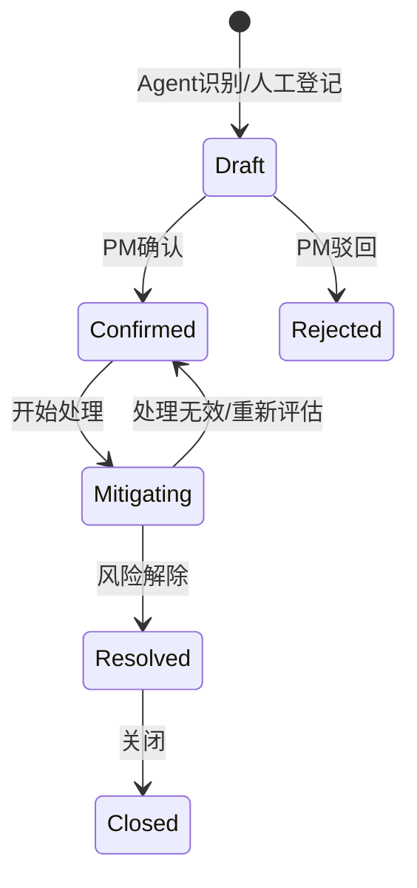
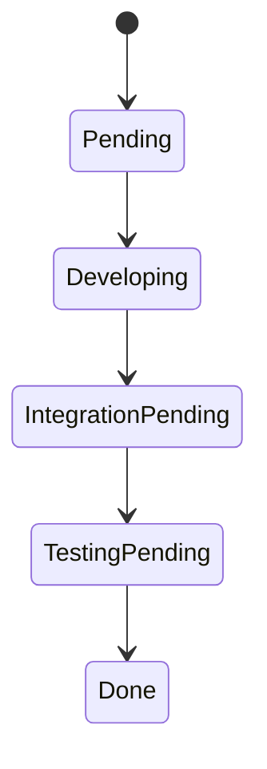

# PM-Agent 工作流设计 Skill

## 触发场景

当用户提出以下类型请求时使用本 Skill：

- 设计项目、需求、任务、迭代、风险、报告的状态流转；
- 设计 Agent 自动建议、人工确认、工具调用后的业务动作；
- 设计通知、提醒、站内消息流程；
- 输出或评审 Mermaid 流程图 / 状态机图；
- 判断第一版是否需要审批流、BPM 引擎、复杂流程配置；
- 分析流程异常分支、回退规则、状态日志和验收标准。

## 目标

帮助 Claude 设计清晰、可落地、可追踪的业务流程和状态机，使 PM-Agent 的项目管理业务与 Agent 自动化行为都有明确边界。第一版只做轻量状态流转，不引入完整审批流或 BPM 引擎。

---

## 一、流程设计基线

| 项 | 决策 |
|---|---|
| 第一版流程形态 | 只做状态流转，不做完整审批流 |
| 审批流 | 后续企业级增强再考虑，不纳入 MVP |
| BPM 引擎 | 第一版不引入 Flowable / Camunda |
| 流程图 | 需要 Mermaid 输出 |
| 通知渠道 | 第一版只做站内消息 |
| Agent 高风险动作 | 必须人工确认 |

---

## 二、核心状态流转

### 2.1 任务状态

任务状态贴近研发流程：

```text
待处理 → 开发中 → 待联调 → 待测试 → 已完成
   │        │          │          │
   └────────┴──────────┴──────────┴──→ 已阻塞
```

建议 code：

| 状态 | code | 说明 |
|---|---|---|
| 待处理 | `pending` | 已创建，尚未开始 |
| 开发中 | `developing` | 正在开发 |
| 待联调 | `integration_pending` | 等待前后端或系统联调 |
| 待测试 | `testing_pending` | 等待测试或自测确认 |
| 已完成 | `done` | 任务关闭 |
| 已阻塞 | `blocked` | 因依赖、资源、外部问题无法推进 |
| 已取消 | `cancelled` | 不再执行 |

### 2.2 风险流程

Agent 可以识别风险，但**不能直接生效**，必须项目经理确认。



### 2.3 周报流程

周报生成后必须人工编辑确认再发布。

```text
生成草稿 → 人工编辑 → 确认发布 → 已发布
        ↘ 重新生成 / 放弃
```

---

## 三、Agent 人工确认边界

以下操作视为高风险，Agent 只能提出建议或生成待确认动作，不能静默执行：

1. **删除 / 不可逆操作**：删除项目、需求、任务、批量删除、不可逆归档；
2. **权限与成员变更**：角色、权限、项目成员移除、负责人变更；
3. **对外通知 / 发布**：邮件、企微、钉钉、对外报告发布等离开系统边界的动作；
4. **Agent 自动写业务**：Agent 自动修改任务状态、创建风险、生成并采纳拆解任务等业务写入动作。

确认流程最小化设计：

```text
Agent 生成建议 → 前端展示动作卡片 → 用户确认 / 拒绝 → Java 工具 API 执行 → 记录 Agent Trace 和业务状态日志
```

这属于“人工确认”，不是完整审批流。不要在第一版引入审批单、审批节点、会签、转交等复杂概念。

---

## 四、状态日志与通知

### 4.1 状态日志

凡涉及任务、风险、需求、报告等核心状态变更，必须记录状态日志：

| 字段 | 说明 |
|---|---|
| `biz_type` | 业务类型，如 task / risk |
| `biz_id` | 业务 ID |
| `from_status` | 原状态 |
| `to_status` | 新状态 |
| `operator_id` | 操作人；Agent 建议由确认人落地 |
| `source` | manual / agent / system |
| `reason` | 变更原因 |
| `trace_id` | 链路追踪 ID |
| `created_at` | 发生时间 |

### 4.2 站内消息

第一版通知只做站内消息，触发场景包括：

- 任务分配给我；
- 任务被阻塞或解除阻塞；
- Agent 发现风险等待 PM 确认；
- 周报草稿生成完成；
- 高风险动作等待人工确认。

邮件、企微、钉钉后置到第 7 阶段或企业级增强。

---

## 五、流程图输出规范

涉及流程或状态机时，优先输出 Mermaid：



要求：

1. Mermaid 节点使用英文 code，旁边表格解释中文含义；
2. 每条关键流转说明触发条件、允许角色、异常分支；
3. 不画无法实现的复杂图；
4. 图必须和状态枚举 code 一致。

---

## 六、工作流方案输出格式

设计流程时，按以下结构输出：

```markdown
# 工作流设计：[流程名称]

## 流程目标
## 涉及术语
## 参与角色
## 状态定义
| 状态 | code | 说明 |
|---|---|---|

## 状态流转图
（Mermaid）

## 触发条件
## 业务规则
## 异常分支
## Agent 介入点
## 人工确认点
## 状态日志
## 通知规则
## 验收标准
## 待确认问题
```

---

## 七、工作流程

1. 先判断是状态流转、人工确认，还是完整审批流需求；
2. 第一版默认降级为状态流转 + 人工确认，不设计完整审批中心；
3. 对齐术语表和数据模型中的状态 code；
4. 输出 Mermaid 状态图和状态表；
5. 明确每条流转的触发条件、允许角色、异常分支；
6. 明确是否需要站内消息；
7. 涉及 Agent 写业务时，强制加入人工确认点。

---

## 八、不可越界

以下事项必须先经用户确认：

- 第一版引入完整审批流、审批单、审批节点或 BPM 引擎；
- Agent 对高风险动作静默执行；
- 通知渠道提前扩展到邮件、企微、钉钉；
- 状态 code 与数据模型 / 字典表不一致；
- 使用 sprint 或 phase 作为主实体名替代 iteration；
- 流程图没有异常分支或人工确认点却直接进入实现。
