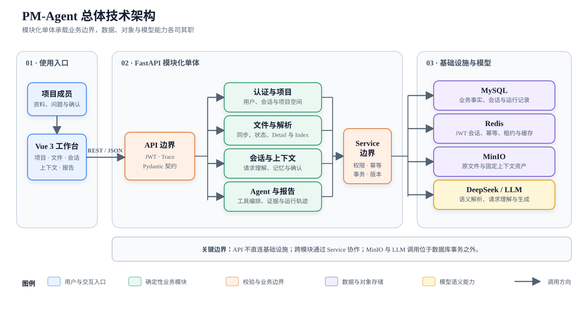
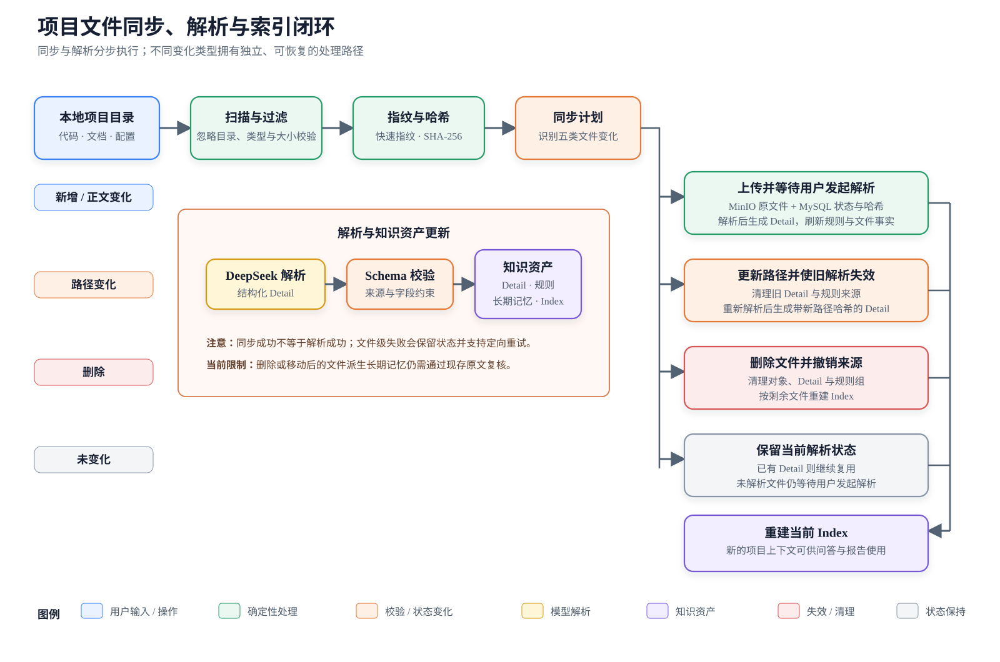
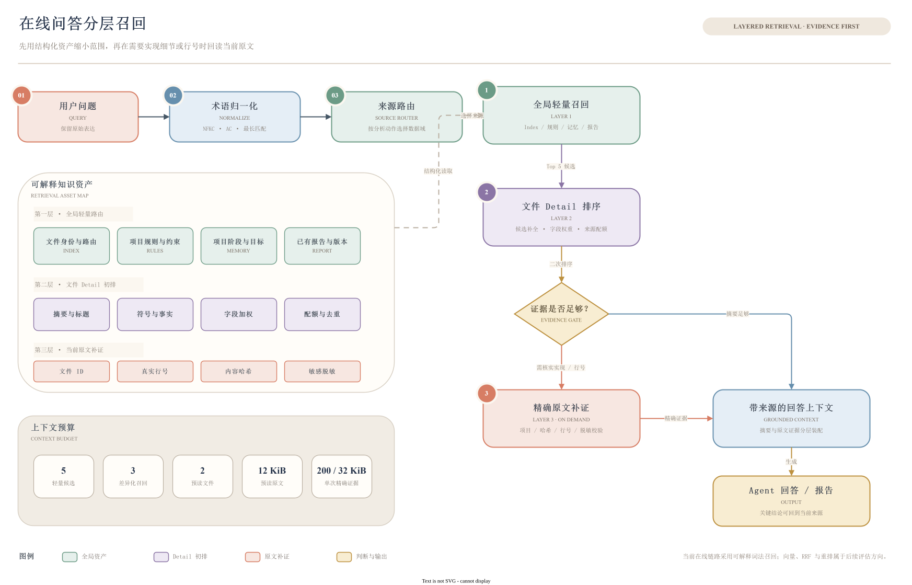
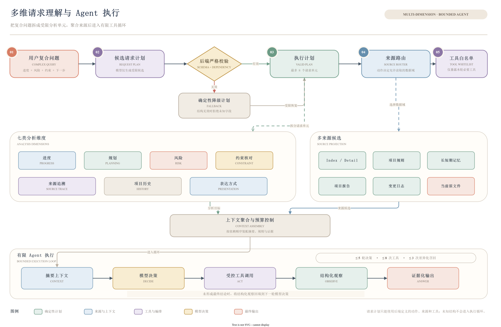
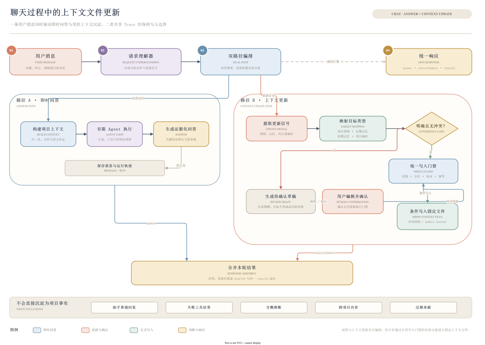

# PM-Agent

面向研发项目资料管理与项目分析场景的智能 Agent 平台。PM-Agent 将分散的代码、技术文档、需求说明和项目规范整理为可检索、可更新、可追溯的项目上下文，并围绕这些真实资料提供项目问答、进度分析、风险识别、约束核对、来源追溯与报告生成能力。

> **在线问答原则：先定位结构化摘要，再按需回读原文。** 模型不执行任意 SQL 或文件操作；问答过程受项目权限、工具白名单和上下文预算约束，涉及具体实现或行号时可继续回读当前原文。项目报告采用独立的分批原文取证链路。

[功能概览](#功能概览) · [技术架构](#技术架构) · [资料闭环](#资料闭环) · [分层召回](#分层召回) · [多维分析](#多维分析) · [上下文更新](#上下文更新) · [快速开始](#快速开始) · [阅读文档](#阅读文档) · [开源协议](#开源协议)

## 项目定位

研发项目中的有效信息往往同时存在于代码、需求、规范和多轮讨论中。直接把全部内容交给大模型，不仅上下文成本高，也容易混淆“当前实现”“历史描述”和“用户建议”。PM-Agent 通过结构化知识资产和分层召回，将这些信息组织成一条稳定链路：

```text
项目文件 → 结构化解析 → 当前知识资产 → 问题理解 → 分层召回
        → Agent 工具调用 → 原文补证 → 回答 / 报告 / 上下文更新
```

平台当前聚焦于三类价值：

- **让项目可理解：** 从文件目录、摘要、规则、记忆和报告中建立项目全局视图。
- **让结论可核对：** 回答和报告中的关键结论能够回到当前文件、内容哈希与原文行号。
- **让上下文可演进：** 文件同步后按需重新解析并刷新知识资产，明确的用户指令受控沉淀，模糊信息先进入确认流程。

PM-Agent 是项目分析与决策辅助工具，**不自动修改项目代码，不把建议写成完成事实，也不直接创建任务或风险业务实体**。

## 功能概览

| 能力 | 当前状态 | 说明 |
|---|---|---|
| 账号与项目空间 | 已实现 | 邮箱注册、登录会话、用户资料、项目创建与独立项目空间 |
| 项目目录同步 | 已实现 | 计算新增、修改、移动、删除与未变化文件，支持上传、覆盖、删除和定向重试 |
| 文件解析与索引 | 已实现 | 为可解析文件生成结构化 Detail，并维护全局 Index、项目规范与项目记忆 |
| 项目智能问答 | 已实现 | 持久化会话、请求级工具选择、结构化上下文召回与原文证据回读 |
| 多维项目分析 | 已实现 | 支持进度、下一阶段规划、风险、约束、来源、历史和表达方式等维度组合分析 |
| 上下文沉淀 | 已实现 | 明确的项目指令受控更新；不确定内容生成待确认草稿，确认后再进入正式上下文 |
| 项目报告 | 已实现 | 生成开发报告与风险报告，保存来源版本、证据和运行记录 |
| 运行追踪 | 已实现 | 记录 Agent 运行状态、工具调用、失败原因、耗时与模型用量 |
| 任务与风险处置 | 规划中 | 当前只提供分析与建议，任务状态机、风险确认和处置流程尚未开放 |

## 技术架构

### 技术选型

| 层次 | 技术 | 主要职责 |
|---|---|---|
| Web 客户端 | Vue 3、TypeScript、Vite、Naive UI、Pinia、Vue Router | 项目工作台、文件同步、助手会话、上下文确认与报告查看 |
| API 与业务 | Python 3.11、FastAPI、Pydantic | 模块化业务接口、数据契约、权限校验与 Agent 编排 |
| 数据访问 | SQLAlchemy 2、Alembic、MySQL 8 | 业务数据持久化、事务边界与数据库迁移 |
| 会话与协调 | Redis | JWT `jti` 会话、幂等控制、租约与缓存 |
| 对象与上下文 | MinIO | 原始项目文件、结构化索引、规则、记忆与更新日志 |
| 模型与检索 | DeepSeek、Aho-Corasick、Unicode NFKC | 文件语义解析、请求理解、术语归一化、可解释召回与回答生成 |
| 质量保障 | Pytest、前端契约测试、Ruff、vue-tsc | 单元测试、接口约束、静态检查与构建验证 |

### 总体架构



后端采用**模块化单体**：API 只调用业务 Service，Repository 负责本模块持久化，跨模块协作通过公开 Service 完成。Python 是业务表的唯一写入者，Alembic 是数据库结构的唯一迁移入口；MinIO 与模型调用不会被放入数据库事务。

详细边界见[系统架构](guide/系统架构.md)。

## 资料闭环

项目资料不是一次性导入。PM-Agent 使用内容指纹、文件状态和固定上下文对象，将目录同步、语义解析、知识更新与后续问答连接成可重复执行的闭环。



核心资产包括全局 `index.json`、文件级 `file_details/*.json`、五类项目规范，以及长短期记忆、项目级用户偏好和更新日志。

完整设计见[资料与上下文](guide/资料与上下文.md)。

## 分层召回



在线问答采用“**全局路由 → Detail 初排 → 原文补证**”三层路径。当前方案通过 NFKC、Aho-Corasick、最长匹配、同义词映射和字段加权完成可解释检索，默认不引入向量数据库；单次预读最多两个文件、合计 **12 KiB** 原文，只有需要核实实现或行号时才继续读取精确证据。报告生成不复用这项预读额度，而是对当前可读文件分批取证并校验来源版本。

## 多维分析

面对“总结进度，同时核对规范并给出下一步”这类复合问题，系统不会只做一次关键词检索，而是先生成受限的请求计划，将问题拆为可验证的分析单元，再为每个单元选择数据来源和工具。



当前支持的分析动作包括项目问答、进度分析、下一阶段任务草案、风险分析、项目约束核对、信息来源追溯和项目历史解释。请求计划只允许使用后端定义的动作、来源和工具；Agent 最多执行 **5 轮模型决策、8 次工具调用和 3 次差异化上下文召回**。

详细流程见[Agent 与多维分析](guide/Agent与多维分析.md)。

## 上下文更新

聊天不仅用于即时问答，也可以将用户明确提出的项目规则、目标变化、纠正信息和表达偏好沉淀到固定上下文文件中。系统先识别更新信号和目标类型：内容明确且不存在冲突时自动更新；信息模糊、目标不确定或涉及高风险替换时生成草稿，等待用户确认后再进入同一套写入门禁。



更新过程会检查项目范围、目标分区、对象版本与幂等键，写入后回读校验并记录更新日志；普通回复、失败工具结果和未经确认的推断不会直接成为项目事实。

## 工程设计

- **文件一致性：** 通过 SHA-256、幂等键、乐观锁、状态机、租约和失败重试协调 MySQL 元数据与 MinIO 对象；正文和路径均未变化时不重复解析。
- **证据有效性：** 精确原文工具回读当前文件并核对内容哈希；报告生成期间来源发生变化时拒绝保存。
- **工具安全边界：** Agent 工具按请求动态收缩，参数和结果都经过 Pydantic 校验；工具只能调用公开业务 Service，模型不能执行 SQL 或访问任意路径。
- **上下文安全：** 项目文件按不可信数据处理，凭据与敏感内容在进入模型或返回证据前进行阻断或脱敏。
- **可追踪输出：** 回答、报告、工具调用和失败状态关联 Trace 与运行记录；报告引用由服务端绑定证据，源版本变化时拒绝保存。
- **模型隔离：** LLM 和 MinIO 调用位于数据库事务之外，外部调用失败不会伪装为业务成功。

## 目录结构

```text
PM-AGENT/
├── frontend/                 # Vue 3 前端与项目工作台
├── agent-service/            # FastAPI 模块化单体、Agent 与 Alembic 迁移
├── deploy/                   # MySQL、Redis、MinIO 本地编排
├── guide/                    # 面向仓库读者的公开说明
└── README.md
```

### `agent-service` 主要目录

```text
agent-service/
├── app/
│   ├── api/v1/                 # API 路由聚合
│   ├── agents/                 # 工具注册、执行与项目上下文门面
│   ├── core/                   # 配置、认证、错误码、幂等、ID 与 Trace
│   ├── infrastructure/         # MySQL、Redis、MinIO 基础设施适配
│   ├── input_context/          # 输入归一化、来源路由、排序与证据装配
│   ├── llm/                    # 模型客户端、Prompt、结构化输出与 Agent 编排
│   ├── modules/
│   │   ├── auth/               # 注册、登录与会话管理
│   │   ├── user/               # 用户资料
│   │   ├── project/            # 项目空间与所有权
│   │   ├── project_file/       # 文件同步、存储、解析与索引
│   │   ├── chat/               # 会话、上下文更新与 Agent 运行
│   │   └── report/             # 开发报告与风险报告
│   ├── project_context/        # Detail、Index、规范与固定上下文模型
│   └── streaming/              # JSON/SSE 事件协议与用量统计
├── migrations/                 # Alembic 数据库迁移
├── tests/                      # 单元、契约与真实链路测试
├── pyproject.toml
└── .env.example
```

## 快速开始

### 环境要求

- Python `3.11+`
- Node.js `20.x`
- pnpm `9.x`
- Docker Desktop 与 Docker Compose
- DeepSeek API Key（启用文件语义解析或真实问答时需要）

### 1. 启动基础设施

```powershell
Copy-Item deploy/.env.example deploy/.env
docker compose --env-file deploy/.env -f deploy/docker-compose.yml up -d mysql redis minio
docker compose --env-file deploy/.env -f deploy/docker-compose.yml ps
```

### 2. 启动后端

```powershell
Set-Location agent-service
python -m venv .venv
. .\.venv\Scripts\Activate.ps1
python -m pip install -e ".[dev]"
Copy-Item .env.example .env
python -m alembic upgrade head
uvicorn app.main:app --reload --port 8000
```

如需真实调用模型，在 `agent-service/.env` 中配置 `DEEPSEEK_API_KEY`；如需对上传文件执行语义解析，同时将 `PM_AGENT_FILE_DETAIL_LLM_ENABLED` 设为 `true`。请务必替换示例 JWT 与中间件密码。

### 3. 启动前端

另开一个位于仓库根目录的 PowerShell 终端：

```powershell
Set-Location frontend
pnpm install
pnpm dev
```

启动后可访问：

- 前端：`http://localhost:5173`
- OpenAPI：`http://localhost:8000/docs`
- 健康检查：`http://localhost:8000/internal/health`
- MinIO 控制台：`http://localhost:9001`

更完整的配置、验证命令和当前限制见[运行与验证](guide/运行与验证.md)。

## 当前边界与后续方向

当前仓库已经形成“**项目创建 → 文件同步 → 解析与索引 → 项目问答 → 上下文确认 → 报告生成 → 运行追踪**”的主业务闭环。以下能力仍在演进：

1. 将任务看板、需求、迭代和风险从分析结果扩展为可确认、可流转的正式业务对象。
2. 为更大规模项目扩充人工标注基准，并持续评估 Recall、MRR、NDCG、忠实度和无答案识别率。
3. 在质量收益明确时再评估 BM25F、向量召回、RRF、重排和 SimHash 去重，不以增加依赖代替效果验证。
4. 将已实现的 SSE 事件编排接入持久化会话接口；当前公开会话链路使用 JSON 响应。
5. 补齐文件删除或路径变化时对文件派生长期记忆的自动失效；当前涉及已移除来源的结论仍需以现存原文件复核。

## 阅读文档

| 主题 | 适合了解的内容 |
|---|---|
| [阅读指南](guide/README.md) | 按角色和关注点选择阅读路径 |
| [系统架构](guide/系统架构.md) | 模块边界、数据职责、调用关系与部署结构 |
| [资料与上下文](guide/资料与上下文.md) | 文件闭环、知识资产、召回路径与一致性策略 |
| [Agent 与多维分析](guide/Agent与多维分析.md) | 请求拆解、工具白名单、上下文沉淀与报告生成 |
| [运行与验证](guide/运行与验证.md) | 环境配置、启动步骤、验证命令与能力边界 |

## 开源协议

本项目基于 [MIT License](LICENSE) 开源，允许在保留版权与许可声明的前提下自由使用、复制、修改、合并、发布、分发、再许可和销售。本软件按“现状”提供，不附带任何明示或默示担保；完整条款以 `LICENSE` 文件为准。
