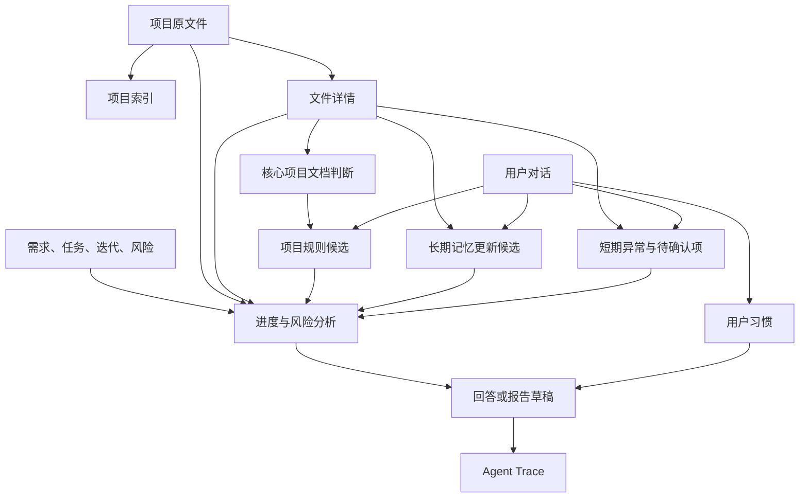

# 项目上下文资产职责与协作设计

## 1. 背景

PM-Agent 的核心定位是跟踪项目开发进度、识别潜在风险、解释项目发展脉络并辅助用户理解后续方向。它不承担代码开发任务，也不以推动模型直接执行开发工作为主要目标。

现有上下文设计包含项目原文件、索引文件、文件详情、项目规范、用户习惯、长期记忆和短期记忆。前期设计对“项目规范”和“用户习惯”赋予了过强的通用召回与业务判断职责，容易使系统偏向开发规范助手，并使普通项目问答过度依赖规则文件。

本设计重新明确各类上下文资产的职责、数据来源、更新方式、使用场景和协作关系，为后续逐模块改造提供统一基线。

## 2. 目标

1. 以项目业务数据和当前项目文件作为进度、风险与项目分析的事实基础。
2. 让索引和文件详情承担定位与分析加速职责，而不是成为新的事实源。
3. 将现有“项目规则”收缩为当前有效的项目约束，只在相关场景参与判断。
4. 将现有“用户习惯”收缩为用户对 Agent 的交互与输出偏好。
5. 让长期记忆记录项目发展脉络，让短期记忆承载跨对话的当前工作上下文。
6. 所有模型提取、自动更新和冲突处理均可追踪、可解释、可撤销。
7. 需求、任务、迭代、风险、报告和 Trace 保持独立业务职责，不被上下文文件替代。

## 3. 范围

### 3.1 本期设计范围

- 项目原文件；
- 项目索引；
- 文件详情；
- 项目规则的目标职责；
- 用户习惯的目标职责；
- 长期记忆；
- 短期记忆；
- 用户与 Agent 的对话记录；
- 上述资产之间的协作关系；
- 项目初始化、项目更新、问答、进度分析、风险分析和报告生成中的使用边界。

### 3.2 不做范围

- 不在本文中确定最终数据库表和字段；
- 不在本文中确定向量数据库及向量化算法；
- 不在本文中设计具体接口；
- 不修改现有代码、Prompt 或存储路径；
- 不将 Agent 生成建议自动转换为正式任务、风险或已发布报告；
- 不把 PM-Agent 扩展成代码开发或自动执行平台。

## 4. 总体原则

### 4.1 信息分层

| 层次 | 内容 | 职责 |
|---|---|---|
| 原始来源层 | 项目原文件、用户原始对话、正式业务记录 | 保存可回溯的原始内容、声明和状态 |
| 分析投影层 | 项目索引、文件详情、确定性检测结果 | 提供定位、检索、筛选和分析加速 |
| 项目上下文层 | 项目规则、长期记忆、短期记忆 | 在特定场景补充项目约束和发展脉络 |
| 用户上下文层 | 用户习惯 | 控制 Agent 的交互方式和输出表现 |
| 分析输出层 | 进度结论、风险候选、规划建议、报告草稿 | 根据当前问题动态生成，不自动成为项目事实 |
| 追踪层 | Agent Trace、来源引用、变更记录、确认记录 | 解释系统为何读取、生成或更新某项内容 |

### 4.2 权威性按问题范围判断

系统不设置一条适用于所有问题的全局来源优先级。不同问题使用不同来源：

- 判断当前实现时，以当前代码、配置和测试证据为主；
- 判断任务登记状态时，以正式业务数据为主；
- 判断未来发展方向时，以用户最近的明确表达和当前有效规划文档为主；
- 判断项目必须遵守的要求时，以当前有效项目规则为主；
- 判断历史原因时，以原始对话、决策记录和长期记忆中的来源链为主；
- 判断用户希望如何获得回答时，以本轮要求和用户习惯为主。

当来源发生冲突时，系统应展示差异并生成待核查事项，不能让模型静默选择一个来源覆盖其他来源。

### 4.3 模型结论不是原始事实

模型可以执行分类、提取、归纳、关联和冲突判断，但模型输出默认属于分析结果或候选。只有满足明确生效条件的内容，才能进入项目规则、用户习惯或其他正式上下文。

## 5. 项目原文件

### 5.1 职责

项目原文件保存项目当前实际内容，是文件类分析结果的最终核查来源。不同类型原文件的证明范围不同：

| 文件类型 | 主要证明范围 |
|---|---|
| 代码与配置 | 当前观察到的实现和配置状态 |
| 测试代码与测试报告 | 当前观察到的验证范围和结果 |
| 需求文档 | 文档声明的需求与验收期望 |
| 规划文档 | 文档声明的发展目标与后续方向 |
| 规范或架构文档 | 文档声明的项目约束和设计基线 |
| 历史文档 | 过去存在过的方案、目标或决策 |

代码存在只能证明观察到了实现，不能单独证明模块已经完成。完成度仍需结合任务状态、测试证据、验收要求和用户声明进行判断。

### 5.2 编辑方式

- 由用户上传、目录同步、覆盖、移动或删除；
- Agent 不直接修改原文件；
- 原文件内容变化后，依赖其内容哈希的分析投影必须失效或重新生成。

### 5.3 数据来源

用户选择并同步到项目中的真实文件。

### 5.4 应用场景

- 核查当前实现；
- 检查项目规则是否被遵守；
- 提供进度和风险分析证据；
- 回答原文来源问题；
- 验证文件详情、长期记忆和模型结论。

### 5.5 禁止边界

- 不根据代码当前写法反向生成新的项目规则；
- 不把文档中的所有陈述自动视为当前有效事实；
- 不根据单个文件直接计算整个项目完成度。

## 6. 项目索引

### 6.1 职责

项目索引是原文件和系统上下文资产的导航目录，负责：

- 当前有效文件清单；
- 文件路径、类型、版本、内容哈希和处理状态；
- 原文件与文件详情之间的对应关系；
- 系统上下文资产的位置引用；
- 文件新增、修改、移动和删除后的可见状态。

### 6.2 编辑方式

- 仅由系统根据当前文件和业务记录确定性生成；
- 不由大模型生成语义内容；
- 项目更新后按同步结果重建或更新。

### 6.3 数据来源

项目文件业务记录和当前有效系统资产记录。

### 6.4 应用场景

- 查找当前有效原文件；
- 查找对应文件详情；
- 判断文件详情是否已经过期；
- 为后续检索和证据读取限定文件范围。

### 6.5 禁止边界

项目索引不提供项目目标、进度、风险或规则结论。

## 7. 文件详情

### 7.1 职责

文件详情是基于原文件生成的可重建分析投影，负责：

- 文件摘要和文件角色；
- 文件与项目的相关程度；
- 文档角色、规范性和时效性；
- 关键项目事实候选；
- 实现、测试、风险和敏感信息信号；
- 内容片段与原文锚点；
- 关联文件和关联主题；
- 项目规则、发展目标和里程碑候选。

### 7.2 核心项目文档判断

由大模型判断文件是否与项目高度绑定。用户界面可以将其表达为“权威文档”，内部判断至少应拆分为：

- 项目相关度；
- 文档角色；
- 规范强度；
- 时间状态；
- 适用范围；
- 模型置信度。

判断整份文件是否为核心项目文档时，不强制要求定位到单句原文。但从该文档提取具体项目规则、发展目标或里程碑时，必须保存对应原文位置或可复核片段。

高度相关不代表文件中的所有内容都拥有绝对优先级。一个高度相关的 README 仍不能自动覆盖专门的安全规范、用户最近明确修改的目标或当前代码状态。

### 7.3 编辑方式

- 项目文件解析时自动生成；
- 原文件内容哈希变化后旧文件详情失效；
- 用户不直接编辑文件详情，但可以触发重新解析；
- 文件详情生成失败不应修改原文件或其他已生效上下文。

### 7.4 数据来源

当前版本原文件、文件元数据以及解析器的确定性输出。

### 7.5 应用场景

- 普通项目问答的第一层候选检索；
- 判断是否需要进一步读取原文件；
- 进度和风险分析的候选发现；
- 项目规则符合性检查；
- 核心项目文档识别。

### 7.6 禁止边界

文件详情不是独立事实源。高可信回答仍需根据原文件版本、哈希和证据锚点进行复核。

## 8. 项目规则

### 8.1 目标定位

现有“项目规则”后续应收缩为项目发展过程中当前有效的要求、禁止事项和必须遵守的基线。产品术语是否正式调整为“项目约束”，应在实施前同步更新术语表。

### 8.2 职责

项目规则可以保存：

- 架构与设计约束；
- 安全限制；
- 代码和文档规范；
- 兼容性要求；
- 质量要求；
- 流程与交付约束。

项目规则不保存：

- 普通代码实现事实；
- 当前开发进度；
- 项目发展目标；
- 用户习惯；
- 风险分析结论；
- 尚未确认的讨论性内容。

### 8.3 数据来源

1. 用户在对话中明确提出的项目要求；
2. 大模型从当前核心项目文档中识别出的明确约束。

项目代码不是项目规则的提取来源，只是规则执行情况的检查对象。

### 8.4 编辑方式

#### 明确指令

当用户明确要求新增、修改或停用某项项目规则时，系统直接执行对应更新，并在当前对话中提示已经记录，同时保留来源、变更历史和撤销能力。

#### 模糊表达

当用户表达为疑问、建议、假设或适用范围不明确时，大模型先说明它准备记录的内容及目标位置，并询问用户是否确认。用户明确确认前不得生效，也不得参与后续召回和分析。

#### 文档提取

- 当前核心项目文档中的明确强制表达，可以自动形成有效项目规则；
- 表达模糊、范围不清、时间状态不明或与现有规则冲突时，进入待确认状态；
- 来源文档被删除、被新版本替代或被识别为历史文档时，关联规则进入待复核状态，不静默删除。

### 8.5 应用场景

- 查询项目当前规定；
- 检查代码、配置和文档是否符合项目要求；
- 风险分析；
- 排期和规划中的硬性限制；
- 解释风险或偏差的判断依据。

### 8.6 禁止边界

- 普通项目问答不默认以项目规则作为检索入口；
- 不能根据代码当前写法推断项目应该继续遵守该写法；
- 不能将发展目标与项目规则混合；
- 不能把模型建议直接写成项目规则。

## 9. 用户习惯

### 9.1 目标定位

现有“用户习惯”后续应收缩为用户对 Agent 交互和输出方式的偏好。产品术语是否正式调整为“用户偏好”，应在实施前同步更新术语表。

用户习惯属于用户级上下文，不与单个项目强绑定。必要时可以存在项目级覆盖值，但不能把项目约束迁移到用户习惯中。

### 9.2 职责

- 回答语言与表达语气；
- 简洁或详细程度；
- 输出格式；
- 是否先给结论；
- 是否展示证据；
- 报告组织方式；
- 分析结果的展示重点；
- 用户未明确指定时的轻量规划偏好。

### 9.3 数据来源

- 用户明确提出的偏好；
- 用户对 Agent 回答的明确反馈；
- 模糊表达经用户确认后的结果。

用户习惯不能从项目文件、项目代码或模型自己的回答中学习。

### 9.4 编辑方式

- 用户明确要求记录、修改或删除个人偏好时直接执行，并提示结果；
- 表达不明确时由 Agent 主动询问，确认前不生效；
- 用户本轮明确要求临时覆盖已有偏好；
- 新偏好明确否定旧偏好时，旧版本转为已替代并保留变更记录。

默认生效顺序为：

```text
用户本轮明确要求
> 当前项目覆盖设置
> 用户全局习惯
> 系统默认设置
```

### 9.5 应用场景

用户习惯只在业务事实检索和分析完成之后参与输出组织，包括问答、进度分析、风险说明、规划建议和报告草稿的表达方式。

### 9.6 禁止边界

用户习惯不能改变项目事实、完成度、风险等级、证据可信度和项目规则。

## 10. 长期记忆

### 10.1 目标定位

长期记忆是供 Agent 理解项目发展脉络的内部可追踪记录，不作为用户直接维护的任务或计划页面，也不替代正式业务数据。

### 10.2 内容分区

| 分区 | 内容 |
|---|---|
| 项目基线 | 项目首次解析时观察到的整体状态和文档声明方向 |
| 当前发展方向 | 当前仍然有效的长期方向和大块目标 |
| 里程碑事件 | 在特定时间观察、声明或验证的重要成果 |
| 方向变更 | 目标增加、修改、取消以及发生变化的原因 |
| 历史归档 | 已经被替代、取消或废弃的方向与方案 |

当前正在执行的细粒度工作不属于长期记忆，应来自正式任务、迭代或短期记忆。

### 10.3 数据来源

- 项目初始化时的当前代码和核心项目文档；
- 用户在对话中明确表达的发展方向变化；
- 项目文件更新后发现的重大实现变化；
- 测试、验收或用户确认形成的里程碑；
- 用户对非代码工作结果的明确反馈。

### 10.4 编辑方式

- 由 Agent 根据项目事件和对话自动整理；
- 不提供直接编辑长期记忆文件的普通业务入口；
- 用户可以通过对话纠正方向、里程碑和历史判断；
- 每条记录保存形成时间、来源、证据状态和变更关系；
- 新内容以新增、替代或归档方式形成时间链，不物理覆盖历史。

### 10.5 里程碑证据状态

| 状态 | 含义 |
|---|---|
| `observed` | 从代码或文件变化中观察到相关实现 |
| `declared` | 用户或文档声明相关目标已经完成 |
| `verified` | 存在测试、验收或多项相互支持的证据 |
| `superseded` | 后续信息证明原里程碑判断已被替代或推翻 |

### 10.6 应用场景

- 回顾项目阶段和重要变化；
- 解释发展方向为什么改变；
- 比较当前实现与历史目标；
- 生成阶段总结和报告；
- 理解对话中的历史指代；
- 为进度分析提供历史基线。

长期记忆不保存正式风险，也不能单独生成正式风险。风险分析可以读取当前发展方向和里程碑作为背景，但仍需以当前业务数据和原始证据完成风险判断。

### 10.7 禁止边界

- 不代替任务、迭代和正式里程碑业务状态；
- 不把代码目录或类的存在直接解释为模块完成；
- 不存储用户习惯；
- 不存储项目规则全文；
- 不作为当前实现状态的最高权威来源。

## 11. 短期记忆

### 11.1 目标定位

短期记忆用于跨对话保存当前仍有价值、但尚未成为长期事实或正式业务记录的项目工作上下文，避免用户在不同会话中重复说明背景。

### 11.2 内容分区

| 分区 | 内容 |
|---|---|
| 当前关注点 | 用户近期重点讨论的方向 |
| 待确认问题 | 尚未获得明确结论的问题 |
| 临时假设 | 后续需要验证的判断 |
| 下一步建议 | 围绕长期方向生成的临时行动建议 |
| 待处理引用 | 指向风险候选、任务或其他业务对象的引用 |

“下一步建议”不是正式任务。用户确认需要执行后，仍应通过任务模块创建正式任务。

### 11.3 数据来源

- 当前及近期用户对话；
- 用户对项目安排的临时调整；
- 尚未确认的发展方向；
- 当前分析产生的待验证问题；
- 项目更新后发现但尚未处理的异常。

### 11.4 编辑方式与生命周期

```text
active
├─→ resolved：问题已经解决
├─→ expired：超过有效时间或复查条件
├─→ promoted：进入长期记忆或正式业务对象
├─→ superseded：被新的用户表达或项目状态替代
└─→ pending_review：与当前来源发生冲突，等待核查
```

- Agent 可以自动新增具有明确来源的短期上下文；
- 模型自己的回答不能作为新的短期记忆来源；
- 项目、来源、记录时间、有效期和下一次复查条件必须可追踪；
- 失效内容不参与默认召回，但可用于历史排查。

### 11.5 应用场景

- 跨对话恢复当前讨论背景；
- 理解用户近期重点；
- 继续处理尚未确认的问题；
- 生成围绕长期方向的临时建议；
- 提示仍未处理的异常或风险候选。

### 11.6 防止跨对话幻觉

- 只在同一项目范围内召回项目短期记忆；
- 每次只召回与当前问题相关的少量活动条目；
- 过期、已解决和已替代内容不参与默认回答；
- 使用短期记忆时表达为“此前讨论中提到”，不表达为当前确定事实；
- 需要高可信结论时继续读取业务数据或原文件验证；
- 正式风险只保存在风险模块，短期记忆只保存候选或关联引用。

## 12. 用户与 Agent 的对话记录

### 12.1 职责

对话记录保存用户原始表达、Agent 回复、工具调用和确认过程，是项目规则、用户习惯及长短期记忆更新的重要来源之一，但不等同于这些上下文资产。

### 12.2 可提取内容

- 用户明确提出的项目规则；
- 用户习惯；
- 发展方向变化；
- 里程碑声明；
- 当前关注点；
- 待确认问题；
- 报告生成素材。

### 12.3 学习与编辑边界

- 用户原话可以成为提取来源；
- Agent 自己生成的建议不能自动成为用户事实；
- Agent 建议只有在用户明确接受后才能进入有效上下文；
- 用户声明某模块完成时，先记录为声明状态，不能自动解释为已经验证完成；
- 明确新增或修改指令可以直接执行；
- 模糊表达必须在当前对话中询问并等待确认。

### 12.4 报告边界

对话可以作为报告素材，但报告生成仍需读取需求、任务、迭代、风险和文件证据。报告草稿是分析输出，不能反向覆盖业务状态和原始证据；确认后的报告由报告模块独立保存。

## 13. 正式业务数据边界

需求、任务、迭代、风险、报告和 Trace 不内化为上述上下文文件中的普通条目。

| 对象 | 必须独立保存的原因 | 与上下文资产的协作方式 |
|---|---|---|
| 需求 | 具有状态、优先级、变更和验收关系 | 按问题生成需求摘要供 Agent 使用 |
| 任务 | 具有负责人、状态、时间和依赖关系 | 为进度分析和短期建议提供当前状态 |
| 迭代 | 具有时间范围和任务集合 | 为进度、排期和报告提供统计范围 |
| 风险 | 具有确认、处理、解决和关闭流程 | 短期记忆只保存风险候选或引用 |
| 报告 | 具有草稿、确认和版本状态 | 使用上下文生成，但不反向成为事实源 |
| Trace | 记录模型、工具、输入输出和确认链路 | 解释上下文为什么被读取或更新 |

上下文文件可以包含这些对象的 ID、摘要和关联关系，但不能成为其唯一存储，也不能覆盖正式业务状态。

## 14. 核心协作流程



## 15. 典型应用场景

| 场景 | 主要使用 | 辅助使用 | 不应使用 |
|---|---|---|---|
| 项目初始化 | 原文件、项目索引、文件详情 | 长期记忆基线、项目规则候选 | 使用用户习惯判断项目事实 |
| 项目更新 | 新旧原文件、项目索引、文件详情 | 长期里程碑、短期待确认项 | 使用旧记忆覆盖当前代码 |
| 普通项目问答 | 文件详情、原文、业务数据 | 长短期记忆 | 默认通过项目规则寻找答案 |
| 项目规则检查 | 项目规则、当前代码或文档 | 文件详情定位 | 从代码当前写法反推新规则 |
| 进度分析 | 需求、任务、迭代、代码、测试 | 长期基线、短期关注点 | 单凭长期记忆判断完成度 |
| 风险分析 | 业务状态、当前证据、项目规则 | 长期方向作为背景 | 让用户习惯改变风险等级 |
| 跨对话衔接 | 短期记忆 | 长期记忆 | 注入全部历史对话 |
| 报告生成 | 业务数据、进度结论、风险结论 | 长短期记忆、用户习惯 | 把报告草稿反写成项目事实 |
| 历史原因查询 | 长期记忆、来源对话 | 原文件历史版本 | 只看当前代码推测历史原因 |

## 16. 项目初始化协作

1. 用户同步项目原文件；
2. 系统建立项目索引；
3. 系统按文件生成文件详情；
4. 模型判断文档角色、项目相关度、规范强度和时间状态；
5. 从核心项目文档中提取项目规则、发展方向和里程碑候选；
6. 建立长期记忆中的项目基线；
7. 模糊、冲突或证据不足的内容进入待确认或待复核状态；
8. 初始化失败不得覆盖已存在的有效上下文。

## 17. 项目更新协作

1. 根据原文件清单和内容哈希识别新增、修改、移动和删除；
2. 更新项目索引；
3. 只重新生成受影响文件的文件详情；
4. 重新判断受影响文档的角色与时效性；
5. 检查来源变化是否影响已有项目规则；
6. 从重大实现变化中生成里程碑候选，而不是直接断言完成；
7. 将尚未处理的冲突和异常写入短期上下文；
8. 保留长期记忆中的历史链，不使用新结果物理覆盖旧记录。

## 18. 对话与隐式学习协作

1. Agent 先判断当前输入是普通问答、明确修改指令还是模糊学习候选；
2. 普通问答按问题类型选择业务数据、文件详情或原文，不默认读取项目规则和用户习惯；
3. 明确项目规则或用户习惯修改指令直接执行，并向用户反馈变更结果；
4. 模糊表达先生成准备写入的内容，再询问用户是否确认；
5. 用户确认后才写入有效上下文；
6. 所有更新记录来源消息、变更前后内容和 Trace；
7. Agent 自己的历史回答不参与自动学习，除非用户明确确认其中的建议。

## 19. 风险与取舍

### 19.1 模型判断核心文档存在误判

模型可能把项目介绍文档误判为所有领域的最高权威。通过拆分项目相关度、文档角色、规范强度、时间状态和适用范围，避免使用单一权威分数直接覆盖其他来源。

### 19.2 隐式学习可能错误写入

取消主动学习按钮降低了操作成本，但增加了误记录风险。通过明确指令直接生效、模糊表达询问确认、来源留痕和撤销能力控制风险。

### 19.3 长短期记忆可能重复业务数据

记忆只能保存摘要、脉络和引用，需求、任务、迭代、风险、报告仍以正式业务模块为准。

### 19.4 项目文件不能完整证明进度

代码、文档、测试和任务状态表达的是不同观察角度。进度分析必须明确区分声明状态、观察状态和验证状态。

### 19.5 上下文持续增长

长期记忆采用当前方向、里程碑、变更和历史归档分区；短期记忆使用有效期和生命周期；失效内容不参与默认召回。后续再根据实际规模决定是否引入向量检索。

## 20. 验收标准

- 每类上下文资产都有唯一、明确的职责；
- 原文件、项目索引和文件详情的权威边界清晰；
- 模型可以识别核心项目文档，但不能通过单一相关度覆盖其他来源；
- 项目代码不再作为新项目规则的提取来源；
- 明确学习指令可以直接生效，模糊表达必须等待用户确认；
- 用户习惯不参与项目事实和风险等级判断；
- 长期记忆能够追踪项目基线、发展方向、里程碑和方向变化；
- 短期记忆具备过期、解决、晋升、替代和待复核边界；
- 普通项目问答不依赖项目规则作为统一检索入口；
- 需求、任务、迭代、风险、报告和 Trace 不被上下文文件替代；
- 所有模型生成的项目规则、记忆和分析结论均可追溯到来源。

## 21. 待确认问题

暂无。后续围绕具体文件结构、存储方式、检索算法和迁移方案分别建立专题设计文档。
