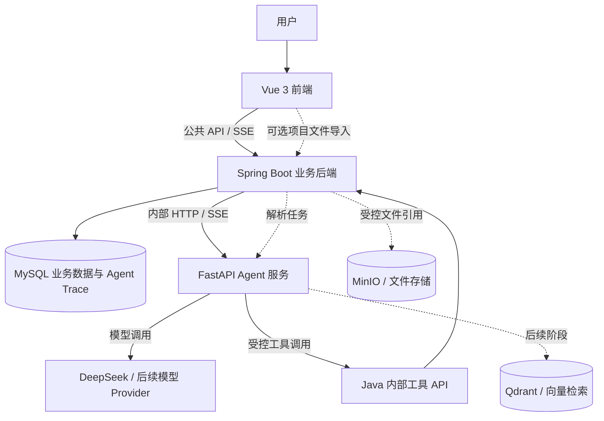

# PM-Agent 整体架构分析与顺序开发 TODO

> 文档状态：当前开发主线建议稿  
> 适用范围：PM-Agent Monorepo（Vue 前端、Spring Boot 后端、FastAPI Agent 服务）  
> 更新时间：2026-07-10

## 1. 背景

PM-Agent 当前已经形成认证、项目、任务和 Agent 服务的部分工程基础，但文档阶段、代码实现和设计稿之间出现了明显错位：

- 根目录旧说明仍将项目描述为第 1 阶段，甚至称 `agent-service` 尚未创建；
- 项目、任务后端接口已经存在，但前端默认使用 Mock，真实接口契约尚未闭环；
- Java 与 Python 已实现 Agent 对话桥接代码，但请求字段和类型不一致，当前无法完成真实调用；
- MinIO、Qwen、内容归一化和 RAG 实验已经提前出现；
- 需求、业务迭代、风险、报告等供 Agent 分析的核心业务数据仍未补齐。

本文用于将现状重新收束为一条可执行的开发主线，明确系统边界、优先级、验收标准和后置范围。本文是开发路线总结，不替代各业务模块的正式设计文档和接口文档。

## 2. 核心结论

当前项目既不能简单视为“第 1 阶段”，也不能因为出现了 MinIO、Qdrant 和 RAG 目录就视为进入了“第 6 阶段”。更准确的判断是：

| 方向 | 当前状态 | 判断 |
|---|---|---|
| 用户与认证 | 基础完成 | 已有注册、登录、登出、当前用户和部分测试 |
| 项目与任务 | 后端部分完成、前端真实联调未闭环 | 默认 Mock 掩盖响应字段不一致，任务状态机和测试仍缺失 |
| 需求、迭代、风险、报告 | 基本未开始 | 只有少量字段预留或文档设计，没有完整业务闭环 |
| Agent 对话 | 技术原型 | 模型适配、Prompt、SSE 部件和 Java 桥接已存在，但跨服务契约目前无法打通 |
| Agent 工具调用 | Demo | 当前使用关键词触发固定数据，不是真实 Tool Calling |
| Agent Trace | 未完成 | 只有 traceId 传递和对话单表，没有完整 Trace 持久化与查询 |
| 项目文件与 MinIO | Java 主导链路 | Java 负责文件 CRUD、权限、元数据和 MinIO；Python 本地文件树扫描已移除，只保留受控文件解析 |
| 内容归一化 | 独立模块基本完成 | 有正式实现和单元测试，但尚未接入真实 Agent 或检索主链 |
| RAG 与记忆 | 预研/占位 | 不应阻塞当前业务和 Agent MVP |

因此，推荐开发顺序为：

```text
现状收口与契约定版
→ 项目/任务真实闭环
→ Agent 非流式基础链路
→ 个人项目管理业务闭环
→ Agent 会话、Trace、SSE 与只读工具
→ Agent 结构化生成与人工确认
→ 项目文件上下文导入
→ 内容归一化与检索
→ RAG、记忆和企业级能力
```

## 3. 推荐总体架构



### 3.1 前端职责

- 展示项目、需求、任务、迭代、风险、报告和 Agent 对话；
- 维护当前用户和当前项目上下文；
- 消费 Java 转发的 SSE 事件；
- 展示 Agent 工具执行过程和人工确认动作卡片；
- 所有用户请求只访问 Java 公共 API，不直接访问 Python Agent 服务。

### 3.2 Java 后端职责

- 作为业务数据唯一事实源；
- 负责登录、权限、幂等、状态流转、业务事务和状态日志；
- 提供项目、任务、需求、迭代、风险、报告等业务 API；
- 提供 Agent 可调用的受控工具 API；
- 调用 Python Agent 服务并向前端转发 JSON 或 SSE；
- 持久化会话、消息、Agent Trace、工具调用和人工确认结果。

### 3.3 Python Agent 服务职责

- Prompt 模板、模型适配、模型路由和上下文窗口控制；
- Agent 编排、工具选择、结构化输出和流式事件生成；
- 调用 Java 工具 API 查询业务数据；
- 生成任务草稿、风险候选和报告草稿；
- 不直接访问 Java 业务数据库，不绕过 Java 权限和状态机。

### 3.4 模型职责

- 自然语言理解和意图识别；
- 项目状态总结；
- 需求拆解草稿；
- 风险解释与建议；
- 周报和阶段报告文字草稿。

模型输出不能作为已经执行的业务结果，关键结构必须通过 Pydantic 或 JSON Schema 校验。

## 4. 当前主要阻塞问题

### 4.1 文档与阶段状态不一致

- 根 README 仍称 `agent-service` 尚未创建；
- 旧规划要求第 2 阶段引入 Redis 和复杂 RBAC，个人开发者版又明确将其后置；
- MinIO 和 Qdrant 在技术规划中属于后续阶段，但当前 Compose 默认会同时启动；
- `docs/06-Agent设计.md`、`docs/15-Java模块个人开发者版开发需求说明.md` 和实际 Agent API 的流式路径口径不同；
- 旧 Figma 页面文档与最新 `docs/16-设计要点.md` 的页面结构不同。

开发前必须先建立唯一主线，避免继续按不同文档重复实现。

### 4.2 项目与任务真实接口尚未闭环

当前前端 `.env.example` 默认使用 Mock。真实接口下存在以下问题：

- 后端项目响应主要返回 `ownerId` 和基础字段，前端依赖 `ownerName`、任务统计、成员数和风险数；
- 后端任务响应返回 `assigneeId`，任务看板优先展示 `assigneeName`；
- 任务状态更新只校验状态值，没有完整合法流转规则；
- 项目、任务、Agent 后端测试缺失；
- 前端只有类型检查和构建脚本，没有自动化交互测试。

因此，第 1 阶段只能视为“骨架已存在”，不能视为“真实联调验收完成”。

### 4.3 Java 与 Python Agent 请求契约不兼容

Python 当前要求：

- 请求体必须包含 `trace_id`；
- `conversation_id` 必须为整数；
- `project_id`、`iteration_id`、`task_id` 必须为整数且不可空。

Java 当前发送：

- traceId 只放在 Header，请求体没有 `trace_id`；
- `conversation_id` 使用 UUID 字符串；
- `project_id` 和 `task_id` 可以为空；
- 额外发送 Python 尚未正式声明的 token 用量字段。

当前 Java 请求会先被 FastAPI 返回 422，尚未进入模型调用。

### 4.4 Agent 配置对象存在运行时错误

FastAPI 接口将 `get_settings()` 返回的 `AppConfig` 传给 `ProjectChatAgent`，但 Agent 和 LLM 客户端按 LLM `Settings` 使用该对象，读取 `default_llm_provider` 和 `get_llm_config()`。即使请求校验通过，也会因为配置对象类型不匹配触发运行时异常。

### 4.5 Agent 安全、事务和 Trace 未闭环

- Java 查询会话历史只按 `conversationId + iterationId`，没有用户和租户隔离；
- Agent 请求中的 `projectId`、`taskId` 未先校验当前用户访问权；
- Java 在数据库事务中执行最长可达 60 秒的外部 HTTP 调用；
- Java 调 Python 只传 `X-Trace-Id`，缺少用户和租户 Header；
- Agent 调用失败时没有落失败记录；
- 当前 V3 只有一轮用户与助手一行的对话表，与长期 `session/message/trace/tool_call` 模型不一致。

### 4.6 项目文件链路已收束到 Java

Python Agent 服务原有的 `root_path` / `output_dir` 本地文件树扫描与索引写入能力已经移除。正式链路由前端向 Java 上传文件，Java 负责鉴权、元数据落库和 MinIO，随后向 Python 传递受控只读地址或文件解析事件。

同时存在以下风险：

- 文件接口缺少完整鉴权和幂等；
- 部分查询、更新、删除接口的 `current_user_id` 可空；
- 文件读取后才检查大小；
- 中途失败可能留下孤儿对象；
- 删除属于高风险动作，必须由 Java 权限边界和人工确认控制。

项目文件导入必须重新定义为浏览器文件集/ZIP、桌面采集器、Git 仓库或受控服务器工作区中的一种，不能继续把本机路径直接当成正式产品契约。

### 4.7 测试边界不清晰

现有 Python 测试混合了：

- 真正的独立单元测试；
- 真实 MinIO 集成测试；
- 真实 Qwen/Ollama 连通测试；
- 会写入测试目录 JSON 文件的脚本；
- 带额外必填参数、无法被 unittest 正常自动发现的测试方法。

必须将测试拆分为 `unit`、`integration`、`manual/smoke` 三组，禁止默认测试命令连接外部模型或改写仓库样例文件。

## 5. 当前开发范围

### 5.1 当前主线范围

- 个人开发者和单人项目管理者；
- 用户与认证；
- 项目、需求、任务、迭代、风险、报告；
- 个人工作台；
- Agent 对话、会话历史、Trace、SSE；
- Agent 只读查询工具；
- 需求拆解、风险候选和报告草稿；
- 人工确认后的受控业务写入。

### 5.2 明确后置范围

- 企业级 RBAC、组织和复杂项目成员管理；
- 多级审批流；
- Redis 集群；
- RabbitMQ、Celery 和大规模异步任务；
- 通知中心和外部通知渠道；
- Word/PDF 导出；
- 完整审计平台和复杂 BI；
- 多模型自动升级路由；
- 完整 RAG、长期记忆、事件图谱和神经记忆。

## 6. 顺序开发 TODO

### P0：收口当前工作和开发口径

- [ ] 为当前 `agent-service/file-tree` 分支建立可回退检查点，避免继续混入其他模块修改；
- [ ] 确认个人开发者版为当前 MVP 主线；
- [ ] 将根 README、开发规划、技术选型、Agent 设计和最新设计要点同步为同一阶段状态；
- [ ] 明确前端只访问 Java，Java 访问 Python 内部接口；
- [ ] 明确 Agent Trace 由 Java/MySQL 持久化；
- [ ] 将“项目文件上下文导入”和“完整 RAG”拆成两个阶段；
- [ ] 给 MinIO、Qdrant 增加 Compose profile，默认只启动 MySQL；
- [ ] 将 Agent 对话中的 `iterationId` 改为不与业务迭代冲突的名称；
- [ ] 更新 `agent-service/README.md` 和本目录旧 TODO 的主线标识。

验收标准：所有主文档对当前产品范围、阶段状态和服务边界表述一致。

### P1：完成项目与任务真实接口闭环

- [ ] 使用 `VITE_USE_MOCK=false` 开展真实联调；
- [ ] 冻结项目列表、项目详情和任务响应 DTO；
- [ ] 统一 `ownerName`、任务统计、成员数、风险数和负责人展示字段；
- [ ] 实现任务合法状态流转；
- [ ] 增加任务状态日志查询；
- [ ] 增加项目进度聚合和基础概览；
- [ ] 实现真实单机幂等，前端重试复用同一个幂等键；
- [ ] 通过新 Flyway migration 修复演示账号，不修改已应用的 V2；
- [ ] 增加项目和任务 Service/Controller 测试；
- [ ] 完成浏览器真实接口手动验收。

验收路径：

```text
注册/登录
→ 创建项目
→ 查看项目详情
→ 创建任务
→ 切换合法状态
→ 查看状态日志
```

全流程不得依赖 Mock。

### P2：打通 Agent 非流式最小闭环

- [ ] 固化一份 Java 请求 JSON、Python 响应 JSON 和错误响应契约；
- [ ] 统一 `conversation_id` 为字符串；
- [ ] 从 Header 读取并透传 `X-Trace-Id`、`X-User-Id`、`X-Tenant-Id`；
- [ ] 允许项目和任务上下文按场景为空；
- [ ] 处理或移除未声明的 token 用量字段，禁止静默漂移；
- [ ] 给 Pydantic 模型设置明确的额外字段策略和长度限制；
- [ ] 修复 `AppConfig` 与 LLM `Settings` 传参错误；
- [ ] Java 调用前校验项目和任务访问权限；
- [ ] 会话历史按租户和用户隔离；
- [ ] 将外部 HTTP 调用移出数据库事务；
- [ ] 增加 mock LLM 的 Python API 测试；
- [ ] 增加 Java consumer contract 测试；
- [ ] 最后执行一次真实 DeepSeek smoke test。

验收标准：Java → Python → 模型 → Java 落库可稳定完成一轮非流式对话，失败返回统一中文错误和同一个 traceId。

### P3：强化任务、项目和个人工作台

- [ ] 任务列表支持分页、排序、状态、优先级、截止日期和关键词过滤；
- [ ] 实现逾期任务、完成时间、完成说明和实际工时；
- [ ] 完成项目概览、任务状态分布和进度聚合；
- [ ] 完成项目归档和删除保护；
- [ ] 实现个人工作台 v1：进行中项目、今日待办、逾期任务、近期完成；
- [ ] 按最新设计实现统一主布局；
- [ ] 在 Pinia 或路由中维护统一 `currentProjectId`；
- [ ] 当前阶段按本人/项目 owner 数据边界实现，不提前开发复杂成员管理。

验收标准：用户进入系统后能够明确看到当前项目、今日任务和下一步工作。

### P4：需求管理纵向闭环

- [ ] 确认需求状态机和最小字段；
- [ ] 编写需求模块设计文档；
- [ ] 新增 Flyway migration；
- [ ] 完成需求 CRUD、状态修改和项目归属校验；
- [ ] 完成需求与任务关联；
- [ ] 完成需求列表、详情和手动拆任务页面；
- [ ] 增加 Service、Controller、权限和状态异常测试；
- [ ] 保留 Agent 拆解入口，但暂不自动创建任务。

验收标准：需求可以被记录、确认，并由用户手动拆解或关联到任务。

### P5：业务迭代纵向闭环

- [ ] 确定任务与迭代的唯一关系模型；
- [ ] 避免同时长期维护 `pm_task.iteration_id` 和 `pm_iteration_task` 两套事实源；
- [ ] 完成迭代 CRUD、当前迭代、任务加入/移出、进度和复盘；
- [ ] 完成当前迭代页面；
- [ ] 增加日期边界、状态流转和项目权限测试。

验收标准：可以创建迭代、加入任务、查看进度、结束迭代并保存复盘。

### P6：风险管理人工闭环

- [ ] 统一风险状态、等级和事件模型；
- [ ] 新增 `pm_risk` 和 `pm_risk_event`；
- [ ] 完成风险登记、确认、处理、解决和关闭；
- [ ] 支持风险关联项目和任务；
- [ ] 完成风险中心和处理时间线；
- [ ] 增加风险状态流转、权限和关闭条件测试；
- [ ] 当前阶段只做人工登记，不做自动风险扫描。

验收标准：风险从发现到关闭有完整状态和事件记录。

### P7：报告草稿闭环

- [ ] 完成 `pm_report` 数据模型和报告模块设计；
- [ ] 由 Java 聚合任务、迭代和风险数据；
- [ ] 支持周报草稿、阶段报告草稿、编辑和确认；
- [ ] 第一版保存 Markdown，不做 Word/PDF；
- [ ] 完成报告中心页面；
- [ ] 增加聚合口径和报告状态测试。

验收标准：不调用模型也能生成一份结构完整、数据可追溯的周报草稿。

### P8：完成 Agent 会话、Trace、SSE 和只读工具

- [ ] 通过新 Flyway migration 补充 `agent_session`、`agent_message`、`agent_trace`；
- [ ] 不修改已经应用的 V3；
- [ ] 成功和失败调用都记录 Trace；
- [ ] Prompt 使用稳定版本标识，如 `project_chat_v1`；
- [ ] 增加会话列表和历史消息接口；
- [ ] 实现 Python → Java → 浏览器的端到端 SSE；
- [ ] 统一流式事件：`meta → tool_start → tool_result → token → done/error`；
- [ ] 正确处理 token 换行、客户端断开、取消和超时；
- [ ] 用 Java 真实工具替换 Demo 固定数据；
- [ ] 首批实现项目概览、任务列表和逾期任务只读工具；
- [ ] 再接入工作台、需求、迭代和风险只读工具；
- [ ] 完成 PM 助手页面和 Trace 查询入口。

验收标准：用户询问“当前项目有哪些逾期任务”时，回答来自 Java 真实数据，且可以通过 traceId 查看 Prompt、模型、工具入参、工具结果、耗时和最终回答。

### P9：完成 Agent 结构化生成和人工确认

- [ ] 需求拆解使用独立 Prompt 和任务草稿 Schema；
- [ ] 风险分析使用独立 Prompt 和风险候选 Schema；
- [ ] 周报生成使用独立 Prompt 和报告草稿 Schema；
- [ ] 所有写建议返回 `requiresConfirmation=true`；
- [ ] 前端展示确认和拒绝动作卡片；
- [ ] 用户确认后由 Java 执行业务写入；
- [ ] 写操作校验权限、幂等键、状态机和业务归属；
- [ ] 记录 `agent_tool_call`、人工确认结果和业务状态日志；
- [ ] 删除、权限变更、外部通知等操作继续禁止自动执行。

验收标准：任何 Agent 写业务操作都无法绕过人工确认直接执行。

### P10：重新设计项目文件上下文导入

- [ ] 新建项目不强制选择文件夹，项目创建必须可以独立成功；
- [ ] 文件导入作为项目创建后的可选第二步；
- [ ] 第一版在浏览器目录上传和 ZIP 上传中确定一种正式方案；
- [ ] 前端将文件发送给 Java，Java负责鉴权和元数据落库；
- [ ] Java向 Python 传递受控文件引用，不传任意服务器路径；
- [ ] 增加文件数量、大小、深度、符号链接和敏感文件限制；
- [ ] 使用流式上传下载，读取前完成大小限制；
- [x] 移除 Python 本地文件树扫描和 `Project_Index.json` 写入；
- [ ] 增加项目级锁、幂等和补偿；
- [ ] 为索引增加 schema version；
- [ ] 删除文件必须通过 Java 权限和人工确认边界；
- [ ] 增加独立 MinIO 集成测试，不加入默认单元测试命令。

验收标准：项目文件能够通过 Java 安全导入，Python 仅基于受控文件事件生成文件详情和项目摘要，不依赖向量库，也不能访问任意服务器路径。

### P11：接入内容归一化、检索和 RAG

- [ ] 先将现有内容归一化模块接入真实查询或索引链路；
- [ ] 建立固定检索评估集和基线指标；
- [ ] 再实现 BM25F 字段召回；
- [ ] 再实现 SimHash 近重复过滤；
- [ ] 关键词检索稳定后再引入 Embedding 和向量检索；
- [ ] 最后实现文档切片、Qdrant、重排序和引用来源；
- [ ] 合并重复的 Qwen 客户端和配置，只通过统一 LLM 编排层调用；
- [ ] 长期记忆、事件图谱和神经记忆继续保留在长期 Backlog。

验收标准：RAG 回答包含可验证引用，检索指标相对固定基线有明确提升，且不影响核心业务和 Agent 对话可用性。

## 7. 每个业务模块的固定开发模板

为避免再次出现“只完成后端”或“只完成页面”的情况，每个模块统一按以下顺序开发：

```text
术语与状态确认
→ 最小模块设计文档
→ 数据模型与 Flyway
→ Service 与业务规则
→ Controller 与接口文档
→ 前端 API、状态和页面
→ 单元测试与接口测试
→ 真实浏览器验收
→ 同步更新总文档
```

任何一个模块没有完成最后的真实接口验收，都不能标记为完成。

## 8. 质量门

### 8.1 后端

- `mvn test` 必须通过；
- 新增模块必须有 Service 核心业务测试；
- Controller 至少覆盖登录态、参数校验、统一响应和幂等键；
- Agent 外部调用不得放在业务事务中；
- Flyway 只能新增 migration，不修改已应用脚本。

### 8.2 前端

- 使用项目要求的 Node 20 和 pnpm 9；
- `pnpm typecheck` 必须通过；
- `pnpm build` 必须通过；
- 每个阶段至少完成一次真实接口浏览器验收；
- Mock 只能用于开发占位，不能作为阶段验收依据。

### 8.3 Agent 服务

- 单元测试不得连接真实 MinIO、Ollama 或外部模型；
- 集成测试使用独立标记和独立命令；
- smoke 测试允许连接真实服务，但不得进入默认质量门；
- 测试不得改写仓库中的固定样例文件；
- 所有关键结构化输出必须通过 Pydantic 校验；
- 错误、超时和 SSE 中断必须有可验证测试。

### 8.4 阶段交付

每个阶段固定执行：

```text
mvn test
pnpm typecheck
pnpm build
Python unit tests
Java ↔ Python contract tests
真实接口手动验收
```

## 9. 已验证基线

本轮审计得到的基线结果：

- 后端 `mvn test` 通过，共 8 个认证和用户用例；
- 后端现有测试未覆盖项目、任务和 Agent；
- 前端类型检查通过；
- 当前本机 Node 为 24，而项目要求 Node 20，应统一环境；
- Python 内容归一化 12 个正式单元测试通过；
- Aho-Corasick Demo 的 2 个测试通过；
- Python 全量测试混入真实 Qwen、MinIO、环境依赖和写文件行为，当前不能作为稳定质量门；
- Java → Python 对话请求经 Pydantic 验证会出现 `trace_id` 缺失、`conversation_id` 类型不一致和 `task_id` 可空性不一致错误。

## 10. 风险与取舍

| 风险 | 当前取舍 |
|---|---|
| 同时推进业务、Agent、文件、RAG 导致失控 | 每次只推进一个可验收纵向切片 |
| 前端 Mock 长期掩盖真实接口问题 | 阶段验收强制关闭 Mock |
| Agent 没有真实业务数据只能做 Demo | 先补个人项目管理闭环，再扩工具 |
| 文件导入成为项目创建的强依赖 | 项目创建与文件导入拆成两个步骤 |
| MinIO/Qdrant 提前增加运行负担 | 使用 Compose profile，按阶段启用 |
| Agent 写操作越权或误操作 | 只输出草稿/候选，Java校验，人工确认后执行 |
| Trace 存储和 Prompt 泄露敏感信息 | Java统一持久化、脱敏、限制保留期 |
| 测试依赖本地环境导致结果不稳定 | 拆分 unit、integration、smoke 三组 |

## 11. 待确认问题

1. 项目文件正式导入方式选择浏览器目录上传、ZIP 上传、Git 仓库连接还是桌面采集器；本文建议第一版优先浏览器目录或 ZIP 上传。
2. SSE 对外接口采用同一 `/api/v1/agent/chat` 配合 `stream=true`，还是单独 `/api/v1/agent/chat/stream`；需要固定为唯一契约。
3. 当前 `agent_conversation_message` 是继续作为临时表，还是通过新 migration 迁移到 `agent_session + agent_message + agent_trace`；本文建议新增迁移并逐步切换，不修改 V3。
4. 任务与业务迭代采用 `pm_task.iteration_id` 还是 `pm_iteration_task` 关系表作为唯一事实源。
5. 个人版真实幂等优先使用 Caffeine 还是数据库幂等记录；Redis继续后置。

## 12. 参考文档与代码

- [`../../docs/01-开发规划.md`](../../docs/01-开发规划.md)
- [`../../docs/04-数据模型.md`](../../docs/04-数据模型.md)
- [`../../docs/05-接口规范.md`](../../docs/05-接口规范.md)
- [`../../docs/06-Agent设计.md`](../../docs/06-Agent设计.md)
- [`../../docs/15-Java模块个人开发者版开发需求说明.md`](../../docs/15-Java模块个人开发者版开发需求说明.md)
- [`../../docs/16-设计要点.md`](../../docs/16-设计要点.md)
- [`../../docs/17-内容归一化与词库建设设计.md`](../../docs/17-内容归一化与词库建设设计.md)
- [`../../deploy/docker-compose.yml`](../../deploy/docker-compose.yml)
- [`../app/streaming/payloads/request.py`](../app/streaming/payloads/request.py)
- [`../app/llm/orchestration/project_chat_agent.py`](../app/llm/orchestration/project_chat_agent.py)
- [`../app/project/files/schemas.py`](../app/project/files/schemas.py)
- [`../../backend/src/main/java/com/ning/pm/agent/service/impl/AgentChatServiceImpl.java`](../../backend/src/main/java/com/ning/pm/agent/service/impl/AgentChatServiceImpl.java)
- [`../../frontend/src/modules/project/types.ts`](../../frontend/src/modules/project/types.ts)
