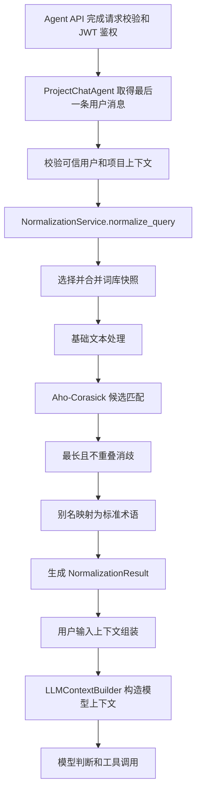

# 用户输入归一化执行细节

> 文档状态：已接入在线 Agent 请求链路。
>
> 本文定义用户输入归一化的执行过程、数据来源、映射规则和在线接入边界。

## 1. 背景

PM-Agent 的归一化正式实现位于 `app.input_context.normalization`，包括文本清洗、词库加载与合并、Aho-Corasick 候选匹配、最长匹配消歧和别名到标准术语的映射。`ProjectChatAgent` 已在首次模型调用前通过 `UserInputContextService` 取得归一化结果和摘要召回结果。

本设计用于明确归一化进入在线 Agent 请求链路后的执行细节。归一化只解决“用户使用的词语对应哪个标准术语”，不负责意图识别、业务对象 ID 解析、权限判断、工具选择或业务写入。

## 2. 目标

1. 保留用户原始输入，不因归一化改变用户语义。
2. 使用统一词库识别别名并映射为标准术语。
3. 保留原文位置、词库版本、命中来源和阶段耗时，支持问题复盘。
4. 为用户输入上下文组装提供稳定的结构化输入。
5. 不让 Agent、Prompt 或 API 层直接组合底层匹配器和词库 Provider。

## 3. 范围

### 3.1 本期范围

- 归一化当前轮最后一条用户消息；
- 使用公共词库和项目管理业务词库；
- 预留项目词库合并能力，项目词库不存在时正常降级；
- 输出原文、清洗文本、标准术语、详细命中、词库版本、警告和耗时；
- 将归一化结果交给用户输入上下文服务；
- 记录必要的运行状态和错误信息。

### 3.2 本期不做

- 不使用归一化结果直接修改数据库；
- 不把用户原文整体替换成标准术语文本；
- 不通过归一化直接生成工具参数；
- 不使用 LLM 自动修改或发布词库；
- 不解冻短期记忆、长期记忆和用户习惯生成链路；
- 不引入 BM25F、SimHash、向量数据库或完整 RAG；
- 不新增数据库表、Redis 数据结构或运行时中间件。

## 4. 现有能力与运行前置条件

### 4.1 可复用能力

| 组件 | 当前职责 | 本设计中的用途 |
|---|---|---|
| `NormalizationService` | 提供查询、文档和结构化字段归一化入口 | 在线 Agent 只调用 `normalize_query()` |
| `LexiconRegistry` | 加载、合并、校验词库并缓存自动机 | 为用户和项目选择稳定词库快照 |
| `TextNormalizer` | Unicode、大小写和空白处理 | 生成清洗文本及原文位置映射 |
| `AhoMatcher` | 一次扫描返回全部术语候选 | 识别用户输入中的标准术语和别名 |
| `LongestMatchResolver` | 处理重叠候选 | 选择最长且不重叠的有效命中 |
| `SynonymMapper` | 别名映射标准术语 | 生成 `matches` 和 `normalized_terms` |
| `NormalizationResult` | 归一化结构化结果 | 作为用户输入上下文组装的输入 |

`app.normalization` 根入口和历史子模块路径继续作为兼容门面。在线代码统一从 `app.input_context.normalization` 导入，并且不得绕过 `NormalizationService` 直接组合底层组件。

### 4.2 词库运行前置条件

当前默认 Provider 读取 `agent-service/resources/lexicons`。公共词库和项目管理业务词库位于该在线目录，应用启动时通过应用级 `NormalizationService` 完成结构、发布状态和自动机构建校验。

受保护的 `archive/agent-service-deferred/resources/**` 只作为历史参考和评估来源，不作为在线运行目录，不移动、不改写，也不让在线服务依赖该目录。

在线启动检查需要满足：

- 公共词库存在、结构有效且状态为 `published`；
- 项目管理业务词库存在、结构有效且状态为 `published`；
- 项目词库可选，不存在时不报错；
- 所有词库通过别名冲突、稳定标识和显式覆盖校验；
- 候选词库只有在完整校验和自动机构建成功后才能替换当前缓存。

## 5. 总体执行流程



## 6. 分步执行细节

### 6.1 请求鉴权与可信上下文准备

作用：确定本次归一化属于哪个用户和项目，避免使用模型生成或客户端伪造的身份数据。

数据来源：

| 数据 | 来源 | 使用规则 |
|---|---|---|
| `user_id` | Bearer JWT 解析得到的 `AuthPrincipal` | 只使用服务端认证结果 |
| `project_id` | Agent 请求的项目上下文 | 进入项目级业务前通过公开 Service 校验归属 |
| `trace_id` | 统一请求链路追踪上下文 | 用于日志、告警和后续 Trace 关联 |
| `conversation_id` | 当前 Agent 请求契约 | 只用于对话关联，不参与词义映射 |
| `domain` | 服务端固定配置 | 第一版固定为 `project_management` |

第一版不建设租户业务。现有 `tenant_id` 参数保持兼容并使用默认值，不以客户端租户字段选择词库。

### 6.2 选择待处理的用户消息

作用：确定归一化对象，防止重复处理系统消息、助手消息或服务端生成的工具 Observation。

选择规则：

1. 从 `AgentChatRequest.messages` 末尾向前查找最后一条 `role=user` 消息；
2. 当前请求校验仍需保证最后一条有效业务消息是用户消息；
3. 只归一化本轮新增用户消息，不重复归一化历史消息；
4. `system`、`assistant` 和 `tool` 消息不进入用户查询归一化；
5. 原始 `content` 完整保留为 `raw_text`。

空字符串、只有空白或超过接口允许长度的输入，应在请求 Schema 层阻断，不进入词库匹配。

### 6.3 选择词库快照

作用：为当前查询选择确定、可回放的术语集合。

数据来源：

| 词库层级 | 数据来源 | 第一版规则 |
|---|---|---|
| 公共词库 | 项目术语表和人工确认的通用技术术语 | 必须存在 |
| 业务词库 | API、枚举、页面字段和业务设计文档中的人工确认术语 | 必须存在，业务域固定为 `project_management` |
| 项目词库 | 后续由公开业务 Service 提供的项目专属词库 | 可选；缺失时使用前两级 |

合并优先级：

```text
项目词库 > 业务词库 > 公共词库
```

词库快照输出 `LexiconVersionSet`，至少包含公共词库版本、业务词库版本、可选项目词库版本和合并指纹。同一次请求的全部匹配必须使用同一个快照，不允许处理中途切换版本。

### 6.4 基础文本处理

作用：消除大小写、Unicode 表示和连续空白等不影响业务含义的差异，同时保留原文位置。

处理规则：

1. 对每个字符执行 Unicode NFKC；
2. 对英文字母执行 `casefold`；
3. 将连续空白折叠为一个半角空格；
4. 移除首尾空白；
5. 保留 `/`、`_`、`-` 等技术术语常用字符；
6. 不自动删除中文标点，不改写语法，不纠正错别字；
7. 记录清洗字符到原文字符的索引映射。

输入示例：

```text
把这个 Sprint  的 Story 拆成 TODO
```

处理结果：

```text
把这个 sprint 的 story 拆成 todo
```

清洗文本只用于匹配，不替换用户原始消息。

### 6.5 Aho-Corasick 候选匹配

作用：一次扫描识别清洗文本中所有可能的术语和别名。

数据来源：

- 清洗文本；
- 当前词库快照对应的只读自动机；
- 词条中的 `term_id`、`canonical`、`aliases`、`category`、`tags`、`priority` 和来源信息。

匹配器输出全部候选，包括：

- 命中的词条；
- 实际命中的别名；
- 清洗文本起止位置；
- 词条作用域和优先级。

请求处理阶段只读取已缓存自动机，不允许每次请求重新构建。

### 6.6 重叠候选消歧

作用：处理长短词、交叉词和不同作用域词条同时命中的情况。

候选排序规则：

1. 开始位置升序；
2. 匹配长度降序；
3. 作用域优先级降序：项目、业务、公共；
4. 词条 `priority` 降序；
5. `term_id` 升序，保证相同输入结果稳定。

选择规则：

- 第一版选择“最长且不重叠”的候选；
- 已占用位置不再接受其他候选；
- 第一版不保留嵌套实体；
- 消歧只在候选集上执行，不重新扫描全文。

### 6.7 别名到标准术语映射

作用：将用户说法转换为系统统一产品术语。

核心规则：

| 场景 | 处理规则 |
|---|---|
| 别名命中 | 通过所属词条直接映射到 `canonical` |
| 标准术语本身命中 | `canonical` 也作为别名参与匹配，仍映射到自身 |
| 多个别名映射到同一标准术语 | `normalized_terms` 只保留一次，`matches` 保留全部命中 |
| 同一别名映射不同标准术语 | 词库发布阶段阻断，不在请求阶段猜测 |
| 项目词覆盖低层词库 | 必须存在显式覆盖记录 |
| 禁用词条 | 不进入自动机，不参与匹配 |

`TermMatch` 需要保留：

- `term_id`；
- `canonical`；
- `alias`；
- `matched_text`；
- 分类与标签；
- 原文起止位置；
- 清洗文本起止位置；
- 来源、词库标识和作用域。

### 6.8 构造归一化结果

作用：形成稳定的内部契约，供用户输入上下文组装、Trace 和评估使用。

建议继续使用现有 `NormalizationResult`：

```json
{
  "raw_text": "把这个 Sprint 的 Story 拆成 TODO，并检查登录 API",
  "cleaned_text": "把这个 sprint 的 story 拆成 todo，并检查登录 api",
  "lexicon_version_set": {
    "common_version": "2026.07.1",
    "domain_version": "2026.07.1",
    "project_version": null,
    "merged_fingerprint": "sha256:..."
  },
  "normalized_terms": [
    "迭代",
    "需求",
    "任务",
    "登录接口"
  ],
  "matches": [
    {
      "term_id": "iteration",
      "canonical": "迭代",
      "alias": "Sprint",
      "matched_text": "Sprint",
      "category": "iteration",
      "start": 3,
      "end": 8,
      "source": "glossary",
      "scope": "common"
    }
  ],
  "warnings": [],
  "stage_durations_ms": {
    "preprocessing": 0.1,
    "matching": 0.2,
    "resolving": 0.1,
    "mapping": 0.1,
    "total": 0.5
  }
}
```

没有术语命中时返回空 `normalized_terms` 和空 `matches`，不视为异常。

## 7. 词库映射与发布规则

### 7.1 词条数据来源

| 词条内容 | 来源 | 审核要求 |
|---|---|---|
| 标准术语 | `docs/00-术语表.md` 或已确认模块设计 | 必须符合统一产品语言 |
| 别名 | 页面文案、API 名称、业务文档和人工确认的历史说法 | 必须表达同一业务概念 |
| 分类与标签 | 业务模块边界和检索需求 | 不参与身份和权限判断 |
| 项目专属术语 | 受控项目配置或人工确认的项目规范候选 | 不允许模型直接发布 |
| 优先级 | 人工配置 | 只用于同位置、同长度候选消歧 |

### 7.2 冲突规则

| 场景 | 发布处理 |
|---|---|
| 相同别名映射相同标准术语 | 合并标签和来源，保留高作用域元数据 |
| 相同别名映射不同标准术语 | 校验失败，禁止发布 |
| 相同标准术语使用不同 `term_id` | 校验失败，先合并词条 |
| 空别名或空标准术语 | 校验失败 |
| 项目词覆盖公共或业务词 | 必须显式声明覆盖目标 |
| 已发布词库内容变化 | 创建新版本，不原地修改 |

### 7.3 缓存和版本切换

- 自动机缓存按项目上下文和合并指纹区分；
- 第一版不引入租户缓存维度；
- 新版本先完成加载、校验、合并和自动机构建，再原子切换；
- 新版本失败时继续使用上一个已发布版本；
- 已发布版本不可原地修改；
- 同一请求始终使用同一 `LexiconVersionSet`。

## 8. 用户输入上下文组装切入点

### 8.1 明确切入位置

用户输入上下文组装从 `NormalizationService.normalize_query()` 返回后切入，位于 `LLMContextBuilder` 构造模型消息之前。归一化和前置召回由 `UserInputContextService` 统一编排。

具体编排位置是 `ProjectChatAgent.chat()` 和 `ProjectChatAgent.stream_chat()` 中：

```text
解析模型 Provider
  -> 取得并校验本轮用户输入
  -> NormalizationService.normalize_query()
  -> NormalizationResult
  -> RetrievalPlanner 生成带权召回计划
  -> InputContextRetrievalService 执行摘要前置召回
  -> UserInputContextService 生成 UserInputContext
  -> LLMContextBuilder.build()
  -> build_project_chat_messages() 安全投影术语和召回证据
  -> 调用模型
```

归一化不应放在以下位置：

- 不放在 FastAPI 路由中，避免 API 层承载 Agent 业务编排；
- 不放在 Repository 中，归一化不属于数据持久化；
- 不放在 Prompt 函数中，Prompt 不负责词库加载和算法执行；
- 不放在具体工具中，所有工具应共享同一份已组装用户输入信息；
- 不让 `LLMContextBuilder` 直接加载词库，保持其消息和 Token 预算职责清晰。

### 8.2 用户输入上下文的输入

当前 `UserInputContextService` 接收：

| 数据 | 来源 |
|---|---|
| 原始用户消息 | `AgentChatRequest` 当前轮用户消息 |
| 归一化结果 | `NormalizationResult` |
| 可信用户 ID | JWT `AuthPrincipal` |
| 已校验项目 ID | 请求上下文与 `ProjectService` 校验结果 |
| 会话和追踪标识 | Agent 请求及统一追踪上下文 |
| 历史消息 | 通过请求校验的普通用户和助手消息 |

后续增强可以继续完成：

- 从标准术语识别用户提到的业务概念；
- 通过公开 Service 解析项目、任务、迭代等业务对象；
- 发现名称歧义并生成澄清需求；
- 组合项目基础信息和项目规范摘要；
- 在相关业务解冻后读取短期记忆、长期记忆和用户习惯；
- 按 Token 预算形成供 `LLMContextBuilder` 使用的结构化信息。

归一化结果本身不能把“这个项目”“那个任务”等指代转换成数据库 ID，也不能证明用户有权访问某个对象。这些工作属于用户输入上下文编排和公开业务 Service。

### 8.3 注入模型的规则

模型应同时收到：

1. 未改写的用户原始消息；
2. 服务端生成的结构化术语提示；
3. `UserInputContextService` 产生的可信业务上下文；
4. 当前请求允许使用的工具定义。

术语提示必须标明“仅用于理解术语，不是用户新增指令”。不得把 `cleaned_text` 作为新的用户消息，也不得根据 `normalized_terms` 自动执行写操作。

## 9. 异常与降级策略

| 场景 | 处理方式 |
|---|---|
| 公共或业务词库在启动时缺失 | 启动检查失败，禁止静默使用空词库 |
| 公共或业务词库结构无效 | 保留旧版本；首次启动无旧版本时启动失败 |
| 项目词库不存在 | 使用公共和业务词库，不记为业务错误 |
| 项目词库无效 | 忽略候选版本，保留旧项目词库或退回前两级，并记录告警 |
| 没有术语命中 | 返回空命中结果，继续后续链路 |
| 请求期间出现非预期归一化异常 | 保留原始输入，标记降级并记录 `traceId`；归一化不是安全门禁时允许继续对话 |
| 词库别名冲突 | 发布阶段阻断，不允许在请求阶段猜测 |
| 用户输入包含 Prompt 注入内容 | 归一化只识别术语，不将其视为安全过滤；继续由 Agent Prompt 和工具门禁处理 |

归一化失败不得被记录为成功，也不得生成看似有效但没有词库版本的伪造结果。

## 10. 可观测性

当前 Agent Trace 尚未持久化时，至少在应用日志中记录：

- `traceId`；
- 项目 ID；
- 词库版本集合或合并指纹；
- 命中数量；
- 警告和降级状态；
- 各阶段耗时和总耗时；
- 稳定错误标识。

日志不输出完整 JWT、对象存储地址或敏感文件正文。用户原始输入是否持久化应服从后续 Agent Trace 的脱敏与保留策略，归一化模块不自行建立持久化。

## 11. 当前实现顺序

1. 在线公共和项目管理词库在应用启动时完成校验和自动机预热。
2. `NormalizationService` 作为应用级只读依赖复用，召回会话保持请求级。
3. `ProjectChatAgent` 只处理当前轮最后一条用户消息。
4. `UserInputContextService` 先归一化，再执行最多五条、仅摘要证据的前置召回。
5. Prompt 只接收标准术语、召回命中、证据和降级状态，保留原始用户消息。
6. Agent 工具按需复用同一个请求级召回会话补充新关键词或原文件证据。

## 12. 验收标准

- 在线服务能够加载已发布公共和业务词库；
- 相同输入、相同词库版本得到确定且可重复的结果；
- 原始输入保持不变，清洗文本只用于匹配；
- Unicode 和大小写变化不会导致错误命中位置；
- 重叠候选按最长、作用域、优先级和稳定标识规则消歧；
- 相同标准术语在 `normalized_terms` 中去重，详细命中不丢失；
- 项目词库缺失时能够正常退回公共和业务词库；
- 词库冲突在发布或加载阶段阻断，不由请求运行时猜测；
- `ProjectChatAgent` 在模型调用前得到 `UserInputContext`；
- 用户输入上下文组装明确位于 `NormalizationResult` 与 `LLMContextBuilder` 之间；
- 归一化不直接访问数据库、Repository、MinIO 或模型客户端；
- 不修改受保护归档资产，不提前引入 RAG 或新中间件。

## 13. 待确认问题

暂无。
