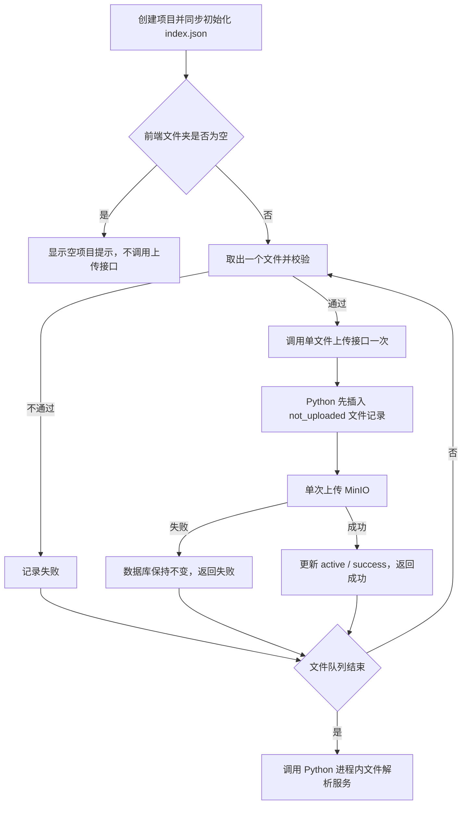

# 03 业务流程

本文档说明 PM-Agent 智能项目管理 Agent 平台的核心业务流程。所有流程在初版尽量轻量，避免引入重型 BPM 引擎。

---

## 一、角色定义

| 角色 | 主要诉求 | 权限要点 |
|---|---|---|
| 项目经理 | 进度、风险、资源、报告 | 项目管理、风险处理、报告发布、Agent 高权限工具 |
| 产品经理 | 需求、变更、优先级 | 需求管理、迭代规划 |
| 开发人员 | 任务、阻塞 | 自己任务的更新、查看项目状态 |
| 测试人员 | 测试计划、缺陷 | 测试任务管理、缺陷登记 |
| 管理员 | 用户、权限、系统配置 | 全部权限 |
| Agent 助手 | 自动化辅助 | 只能调用受控工具 |

---

## 二、项目生命周期

```text
未开始 → 进行中 → 暂停 / 延期 → 已完成 → 已归档
```

### 关键事件

- 创建项目（项目经理）；
- 启动项目（项目经理）；
- 项目阶段变更（项目经理）；
- 项目暂停 / 恢复（项目经理）；
- 项目归档（管理员或项目经理）；
- 项目删除把记录标记为 `disabled`，同时记录 `deleted_at` 和三十天后的 `purge_after`，保留期内继续保留项目文件和 MinIO 上下文；
- `disabled` 项目不参与名称判重，再次创建同名项目时生成新项目 ID 和空白上下文；
- 外部定时器扫描超过 `purge_after` 的项目，先清空 MinIO 项目前缀，确认无剩余对象后再物理删除项目及其级联文件记录；单个项目清理失败时跳过，等待下一次定时扫描；
- 项目变更记录入 `pm_project_status_log`。

---

## 三、需求生命周期

```text
草稿 → 待评审 → 已确认 → 开发中 → 已交付 → 已验收 → 已上线 → 已取消
```

### 业务规则

- 草稿可以由产品或 Agent 创建；
- 已确认后需求变更需要记录到 `pm_requirement_change_log`；
- 已确认需求才能拆解为任务；
- 已上线需求自动归档，可作为知识沉淀候选。

### Agent 介入点

- 草稿生成：根据用户口述自动生成结构化需求；
- 验收标准生成：根据需求自动生成验收标准草稿；
- 变更分析：识别变更对已有任务的影响。

---

## 四、任务生命周期

```text
待处理 → 开发中 → 待联调 → 待测试 → 已完成 → 已取消
```

### 业务规则

- 任务必须挂在项目下，可选择关联需求与迭代；
- 任务依赖通过 `pm_task_dependency` 记录；
- 状态变更全部写入 `pm_task_status_log`；
- 临近截止时间自动触发提醒（第 5 阶段）。

### Agent 介入点

- 需求拆解：自动生成任务草稿；
- 进度问答：自然语言查询任务状态；
- 阻塞识别：发现长时间未更新或依赖未完成的任务。

---

## 五、迭代生命周期

```text
未开始 → 进行中 → 已结束 → 已复盘
```

### 业务规则

- 迭代有固定起止日期；
- 任务可挂载到迭代下；
- 迭代结束后可生成复盘报告；
- 每个迭代支持燃尽图。

### Agent 介入点

- 迭代规划建议：根据任务规模和成员负载给出承接量建议；
- 迭代复盘生成：根据完成情况自动起草复盘文档。

---

## 六、风险管理流程

```text
识别 → 评估 → 确认 → 处理中 → 已关闭
```

### 业务规则

- 风险来源：人工登记、Agent 自动识别；
- 风险等级：高、中、低；
- 自动识别的风险默认状态为“待确认”，项目经理确认后进入“处理中”；
- 风险类型：进度延期、资源冲突、需求变更、依赖阻塞、缺陷增多、测试滞后、发布风险。

### Agent 介入点

- 自动识别：每日扫描；
- 自然语言说明：Agent 生成风险描述与处理建议；
- 风险报告：定期生成项目风险报告。

---

## 七、会议纪要与待办流程

```text
上传纪要 / 录入文本 → Agent 提取 → 项目经理确认 → 转任务/风险 → 跟踪关闭
```

### 业务规则

- 纪要可由用户上传文档或粘贴文本；
- Agent 自动生成摘要与待办候选；
- 待办候选必须经过项目经理确认才落入业务系统；
- 关联到具体项目、任务、风险。

---

## 八、周报生成流程

```text
触发生成 → Agent 起草 → 项目经理编辑 → 确认发布 → 归档
```

### 业务规则

- 每周固定时间或手动触发生成；
- Agent 默认基于数据生成草稿；
- 必须人工确认后才能发布；
- 历史周报全部归档；
- 支持导出 Markdown / Word / PDF（第 7 阶段）。

---

## 九、Agent 工具调用流程

Agent 工具调用流程、注册信息、首批工具与高风险确认规则以 [06-Agent设计.md](./06-Agent设计.md) 第 7、8 节为唯一权威，本文不再重复描述。

---

## 十、通知与提醒流程

```text
事件触发 → 通知路由 → 渠道发送 → 用户接收 → 操作回写
```

### 业务规则

- 事件来源：任务即将到期、任务延期、风险新增、周报生成、Agent 待办；
- 渠道：站内消息（必做），邮件、企微、钉钉（第 7 阶段可选）；
- 用户可设置接收偏好；
- 所有通知留存历史。

---

## 十一、权限与审计

- 所有关键操作（创建、删除、状态变更、权限变更）写入审计日志（**审计日志完整实现延至第 7 阶段或更早增强阶段；第 1 阶段仅留注解占位**）；
- Agent 自动操作必须可追溯（依托 `agent_trace`，第 3 阶段落地，不随审计延期）；
- 用户操作必须经过 Bearer JWT 与 Redis 会话鉴权；
- 工具调用必须校验调用方身份与权限。

---

## 十二、状态机统一约定

- 状态使用小写字符串 code 存储，例如 `pending`、`developing`、`blocked`、`done`；
- 每次状态变更写入 `*_status_log` 表，包含旧状态、新状态、操作人、时间、备注；
- 非法状态流转必须抛出业务异常，统一错误码段为 `3xxxx`。

---

## 十三、Agent 与业务的协作原则

1. Agent 永远不直接写库；
2. Agent 自动生成的结果默认为“草稿”，由人工确认；
3. Agent 高风险操作必须有人工确认入口；
4. Agent 行为必须可追溯、可解释、可关闭；
5. Agent 不应在没有数据支撑时给出业务建议。

### 显式学习流程

```text
用户主动学习 → 模型提取候选 → 用户查看／修改／确认
→ 后端条件更新对应固定上下文文件 → 记录来源与变更
```

- 显式学习用于替代对话后的隐式学习，不改变 MinIO 正式目录结构。
- 未确认候选、助手回答和模型推断不得参与正式召回。
- 确认后的项目规则写入 `system/project_specification.json`，记忆写入长短期记忆固定文件，习惯写入 `system/user_habits/*.json`。
- 学习草稿、反馈和确认状态属于工作流数据，不是正式上下文正文。
- 文件解析与显式学习更新同一个项目规范文件，文件刷新不得覆盖用户确认规则。

## 十四、项目文件单文件上传流程



- 前端逐文件校验、逐文件顺序上传并汇总结果。
- 当前流程不自动重试，失败文件只提示用户后续更新项目。
- Python 在数据库事务外执行 MinIO PUT。
- 文件先以 `uploading / not_uploaded` 落库，成功后更新为 `active / success`。
- MinIO 失败后不更新文件行。
- 单文件上传不改写 `index.json`，项目创建时的初始化索引保持不变。
- 文件队列结束后调用解析接口，当前接口不实现解析业务。
- 当前链路不发布 RabbitMQ 消息、不写 Outbox、不调用 Python。
- 详细规则以 [18-项目文件可靠上传模块设计.md](./18-项目文件可靠上传模块设计.md) 为唯一权威。
