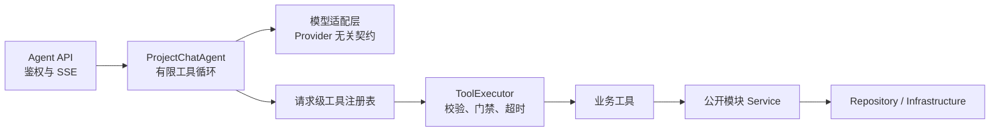

# Agent 设计

## 1. 目标与范围

当前版本提供模型原生工具调用、请求级工具注册表、安全执行器、有限 ReAct 循环以及 JSON/SSE 两种响应模式。当前已注册 `get_current_project`、`list_current_project_files` 和 `list_owned_projects` 三个真实只读工具，分别查询当前项目、当前项目公开文件和当前用户拥有的项目。

当前不实现写工具、人工确认持久化、Agent Trace 数据表、并行工具执行和 Qwen/Ollama 工具协议适配。这些能力保留扩展点，但不能作为已交付能力使用。

## 2. 运行边界

Agent 与传统业务模块运行在同一个 FastAPI 进程中，但依赖边界保持隔离：

Agent、LLM、Prompt 和工具不得获取数据库 Session，不跨模块访问表，不调用 Repository，也不执行模型生成的 SQL。业务工具只依赖目标模块公开 Service。

## 3. 组件职责

| 组件 | 职责 | 禁止事项 |
|---|---|---|
| `LLMAssistantTurn` / `LLMTurnStreamEvent` | 统一文本、推理内容、工具调用、流式增量和 token 用量 | 携带业务 Service 或鉴权对象 |
| Provider Client | 把厂商协议转换为统一 LLM 契约 | 选择业务工具或执行业务逻辑 |
| `ToolRegistry` | 显式注册本请求允许调用的工具，生成模型函数定义 | 自动扫描模块、注册未注入依赖的全局单例 |
| `ToolExecutor` | 查找工具、解析 JSON、Pydantic 校验、确认门禁、超时、结果校验和错误收敛 | 直接访问数据库或信任模型身份字段 |
| 业务工具 | 把已校验参数映射到公开 Service | 接收 Session、Repository、JWT 或执行动态 SQL |
| `ProjectChatAgent` | 控制模型决策、工具 Observation 回传、步骤上限和最终回答 | 包含具体模块的数据访问实现 |

## 4. 原生工具调用链路

1. FastAPI 完成 Bearer JWT 校验，并取得可信 `principal.user_id`。
2. 请求依赖构造项目与项目文件 Service、三个只读业务工具、请求级 `ToolRegistry` 和 `ToolExecutor`。
3. Agent 根据 Provider 能力生成工具定义；不支持原生或流式工具调用时立即返回 `40001`。
4. 模型返回文本或 `tool_calls`。工具调用 ID 和原始 JSON 参数保持字符串形式，不提前猜测类型。
5. Agent 把 assistant 工具决策加入上下文，执行器按工具输入模型校验参数并调用公开 Service。
6. 工具结果转换为结构化 Observation，以对应 `tool_call_id` 回传模型。
7. 模型没有继续请求工具时返回最终中文回答；最多执行 5 个模型步骤和 8 次工具调用。

非流式响应汇总本轮所有模型调用的 token 用量。流式响应在工具阶段发送 `tool_call`、`tool_result`，在最终回答阶段发送 `token` 和 `done`。

## 5. 注册与执行规则

- 工具名称使用小写字母、数字和下划线，最长 64 字符；名称必须唯一并提供清晰描述。
- 每个工具必须声明 Pydantic 输入、输出模型、操作类型、超时时间和是否需要人工确认。
- 工具注册表是请求级白名单，不使用装饰器副作用或目录自动扫描。
- 工具上下文中的用户 ID 来自 JWT，项目 ID 来自已校验的对话上下文；模型只能生成业务参数，不能覆盖身份。
- 未注册工具、非法参数、超时、业务异常和输出结构错误统一转换为安全 Observation，让模型可以解释失败，但日志保留 traceId 和调用 ID。
- 当前工具只读且顺序执行。引入并行执行前必须确认数据库会话和业务 Service 可安全并发。

## 6. 当前工具

| 工具 | 类型 | 输入 | 输出 | Service |
|---|---|---|---|---|
| `get_current_project` | 只读 | 无模型业务参数 | 项目 ID、名称、状态、创建和更新时间 | `ProjectService.get_owned` |
| `list_current_project_files` | 只读 | 可选 `business_code`：`project` / `user` | 公开文件总数及文件名称、相对路径、类型、大小、处理状态和更新时间 | `ProjectFileService.list_files` |
| `list_owned_projects` | 只读 | 无模型业务参数 | 当前用户项目总数及项目 ID、名称、状态、创建和更新时间 | `ProjectService.list_owned` |

工具会再次执行资源归属校验。完整业务结果只作为模型 Observation 使用，对客户端仅暴露工具状态和安全摘要。项目文件工具不向模型返回 MinIO 存储路径、对象键或预签名地址。

## 7. Provider 能力

Provider 通过能力对象显式声明 `native_tool_calling`、`streaming_tool_calling`、`parallel_tool_calling` 和 `reasoning_content_round_trip`。当前仅 DeepSeek 适配器开启原生与流式工具调用；其他 Provider 在完成协议实现和测试前保持关闭。

模型适配层需要完整回传 assistant 的 `tool_calls`；需要推理内容回传的模型还必须保留 `reasoning_content`，否则下一轮请求可能被 Provider 拒绝。

## 8. 权限与身份

- `/api/v1/agent/chat` 必须携带 Bearer JWT。
- JWT `sub` 必须与请求体 `user.user_id` 一致。
- 客户端不得提交 `assistant.tool_calls` 或 `tool` 消息，避免伪造 Observation。
- 工具执行前由目标模块 Service 再次校验资源归属和状态。
- 删除、权限变更、对外通知等高风险动作必须保留人工确认。
- 写工具需要权限校验、幂等门禁、人工确认和 Agent Trace，当前版本不注册写工具。

## 9. Trace

`X-Trace-Id` 从前端进入 FastAPI，并写入统一响应与响应头。Agent 请求中的 `trace_id` 用于现有流式事件兼容；后续应由接入层统一校验两者一致。

Trace 落库后至少记录：

- 用户、项目、会话与轮次；
- 模型提供方、模型名和 token 用量；
- 工具名、结构化参数摘要、执行状态、错误标识与耗时；
- 人工确认状态；
- 错误码与 traceId。

当前版本只通过响应事件和应用日志提供运行观测，不宣称已经完成 Agent Trace 持久化。

## 10. 文件解析

项目文件解析是 Python 应用服务，不再是跨 Java/Python HTTP：

1. Service 查询 `active`、尚无有效分析版本且解析次数小于 3 的文件；
2. 通过对象键使用 MinIO SDK 读取；
3. 复用既有解析器、Prompt 和模型适配器；
4. Pydantic 校验输出与文件身份；
5. 写 `system/file_details/*.json`；
6. 条件更新分析投影与解析次数；
7. 从数据库完整生成 `system/index.json`；
8. 将当前有效文件分析投影交给结构化模型生成器，经 Pydantic 校验和稳定 ID 合并后写入 `system/project_specification.json`。

文件详情和项目规范复用同一个结构化 JSON 模型调用组件，具体 Prompt 和 Pydantic 输出模型保持独立。MinIO、LLM 等外部调用位于数据库事务外。单文件分析失败记录错误并继续处理其他候选文件；解析入口可重复调用，以恢复文件级失败或项目规范构建失败。

## 11. 模型与成本

- 模型输出优先使用结构化 JSON。
- 关键输出必须经 Pydantic 或 JSON Schema 校验。
- 模型路由、Prompt 缓存和 token 预算沿用既有 LLM 适配层。
- 禁止把数据库凭据、JWT、预签名地址或敏感文件原文写入 Prompt。
- 本次迁移不扩展完整 RAG、训练或评测能力。

## 12. 验收标准

- DeepSeek 非流式和流式响应都能正确拼装分片工具参数并完成至少一轮工具调用。
- 模型请求未注册工具或非法参数时，业务 Service 不会被调用，模型可收到结构化失败 Observation。
- 工具使用 JWT 用户身份调用 `ProjectService.get_owned`，无法通过请求或模型参数切换用户。
- 达到步数或工具次数上限时终止循环并返回稳定错误码。
- 客户端提交工具历史会在请求校验阶段被拒绝。
- 既有纯文本 LLM 接口保持兼容，项目全量测试通过。

## 13. 待确认问题

- 写工具进入开发前，需要确定人工确认令牌、幂等键和 Trace 持久化的数据模型。
- Qwen 需要保留 Ollama 当前接口还是迁移到原生工具协议，待对应 Provider 开发时确认。
