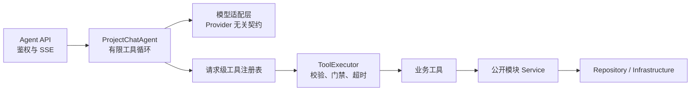

# Agent 设计

## 1. 目标与范围

当前版本通过普通 JSON 接口提供模型原生工具调用、请求级工具注册表、有限工具循环、持久化会话、显式学习和文本报告。流式编排函数保留兼容测试，本轮不开放新的 SSE 业务入口。实际注册八个只读工具，目录由注册表动态生成。

当前不实现写工具、模型写入授权流程、并行工具执行和 Qwen/Ollama 工具协议适配。学习、条目管理及报告生成由用户明确调用业务接口；轨迹使用 `agent_run` 持久化。

## 2. 运行边界

Chat 业务按职责划分为会话、显式学习、正式上下文读取与更新、运行记录和旧协议兼容子包。`chat/api.py` 仅聚合路由，`conversation/api.py`、`learning/api.py`、`context/api.py`、`runs/api.py` 分别承载对应接口；`legacy/api.py` 保留原无状态问答。报告的请求结构、模型输出约束和依赖装配归报告模块，结构化生成器装配复用 `app.llm.dependencies`。草稿预览、反馈和确认接口见接口规范第 10 节。

各业务服务分别位于职责子包。`learning` 负责模型提取、定向反馈、草稿和确认；上下文服务负责把已确认候选映射到 `project_specification.json`、长短期记忆或用户习惯固定文件，并提供统一读取视图。草稿、反馈和确认计划属于工作流数据，不参与召回。所有模型和 MinIO 调用之前释放数据库事务；正式内容始终以 `system/` 固定文件为准。

会话、学习工作流与运行分别维护自己的持久化职责。`chat/dependencies.py` 统一装配共享请求级 Session；数据库负责会话游标、候选审核状态、来源变更、租约和运行记录。用户确认后，业务服务在事务外对目标固定文件执行条件写，再保存发布结果；仓储不自行提交，也不调用其他仓储。报告和文件解析通过公开服务协作，不直接构造其他模块仓储。目录、依赖及事务详情见 [Chat 模块分层设计](./26-Chat模块分层设计.md)。

Agent 与传统业务模块运行在同一个 FastAPI 进程中，但依赖边界保持隔离：



Agent、LLM、Prompt 和工具不得获取数据库 Session，不跨模块访问表，不调用 Repository，也不执行模型生成的 SQL。业务工具只依赖目标模块公开 Service。

## 3. 组件职责

| 组件 | 职责 | 禁止事项 |
|---|---|---|
| `LLMAssistantTurn` / `LLMTurnStreamEvent` | 统一文本、推理内容、工具调用、流式增量和 token 用量 | 携带业务 Service 或鉴权对象 |
| Provider Client | 把厂商协议转换为统一 LLM 契约 | 选择业务工具或执行业务逻辑 |
| `ToolRegistry` | 显式注册本请求允许调用的工具，生成模型函数定义 | 自动扫描模块、注册未注入依赖的全局单例 |
| `ToolExecutor` | 查找工具、解析 JSON、Pydantic 校验、确认门禁、超时、结果校验和错误收敛 | 直接访问数据库或信任模型身份字段 |
| 业务工具 | 把已校验参数映射到公开 Service | 接收 Session、Repository、JWT 或执行动态 SQL |
| `ProjectChatAgent` | 控制模型决策、工具 Observation 回传、步骤上限和最终回答 | 包含具体模块的数据访问实现 |

## 4. 原生工具调用链路

1. FastAPI 完成 Bearer JWT 校验，并取得可信 `principal.user_id`。
2. 请求依赖构造项目、文件、上下文、报告 Service、八个只读业务工具、请求级 `ToolRegistry` 和 `ToolExecutor`。
3. Agent 根据 Provider 能力生成工具定义；不支持原生或流式工具调用时立即返回 `40001`。
4. 模型返回文本或 `tool_calls`。工具调用 ID 和原始 JSON 参数保持字符串形式，不提前猜测类型。
5. Agent 把 assistant 工具决策加入上下文，执行器按工具输入模型校验参数并调用公开 Service。
6. 工具结果转换为结构化 Observation，以对应 `tool_call_id` 回传模型。
7. 模型没有继续请求工具时返回最终中文回答；最多执行 5 个模型步骤和 8 次工具调用。

非流式响应汇总本轮所有模型调用的 token 用量。流式响应在工具阶段发送 `tool_call`、`tool_result`，在最终回答阶段发送 `token` 和 `done`。

## 5. 注册与执行规则

- 工具名称使用小写字母、数字和下划线，最长 64 字符；名称必须唯一并提供清晰描述。
- 每个工具必须声明 Pydantic 输入、输出模型、操作类型、超时时间和是否需要人工确认。
- 工具注册表是请求级白名单，不使用装饰器副作用或目录自动扫描。
- 工具上下文中的用户 ID 来自 JWT，项目 ID 来自已校验的对话上下文；模型只能生成业务参数，不能覆盖身份。
- 未注册工具、非法参数、超时、业务异常和输出结构错误统一转换为安全 Observation，让模型可以解释失败，但日志保留 traceId 和调用 ID。
- 当前工具只读且顺序执行。引入并行执行前必须确认数据库会话和业务 Service 可安全并发。

## 6. 当前工具

| 工具 | 类型 | 输入 | 输出 | Service |
|---|---|---|---|---|
| `get_current_project` | 只读 | 无模型业务参数 | 项目 ID、名称、状态、创建和更新时间 | `ProjectService.get_owned` |
| `list_current_project_files` | 只读 | 可选 `business_code`：`project` / `user` | 公开文件总数及文件名称、相对路径、类型、大小、处理状态和更新时间 | `ProjectFileService.list_files` |
| `list_owned_projects` | 只读 | 无模型业务参数 | 当前用户项目总数及项目 ID、名称、状态、创建和更新时间 | `ProjectService.list_owned` |
| `retrieve_project_context` | 只读 | 查询文本、召回范围、证据深度和结果上限 | 规范、文件详情、记忆及按需脱敏原文证据 | `AgentInputContextGateway` → `InputContextRetrievalService` |
| `list_context_entries` | 只读 | 可选条目类型和关键词 | 有效词条、习惯、记忆、来源和版本 | `ContextService.list_entries` |
| `get_project_report` | 只读 | 可选报告类型或 ID | 已有报告、生成时间和来源版本 | `ReportService.list` |
| `read_project_file_evidence` | 只读 | 文件 ID、起止行 | 真实脱敏原文、哈希和截断标记 | `ProjectFileService.read_evidence` |
| `get_context_changes` | 只读 | 可选条目 ID | 前后版本、原因和来源消息 | `ContextService.changes` |

工具会再次执行资源归属校验。普通问答响应只返回状态和安全摘要，完整 Observation 可由拥有该项目的用户通过运行轨迹接口查询。项目文件工具不向模型返回 MinIO 存储路径、对象键或预签名地址。

## 7. Provider 能力

Provider 通过能力对象显式声明 `native_tool_calling`、`streaming_tool_calling`、`parallel_tool_calling` 和 `reasoning_content_round_trip`。当前仅 DeepSeek 适配器开启原生与流式工具调用；其他 Provider 在完成协议实现和测试前保持关闭。

模型适配层需要完整回传 assistant 的 `tool_calls`；需要推理内容回传的模型还必须保留 `reasoning_content`，否则下一轮请求可能被 Provider 拒绝。

## 8. 权限与身份

- `/api/v1/agent/chat` 必须携带 Bearer JWT。
- JWT `sub` 必须与请求体 `user.user_id` 一致。
- Agent 请求、工具输出和项目上下文 JSON 中的用户 ID、项目 ID 使用十进制字符串；进入可信业务上下文后转换为 Python 整数参与归属校验。
- 客户端不得提交 `assistant.tool_calls` 或 `tool` 消息，避免伪造 Observation。
- 工具执行前由目标模块 Service 再次校验资源归属和状态。
- `record_status=disabled` 的项目在工具层表现为项目不存在，模型不能读取已惰性删除项目的上下文。
- 删除、权限变更、对外通知等高风险动作必须保留人工确认。
- 写工具需要权限校验、幂等门禁、人工确认和 Agent Trace，当前版本不注册写工具。

## 9. Trace

`X-Trace-Id` 从前端进入 FastAPI，并写入统一响应与响应头。Agent 请求中的 `trace_id` 用于现有流式事件兼容；后续应由接入层统一校验两者一致。

Trace 落库后至少记录：

- 用户、项目、会话与轮次；
- 模型提供方、模型名和 token 用量；
- 工具名、结构化参数摘要、执行状态、错误标识与耗时；
- 人工确认状态；
- 错误码与 traceId。

持久化接口将文件解析、问答、学习和报告的模型轨迹写入 `agent_run`，工具轨迹同时保存参数、完整结果、错误、步骤和耗时；旧 `/chat` 仍保留无状态兼容语义。每次模型请求的原始 usage、协议消息和完成原因用于排障。

## 10. 输入上下文受控召回

项目问答在首次模型判断前通过 `UserInputContextService` 归一化当前轮最后一条用户消息，并执行最多五条召回。持久化会话入口同时为相关文件补充最多两个文件、合计 12 KiB 的脱敏原文；旧入口默认仍只取摘要。模型发现证据不足时，可调用 `retrieve_project_context` 使用新关键词或原文证据深度再次召回，或用 `read_project_file_evidence` 精确核查目标文件。前置召回和工具召回复用同一个请求级 `InputContextRetrievalService`，相同查询和已读取 MinIO 对象不会重复加载，单次 Agent 请求最多执行三次不同召回。

在线召回归入 `app.input_context`，与用户输入归一化形成同一个输入处理模块；`app.project_context` 只保留索引、文件详情和项目规范等上下文资产的模型、生成及提取能力。依赖方向固定为 `Agent / Tool → input_context → project_context 资产模型与基础设施`，资产生成代码不得反向依赖在线召回。

`input_context` 内部分层如下：

| 组件 | 职责 |
|---|---|
| `normalization/` | 归一化正式实现，负责词库、文本处理、匹配、消歧、映射和运行时降级；`app.normalization` 仅保留兼容导出 |
| `schemas.py`、`service.py` | 定义并组装 `UserInputContext`，统一承载原文、归一化结果、召回结果和降级状态 |
| `retrieval/planning.py`、`policy.py` | 生成带来源和权重的词项，决定数据源、证据级别、候选预算和请求级限制 |
| `retrieval/snapshot.py` | 校验可信项目身份和对象前缀，限制相对路径并缓存 MinIO 对象 |
| `retrieval/sources/` | 由独立 Provider 把文件、规范、记忆、习惯和更新日志转换为统一候选，并为短名单补充文件详情 |
| `retrieval/ranking.py` | 执行带权字段评分、完整短语加分、稳定排序、评分分解和最佳内容切片定位 |
| `retrieval/evidence.py` | 在原文配额内完成文件提取、行号截取、敏感阻断和脱敏 |
| `retrieval/service.py` | 只负责编排上述组件、结果缓存、召回次数限制和统一结果组装 |

文件和规范沿用 system 快照的可解释词法召回：标准术语、技术标识、原始短语和中文兜底词组按来源赋予不同权重；先生成候选，再为前 `2 × limit`、最多十六个文件候选读取详情并二次排序。用户习惯只参与偏好问题，更新日志只参与变更问题；持久化会话的有效习惯、规则和记忆只读取 MinIO `system/` 固定文件，每次读取重新校验有效状态与期限。原文补证最多两个文件、合计 12 KiB、每文件最多 100 行，并在进入模型前执行既有敏感内容阻断和脱敏，不改变相关性分数。

证据 `kind` 区分 `source` 原文、`summary` 摘要和 `user_statement` 用户陈述。原文行范围反映实际返回内容，截取时带 `truncated`。摘要没有提及某事实，不能据此断言原文件没有记录；涉及文档与用户纠正的比较时必须核查原文，无法取得原文则明确标记尚未核实。

`NormalizationService` 是应用级只读单例，应用启动时必须完成公共和项目管理词库校验及自动机预热；项目词库缺失时退回前两级词库。`InputContextRetrievalService` 保持请求级实例，其对象缓存、结果缓存和三次召回限制不得跨请求共享。

召回位置先使用 `StorageLocationFactory` 的标准路径，再兼容四位补零的测试路径；任何索引都必须校验项目 ID、用户 ID、桶名和对象前缀。当前固定夹具使用 bucket `pm-agent`、对象前缀 `PM-AGENT/0721/0721/`、项目目录 `project_test/`。对象引用必须是受控相对路径，模型不能传入用户 ID、项目 ID、MinIO 对象键或预签名地址。

索引缺失或身份不一致时不生成项目事实；详情缺失或哈希不一致时退回索引摘要；原文件缺失或敏感阻断时退回详情证据。零命中结果显式携带 `no_evidence=true`，Prompt 要求模型说明当前项目资料中未找到，不能自行补全。

## 11. 文件解析

项目文件解析是 Python 应用服务，不再是跨 Java/Python HTTP：

1. Service 查询 `active/success`、尚无有效分析版本、失败可重试或需要升级到当前分析版本的文件；
2. 通过对象键使用 MinIO SDK 读取；
3. 复用既有解析器和 Prompt，通过统一 `DeepSeekClient` 调用 `/chat/completions`；
4. 在 Prompt 前阻断明确凭据内容并脱敏常见密钥、令牌和连接串；
5. Pydantic 校验模型返回的语义字段和结构化规则候选，文件身份字段由服务端构造；
6. 以完整内容哈希和分析版本写 `system/file_details/*.json`，再条件更新分析投影与解析次数；
7. 将当前有效详情中的规则候选按批次交给结构化模型生成器，每批提供完整来源清单和已合并规范作为上下文，只生成新增或修改的条目；全部批次通过 Pydantic 校验并按稳定 ID 合并后写入 `system/project_specification.json`；
8. 最后从数据库完整生成 `system/index.json`。

文件详情和项目规范复用同一个 `StructuredJsonGenerator` 与 DeepSeek 客户端，具体 Prompt 和 Pydantic 输出模型保持独立。结构化调用启用 `response_format={"type":"json_object"}`，设置最大输出 token 与文件解析专用超时，并拒绝空响应和因 token 上限截断的响应。MinIO、LLM 等外部调用位于数据库事务外。单文件分析失败记录错误并继续处理其他候选文件；项目规范刷新失败保留旧对象；解析接口通过结构化批次结果返回文件、规范和索引的实际状态，不把部分失败报告为完整成功。

DeepSeek 对不携带工具的非流式 JSON 生成请求显式关闭思考模式，避免默认思考消耗文件详情和项目规范的输出额度；普通对话和工具编排保持原模式。解析使用独立的 `PM_AGENT_FILE_DETAIL_MAX_OUTPUT_TOKENS`，默认 `24576`，不再复用聊天上下文的输出预留。结构化生成的普通日志记录结束原因、生成额度、输出 token 数和内容长度，不记录正文或思考文本；完整协议仅保存在有权限校验的运行轨迹和被 Git 忽略的本地测试记录中。Pydantic 失败仅记录字段位置、错误类型和输入值的类型名称，不记录输入值本身；业务响应区分截断、空内容和字段不符合要求。

`related_files` 的标准输出为对象数组，例如 `[{"path":"src/api.ts","relation":"导入接口客户端"}]`。模型返回非空路径字符串元素时，语义模型在校验前将其转为 `{"path":"原路径"}`，不推断额外关系。空字符串、数字、空值和嵌套数组仍被拒绝，最多五十项，存储详情继续使用对象数组。

项目规范每批最多十二条候选，同时以候选、来源及摘要序列化后的估算长度 12000 字符作为分批预算；单条候选超出预算时独占一个批次。该字符预算用于拆分输入，不等同于模型 token 上限。单个文件可以分入多个批次，所有有效候选均参与处理。模型只返回本批增量，未提及的旧规则、开发阶段字段、历史变更和其他批次的忽略项由服务端保留。

规范批次发生 `finish_reason=length` 时，服务端丢弃不完整输出，将该批候选二分后重新调用；单条候选仍截断则终止刷新。空输出、字段校验失败和其他调用异常不触发拆批重试。全部批次成功后才执行来源有效性复核并写入 MinIO，任何批次失败都保留原规范。完整文件清单与当前批次候选分开标记，不因某条候选暂未进入当前批次就删除旧规则。分批会增加请求次数，单次输出额度和超时继续沿用上述配置。

项目规范的正文命名遵循固定契约：`technical_constraints` 使用 `constraint`，`development_approach`、`coding_rules`、`document_rules`、`risk_rules` 使用 `rule`。仅在规范模型输出入口，对“标准字段缺失、另一个字段为字符串”的单一字段混用进行确定性改名；不修改正文、来源、身份、状态或历史。两个字段同时存在、类型错误或其他未知字段仍由 Pydantic 严格拒绝，持久化模型不接受别名。纠正日志只记录字段路径与数量，不包含规则原文；此过程不增加模型调用，后续校验或任一批次失败仍保留旧规范。

文件解析模型通过以下环境变量显式启用：

```dotenv
PM_AGENT_FILE_DETAIL_LLM_ENABLED=true
PM_AGENT_FILE_DETAIL_LLM_PROVIDER=deepseek
PM_AGENT_FILE_DETAIL_REQUEST_TIMEOUT_SECONDS=180
PM_AGENT_FILE_DETAIL_MAX_OUTPUT_TOKENS=24576
PM_AGENT_FILE_DETAIL_MAX_SOURCE_BYTES=262144
```

`PM_AGENT_FILE_DETAIL_MAX_SOURCE_BYTES` 约束解析后准备送入模型的 UTF-8 文本，超限文件记录 `FILE_DETAIL_SOURCE_TOO_LARGE`，不会调用模型；原始文件仍由上传限制和具体解析器限制负责门禁。旧的 Qwen/Ollama 客户端仅保留给显式选择的本地模型功能，不再参与在线文件详情和项目规范解析链路。

## 12. 模型与成本

- 模型输出优先使用结构化 JSON。
- 关键输出必须经 Pydantic 或 JSON Schema 校验。
- 模型路由、Prompt 缓存和 token 预算沿用既有 LLM 适配层。
- 禁止把数据库凭据、JWT、预签名地址、私钥或明确凭据原文写入 Prompt。
- 文件解析在调用 DeepSeek 前执行确定性敏感检查：私钥等高风险内容直接阻断模型分析，常见密钥、令牌和连接串先脱敏。该能力是 MVP 安全门禁，不替代专业 DLP，启用文件解析时仍只应选择允许外传的项目文件。
- 本次迁移不扩展完整 RAG、训练或评测能力。

## 13. 验收标准

- DeepSeek 非流式和流式响应都能正确拼装分片工具参数并完成至少一轮工具调用。
- 模型请求未注册工具或非法参数时，业务 Service 不会被调用，模型可收到结构化失败 Observation。
- 工具使用 JWT 用户身份调用 `ProjectService.get_owned`，无法通过请求或模型参数切换用户。
- 达到步数或工具次数上限时终止循环并返回稳定错误码。
- 客户端提交工具历史会在请求校验阶段被拒绝。
- 项目事实在首次模型判断前完成召回，后续工具召回与前置召回复用缓存和统一结果协议。
- 固定夹具 R-01 至 R-07 的正确来源均进入前五条结果，精确代码问题能返回经过脱敏的路径和行号证据。
- 项目索引身份不一致、对象路径越界或原文件包含禁止内容时，不向模型回填不可信原文。
- 既有纯文本 LLM 接口保持兼容，项目全量测试通过。

## 14. 待确认问题

- 写工具进入开发前，需要确定人工确认令牌、幂等键和 Trace 持久化的数据模型。
- Qwen 需要保留 Ollama 当前接口还是迁移到原生工具协议，待对应 Provider 开发时确认。

## 15. 后端闭环与权威数据

`agent_conversation` 保存项目归属和学习游标；`agent_message` 保存用户、助手消息与服务端生成的完整协议组；`agent_run` 保存请求幂等、状态、结果和轨迹。会话租约防止并发覆盖；文件解析的幂等键只识别同一次请求，`active_scope_key` 和 `lease_until` 只限制同一项目并发，二者不混用。解析使用 120 秒滑动租约，独立数据库会话每 30 秒续租；终态和取消立即释放，恢复查询和新解析入口会立即收敛过期运行，后端同时每 30 秒执行一次项目解析租约清理。服务启动时会立即清理已过期或缺少租约信息的文件解析运行，但保留仍在有效期内的运行以兼容多进程。过期运行保留失败记录并允许用户使用新幂等键重试；没有 usage 的请求继续保留费用估算。

`agent_learning_draft` 保存候选、反馈、确认计划和逐目标结果；旧上下文表仅作为迁移与兼容审计来源，不是正式正文。MinIO `system/` 固定文件保存当前生效内容；后端缓存必须按固定对象的 ETag 或内容哈希失效。Redis 仍用于认证等既有能力。

显式 learn 结构化抽取用户新消息并保存待确认草稿，任何候选都不会因模型返回 confirmed=true 而自动生效。助手回答和工具结果不作为用户学习事实。用户可编辑候选或选择一组提交自然语言反馈；模型只能整理选中主题，输出仍待确认。确认绑定草稿版本及所选内容，检查目标固定文件的 ETag、来源和冲突，再将内容合并到项目规范、长短期记忆或用户习惯原路径。短期默认七天，直接纠正、晋升和失效不调用模型。文件解析与人工学习共用 `project_specification.json`，并保留人工纠正。见 [改造设计](./27-云端上下文与显式学习改造.md)。

运行时不再创建 `context/manifest.json`、`context/versions/` 或 `context/drafts/`。旧 ContextStore 仅供迁移工具读取，旧发布接口只适配固定文件当前状态。迁移工具逐项目比较 Manifest 有效内容与固定文件，按稳定 ID 合并，并输出文件哈希、冲突、无法归类内容和草稿迁移数量；确认核对前不删除旧对象。

业务时间统一为 `Asia/Shanghai`：数据库写入上海本地 `DATETIME`，连接会话固定 `+08:00`，租约比较使用统一时间工具，API 输出带偏移 RFC 3339。前端对新值按上海时区展示，旧无偏移值按上海时间兼容，不再补 `Z`。

用户词库复用 Aho-Corasick、最长匹配和版本缓存；缓存键包含用户、项目及有效条目版本。同义词冲突不擅自选择词义。旧 `app.normalization` 导入仍兼容。

`pm_report` 保存开发或风险 Markdown 报告、生成时间、来源文件哈希和上下文版本。报告从当前源文件分批取证，以服务端证据 ID 校验引用，再渲染路径和实际行范围；生成期间来源变化时拒绝保存过期报告。用户纠正与源码不一致时保留双方来源，不宣称代码已修改。

报告证据使用 `E0001` 形式的独立编号，路径和行号保留为服务端元数据，模型只能复制编号。首次引用越界时记录校验失败并限定纠正一次；仍越界则整份报告失败，不保存半份结果。纠正调用同样受 token、超时和累计费用预算约束。

新增工具：`list_context_entries`、`get_project_report`、`read_project_file_evidence`、`get_context_changes`。文件证据工具仅接受当前项目文件 ID 和行范围，最多 200 行、32 KiB，复用脱敏规则；不接受任意路径、URL 或存储键。无需数据库工具注册表。

在线召回比较详情与索引时兼容 `sha256:` 前缀与裸摘要，但摘要必须是完整 SHA-256，且项目、文件、逻辑路径和详情引用均须一致。读取原文后再次计算哈希；对象被替换或索引过期时保留降级提示，不把未核实原文作为证据回填。

文件详情出现字段缺失或类型错误时，保留结构校验事件，并附安全错误位置和完整 Schema 纠正一次；仍不合格则返回失败，不填入默认空字段冒充成功。输出截断、空输出、网络错误不走此纠正路径，每次付费调用仍独立预留费用和记录用量。

默认 `deepseek-v4-flash`；应用上下文预算 131072，问答实际输出 16384，详情/规范 24576，学习 8192，报告 16384，单请求 180 秒。发送前按实际序列化输入保守计量，追加工具结果后重新检查，历史按完整协议组裁剪；累计 usage 仅用于统计。每轮最多五次模型交互、八次工具调用。测试费用先预留后按真实 usage 结算，未知 usage 保留预留，累计上限 30 元。
