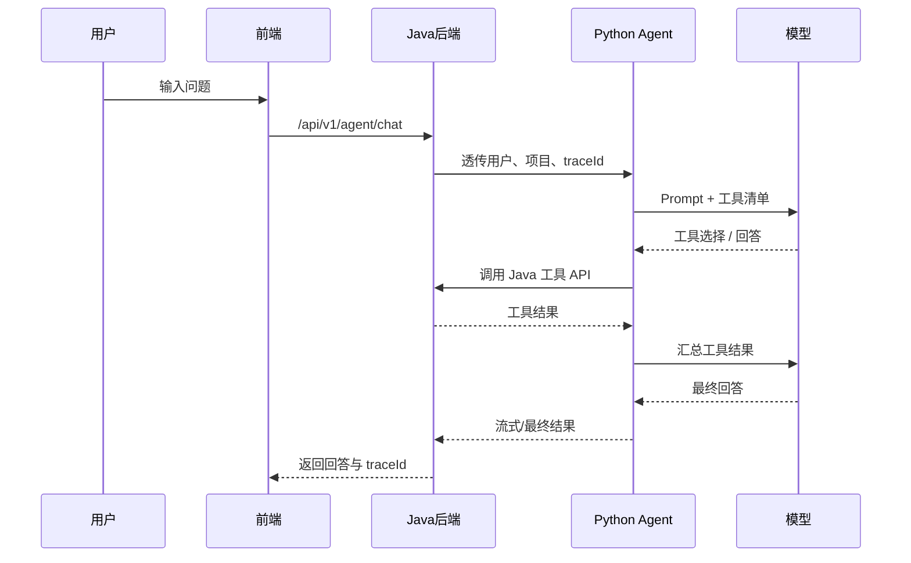

# 06 Agent 设计

本文档定义 PM-Agent 智能项目管理 Agent 平台的 Agent 编排、模型调用、工具调用、Trace、人工确认与分阶段落地方案。所有 Agent 能力必须通过 Java 工具 API 接入业务系统，禁止直接操作数据库。

---

## 1. 背景

PM-Agent 的核心价值不只是项目管理 CRUD，而是通过 Agent 自动理解项目状态、识别风险、生成报告、拆解需求。为了避免 Agent 黑盒化、越权操作和成本失控，需要在第 3 阶段前明确 Agent 架构与约束。

---

## 2. 目标

1. 支持项目自然语言问答、需求拆解、周报生成、风险分析；
2. 让 Agent 通过受控工具 API 查询和推动业务；
3. 所有 Agent 决策可追踪、可复盘、可调试；
4. 高风险动作必须人工确认；
5. 默认使用低成本模型，关键场景再升级。

---

## 3. 范围

### 3.1 本期范围

| 阶段 | 能力 |
|---|---|
| 第 3 阶段 | Agent 问答、流式输出、会话历史、Trace 落库 |
| 第 4 阶段 | 工具调用、需求拆解、周报草稿、Trace 可视化 |
| 第 5 阶段 | 风险分析、异步分析、规则 + 模型结合 |
| 第 6 阶段 | RAG 知识库、文档检索、引用来源 |

### 3.2 不做范围

- 第 1~2 阶段不启动 Python Agent 服务；
- 第 1~5 阶段不提前实现完整 RAG；
- Agent 不直接写数据库；
- Agent 不静默执行删除、权限变更、对外通知等高风险动作；
- 第一版不接入多个高成本模型供应商。

---

## 4. 总体架构

```text
用户 / 前端
   │
   │ /api/v1/agent/chat
   ▼
Java 后端
   │  鉴权、项目权限、traceId、幂等、工具 API
   │
   ├── 查询/写入业务表
   │
   └── HTTP/SSE 调用
       ▼
Python FastAPI Agent 服务
   │  Prompt、模型调用、工具选择、结构化输出
   │
   ├── 调用 Java 工具 API
   │
   └── 调用 DeepSeek / 后续模型 Provider
```

职责分工：

| 层 | 职责 |
|---|---|
| 前端 | 对话、流式展示、工具调用步骤、人工确认动作卡片 |
| Java 后端 | 业务数据、权限、幂等、工具 API、业务状态日志 |
| Python Agent | Prompt、模型调用、工具选择、流式输出、Trace 协作 |
| LLM | 意图识别、总结、拆解、解释、报告生成 |

---

## 5. 模型调用策略

### 5.1 第一版策略

- 默认运行时模型：DeepSeek；
- 调用方式：DeepSeek 优先 + 自研轻量 `ModelClient` 适配层；
- 不强制使用 OpenAI-compatible 协议；
- 不提前接入多个供应商；
- 后续接入 Claude / GPT / Gemini 时，通过 Provider 适配器扩展。

### 5.2 `ModelClient` 适配层职责

| 能力 | 说明 |
|---|---|
| 请求统一 | messages、temperature、max_tokens、stream |
| 响应统一 | content、usage、finish_reason、error |
| 流式事件统一 | token、message_start、message_end、error |
| 错误处理 | 统一异常结构与 traceId |
| 成本统计 | token、耗时、模型名、供应商 |
| Trace 接入 | 写入 `agent_trace` 相关字段 |

### 5.3 模型升级与成本边界

| 项 | 决策 |
|---|---|
| 月度运行时 LLM 成本目标 | 约 600 元人民币以内 |
| 默认模型 | DeepSeek 优先 |
| 升级条件 | 复杂推理、关键判断、最终润色 |
| 升级模型 | Claude、GPT，按任务收益选择 |
| 本地模型 | 后续扩展，暂不纳入当前阶段 |
| 模型供应商扩展 | 第一版不预接入多家，后续按 Provider 适配 |

按场景分层：

| 场景 | 默认模型 | 升级条件 |
|---|---|---|
| 意图识别 | DeepSeek | 识别不稳定、多轮上下文复杂 |
| 项目问答 | DeepSeek | 复杂推理或关键判断 |
| 需求拆解 | DeepSeek 起草 | 拆解质量不达标时升级 Claude / GPT |
| 周报生成 | DeepSeek 草稿 | 最终润色升级更强模型 |
| 风险分析 | DeepSeek / Claude | 关键风险判断可升级 |
| RAG 问答 | 第 6 阶段再细化 | 取决于召回质量与上下文长度 |

原则：默认模型不等于最强模型；模型升级必须可解释（为什么升级、提升什么、增加多少成本）。

---

## 6. Prompt 设计

### 6.1 Prompt 基本结构

```text
角色与目标
项目上下文摘要
可用工具清单
业务约束与禁止事项
输出格式要求
用户输入
```

### 6.2 Prompt 规则

1. Prompt 模板必须有稳定标识，如 `project_chat_v1`；
2. 输出给用户统一中文；
3. 信息不足时必须追问，不得编造项目、任务、人员、时间；
4. 涉及业务结构化结果时，必须使用 JSON Schema 或 Pydantic 校验；
5. 高风险动作输出 `requires_confirmation=true`，由前端展示确认卡片。

### 6.3 上下文窗口控制

1. 项目上下文只传当前任务需要的信息，不传全量项目数据；
2. 工具返回结果由 Agent 总结时优先传摘要；
3. 长列表只传 Top N 与统计信息，必要时让 Agent 追问；
4. RAG 阶段回答必须带引用，但不把所有召回片段塞进上下文；
5. 缓存可复用、非强实时结果（周报草稿、风险分析结果、Prompt 模板、字典等）；
6. 权限敏感结果、未脱敏隐私数据、高风险动作确认结果禁止缓存。

---

## 7. 工具调用设计

### 7.1 工具注册信息

每个工具必须声明：

| 字段 | 说明 |
|---|---|
| `tool_name` | 工具名，如 `query_task_list` |
| `description` | 工具用途 |
| `input_schema` | 输入 JSON Schema / Pydantic |
| `output_schema` | 输出 JSON Schema / Pydantic |
| `permission` | 调用所需权限 |
| `write_operation` | 是否写业务 |
| `requires_confirmation` | 是否需要人工确认 |
| `idempotent` | 是否需要幂等键 |

### 7.2 首批工具

| 工具 | 阶段 | 说明 | 是否写操作 | 是否需人工确认 |
|---|---|---|---|---|
| `query_project_overview` | 第 4 阶段 | 查询项目概览 | 否 | 否 |
| `query_task_list` | 第 4 阶段 | 查询任务列表 | 否 | 否 |
| `query_overdue_tasks` | 第 4 阶段 | 查询延期任务 | 否 | 否 |
| `query_member_workload` | 第 4 阶段 | 查询成员负载 | 否 | 否 |
| `split_requirement_into_tasks` | 第 4 阶段 | 拆解需求为任务草稿 | 是 | 是 |
| `generate_weekly_report` | 第 4 阶段 | 生成周报草稿 | 是 | 是 |
| `create_risk_candidate` | 第 5 阶段 | 创建风险候选 | 是 | 是 |
| `search_knowledge` | 第 6 阶段 | 检索知识库 | 否 | 否 |

### 7.3 工具调用流程



---

## 8. 高风险动作与人工确认

以下操作必须人工确认：

1. 删除 / 不可逆操作；
2. 权限与成员变更；
3. 对外通知 / 发布；
4. Agent 自动写业务，包括修改任务状态、创建风险、生成并采纳拆解任务等。

最小确认流程：

```text
Agent 生成建议 → 前端动作卡片 → 用户确认 / 拒绝 → Java 工具 API 执行 → Trace + 状态日志记录
```

这不是完整审批流，不包含审批单、审批节点、会签、转交等能力。

---

## 9. Agent Trace 设计

### 9.1 Trace 记录目标

Trace 用于回答：

- 用户问了什么？
- Agent 使用了哪个 Prompt？
- 调用了哪些工具？
- 工具返回了什么？
- 模型如何输出最终结论？
- 是否需要人工确认？确认结果是什么？

### 9.2 Trace 表

详见 `docs/04-数据模型.md` 中 `agent_trace` 与 `agent_tool_call` 表。

### 9.3 Trace 保留策略

- 保留 3 个月；
- 暂不归档；
- 开发和调优阶段保留完整工具调用结果；
- 超大输出可截断，并记录 `truncated=true`；
- 敏感字段脱敏后入库；
- 第 6 阶段引入 MinIO 后，可将超大原文外挂存储，Trace 表保留引用路径；
- 成本评估时同时估算 MySQL 存储增长，不只看 LLM token。

### 9.4 成本降级策略

当运行成本接近月预算上限时，按以下顺序降级：

1. 缩短 Prompt 上下文长度；
2. 降低自动分析频率；
3. 增加缓存命中；
4. 高成本模型改为仅手动触发；
5. 批量任务改为排队执行；
6. 暂停非核心 Agent 能力；
7. 最后才降低关键业务决策质量。

---

## 10. 流式输出

第 3 阶段 Agent 必须支持流式输出。

建议策略：

1. Python Agent 调用模型时接收流式事件；
2. Java 后端通过 SSE 转发给前端；
3. 前端展示 token 增量、工具调用状态和最终结果；
4. Trace 最终落完整输出，不逐 token 落库；
5. 工具调用过程以结构化事件展示，不混在自然语言回答中。

---

## 11. RAG 设计（第 6 阶段）

RAG 按原规划第 6 阶段实现，不提前到第一版。

第 6 阶段能力：

- 文档上传；
- 文档解析；
- 文档切片；
- 向量化；
- 检索与重排序；
- `search_knowledge` 工具；
- 回答中展示引用来源。

第 1~5 阶段只允许预留术语和接口扩展点，不引入完整向量库链路。

---

## 12. 错误处理

| 场景 | 处理 |
|---|---|
| 模型调用失败 | 返回 `40002 MODEL_CALL_FAILED` |
| Agent 服务异常 | 返回 `40001 AGENT_SERVICE_ERROR` |
| 工具调用失败 | 返回 `40003 TOOL_CALL_FAILED` |
| 需要人工确认 | 返回 `40004 HUMAN_CONFIRMATION_REQUIRED` 或结构化确认动作 |
| 信息不足 | Agent 追问，不调用工具或写业务 |
| 权限不足 | Java 工具 API 返回 `20002 FORBIDDEN` |

---

## 13. 验收标准

第 3 阶段验收：

- 用户可以打开 Agent 助手页并发起对话；
- 支持流式输出；
- 会话历史可查询；
- `agent_session`、`agent_message`、`agent_trace` 正常落库；
- traceId 能从前端贯穿 Java、Python、模型调用；
- Agent 在信息不足时能追问。

第 4 阶段验收：

- Agent 能调用项目和任务查询工具；
- 能生成需求拆解任务草稿；
- 能生成周报草稿；
- 工具调用记录可在 Trace 中查看；
- 高风险写操作必须人工确认。

---

## 14. 待确认问题

暂无。后续进入第 3 阶段前，需要根据实际 DeepSeek API 形态细化 `ModelClient` 入参、流式事件和错误结构。
