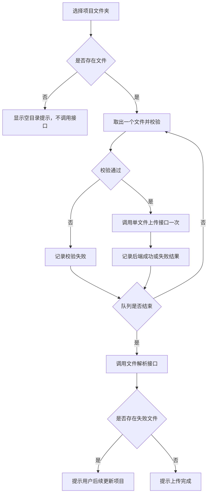
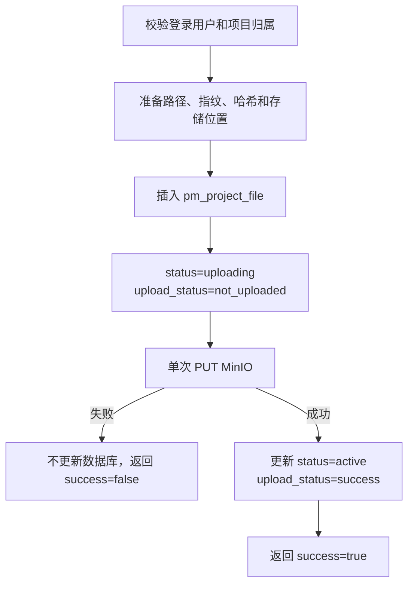

# 项目文件单文件上传模块设计

## 1. 文档定位

本文档是 PM-Agent 项目文件上传链路的当前权威设计。历史批次上传、物理批次、请求级完成闸门和前端自动重试方案均已废止。

## 2. 核心目标

1. 前端逐个校验文件，校验通过后调用一次单文件上传接口。
2. 每个文件只上传一次，前端只收集结果，不在当前流程自动重试。
3. Java 先插入 `not_uploaded` 文件记录，再向 MinIO 上传一次。
4. MinIO 成功后把文件更新为 `active / success`；失败时不再更新数据库记录，直接返回失败结果。
5. 单文件上传不读取或修改 `system/index.json`。
6. 文件队列处理完毕后，前端调用 Java 文件解析接口；当前只保留接口，不实现解析业务。
7. 项目创建时初始化 `system/index.json` 的既有流程保持不变。

## 3. 职责划分

| 组件 | 当前职责 |
|---|---|
| 前端 | 选择目录、逐文件校验、顺序调用单文件上传接口、汇总成功与失败结果、队列结束后调用解析接口 |
| Java | 校验登录用户和项目归属、准备文件元数据、先落库、单次写 MinIO、返回文件级结果、提供解析占位接口 |
| MySQL | 保存每个项目文件的路径、指纹、存储位置和上传状态 |
| MinIO | 保存项目初始化索引和上传成功的项目文件对象 |
| Python Agent | 不参与当前上传和解析占位接口 |

当前链路不使用批次表、批次线程池、RabbitMQ 或 Transactional Outbox。

## 4. 项目创建前提

创建项目时，Java 仍按既有流程同步创建：

```text
PM-AGENT/{ownerUserId}/{projectId}/system/index.json
```

只有初始化成功并进入 `active` 的项目才能上传文件。本次简化不改变项目初始化索引的业务。

## 5. 单文件上传接口

### 5.1 请求

```http
POST /api/v1/projects/{projectId}/files
Authorization: Bearer <token>
X-Trace-Id: <可选>
X-Idempotency-Key: <文件级幂等键>
Content-Type: multipart/form-data
```

Multipart 字段：

| 字段 | 类型 | 说明 |
|---|---|---|
| `file` | File | 当前文件内容 |
| `relativePath` | String | 项目根目录内的规范化相对路径 |
| `sourceMtimeMs` | Long | 源文件最后修改时间，毫秒时间戳 |

一次请求只允许上传一个文件，不再提交 `manifest`、`batch`、文件数组或前端文件 ID。

### 5.2 响应

上传成功：

```json
{
  "fileId": 101,
  "relativePath": "backend/src/main/App.java",
  "fileName": "App.java",
  "success": true,
  "status": "active",
  "uploadStatus": "success",
  "errorCode": null,
  "errorMessage": null
}
```

MinIO 上传失败：

```json
{
  "fileId": 101,
  "relativePath": "backend/src/main/App.java",
  "fileName": "App.java",
  "success": false,
  "status": "uploading",
  "uploadStatus": "not_uploaded",
  "errorCode": "FILE_STORAGE_ERROR",
  "errorMessage": "文件存储服务异常"
}
```

MinIO 失败属于已处理的文件级结果，前端将其加入失败列表。参数、权限、路径冲突或数据库异常仍使用统一错误响应。

## 6. 前端流程



前端规则：

- 校验与上传都按单文件执行；
- 当前选择文件夹流程不自动重试网络异常或业务失败；
- 校验失败、后端返回 `success=false`、请求异常都进入失败列表；
- 所有已选择文件处理完后调用解析接口，即使存在失败文件也照常调用；
- 失败时只提示“后续更新项目”，重试策略由后续更新项目业务负责；
- 未来更新项目业务如果引入最大重试次数，应在队列完成或剩余失败文件达到最大次数后调用解析接口。

## 7. Java 单文件处理



关键约束：

- 数据库插入必须发生在 MinIO PUT 之前；
- 当前上传接口不执行循环重试；
- MinIO 失败后不写失败状态、不修改初始记录；
- 上传成功后的状态更新只允许命中当前 `not_uploaded` 记录；
- 上传接口不调用 `ProjectIndexService`，不改写 `index.json`；
- 路径已存在时直接返回路径冲突，不覆盖已有文件。

## 8. 文件解析接口

```http
POST /api/v1/projects/{projectId}/files/parse
Authorization: Bearer <token>
```

当前接口只校验登录用户是否拥有项目，然后返回成功；不扫描文件、不调用 Python、不发布消息、不修改文件状态或索引。

## 9. 数据模型

上传链路只使用 `pm_project_file`。当前 Flyway V1 直接创建单文件上传所需结构，不包含历史根请求表、物理批次表和文件关联字段。

首次插入的关键状态：

```text
status = uploading
upload_status = not_uploaded
upload_attempts = 1
```

上传成功后只更新：

```text
status = active
upload_status = success
```

`pm_project_file` 只描述文件和上传事实，不保存解析状态、解析结果、解析版本或详情文件引用。后续解析业务需要独立建模。

## 10. 异常与恢复

| 场景 | 当前处理 |
|---|---|
| 前端校验失败 | 不调用后端，记录失败并继续下一个文件 |
| 参数或路径冲突 | 后端统一错误响应，前端记录失败并继续 |
| MySQL 插入失败 | 不调用 MinIO，返回统一错误响应 |
| MinIO 上传失败 | 保留 `uploading / not_uploaded`，返回文件级失败结果 |
| MinIO 成功但状态更新失败 | 返回文件级失败结果；可能存在冗余对象，后续更新项目处理 |
| 解析接口调用失败 | 上传结果保持不变，前端提示解析请求失败 |

## 11. 验收标准

1. 前端不存在分批、批次协议或自动重试代码。
2. 每个校验通过的文件只调用一次单文件上传接口。
3. Java 不存在批次 Controller、Service、DTO、实体、Mapper、枚举和专用线程池。
4. 文件先以 `not_uploaded` 落库，再上传 MinIO。
5. MinIO 失败后没有数据库更新操作，并向前端返回 `success=false`。
6. MinIO 成功后文件为 `active / success`。
7. 单文件上传不修改 `index.json`。
8. 项目创建仍初始化 `system/index.json`。
9. 文件队列结束后调用解析接口，解析接口当前无业务实现。
10. 上传实体和上传表中不存在解析相关字段。

## 12. 待确认问题

暂无。
