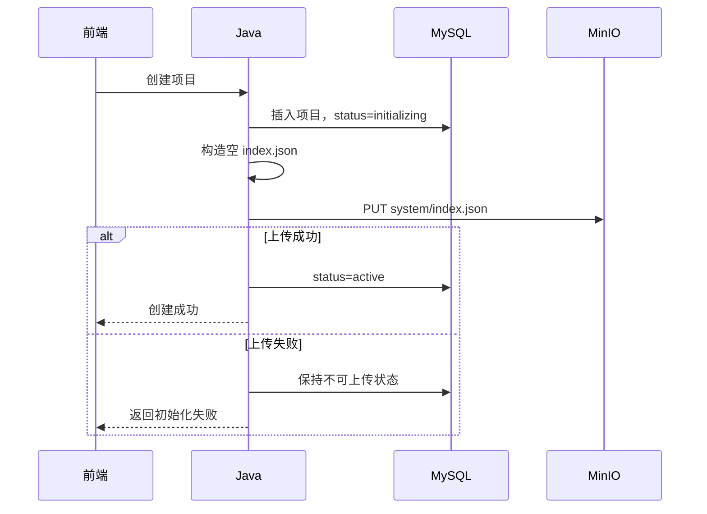

# 项目上下文索引与 MinIO 存储设计

## 1. 文档定位

本文档说明当前 `index.json` 与 MinIO 的存储规则。单文件上传职责和状态规则以 [18-项目文件可靠上传模块设计](./18-项目文件可靠上传模块设计.md) 为准。

## 2. 核心原则

1. MySQL 是项目文件元数据和上传状态的准确数据源。
2. MinIO 保存项目文件内容和 `system/index.json`，不作为上传进度判断依据。
3. 项目创建时必须先成功写入初始 `system/index.json`，项目才能进入 `active`。
4. 单文件上传先保存完整文件元数据和预生成的存储位置，再执行一次 MinIO PUT。
5. 单文件上传成功后只更新文件状态，不修改索引。
6. 文件解析接口当前不实现解析或索引更新。
7. 当前上传链路不使用 RabbitMQ、Outbox 或 Python。

## 3. 存储层级

```text
Bucket: pm-agent

PM-AGENT/{ownerUserId}/{projectId}/
├── project/
│   └── {storageName}
├── user/
│   └── {storageName}
└── system/
    └── index.json
```

规则：

- Bucket 固定为 `pm-agent`；
- 项目根前缀固定为 `PM-AGENT/{ownerUserId}/{projectId}/`；
- 普通文件业务类型使用 `project` 和 `user`；
- `system` 只允许 Java 内部组件写入；
- 对象路径由 Java 统一生成，不接受前端对象键；
- 预签名 URL 不持久化。

## 4. 项目初始化索引

项目创建和初始索引上传保持同步执行：



初始结构：

```json
{
  "project_id": 10,
  "project_name": "PM-Agent",
  "owner_user_id": 1,
  "schema_version": "1.0.0",
  "generated_at": "2026-07-19T10:00:00",
  "updated_at": "2026-07-19T10:00:00",
  "storage": {
    "provider": "minio",
    "bucket": "pm-agent",
    "object_prefix": "PM-AGENT/1/10/",
    "index_path": "system/index.json"
  },
  "summary": {
    "total_nodes": 0,
    "active_files": 0,
    "fail_nodes": 0
  },
  "project": [],
  "user": [],
  "upload_failures": [],
  "system": {
    "index": "system/index.json",
    "project_specification": "system/project_specification.json",
    "long_term_memory": "system/long_term_memory.json",
    "short_term_memory": "system/short_term_memory.json",
    "user_habits": "system/user_habits/",
    "update_journal": "system/update_journal.jsonl"
  }
}
```

## 5. 单文件存储顺序

### 5.1 数据库插入

Java 在 PUT MinIO 前生成并保存：

```text
storageUuid = 16 位随机十六进制值
storageName = {文件主名}-{storageUuid}.{扩展名}
objectKey = PM-AGENT/{ownerUserId}/{projectId}/project/{storageName}
minioPath = project/{storageName}
status = uploading
uploadStatus = not_uploaded
```

同时保存逻辑相对路径、文件名、扩展名、大小、MIME、修改时间、快速指纹和内容哈希。

### 5.2 MinIO 上传成功

Java 把同一条文件记录更新为：

```text
status = active
uploadStatus = success
```

本步骤不改写 `system/index.json`。

### 5.3 MinIO 上传失败

- 不更新文件记录；
- 文件保持 `uploading / not_uploaded`；
- 文件级失败通过接口响应返回；
- 当前前端不自动重试，只提示后续更新项目。

## 6. 索引更新边界

本次简化后的单文件上传和解析占位接口都不触发索引重建。

以下既有操作的索引行为不在本次范围内：

- 覆盖已有文件内容；
- 修改已有文件路径；
- 删除已有文件。

后续实现新的解析业务时，应重新明确解析完成条件和索引更新时间，不能把旧批次完成闸门直接恢复。

## 7. 冗余对象清理

当前上传热路径不执行复杂补偿。MinIO PUT 成功但数据库状态更新失败时，可能出现未被有效状态引用的对象。

后续清理任务可以从 MySQL 查询有效 `object_key`，再与 MinIO 项目前缀对象比对并清理长期冗余对象。该功能当前未实现。

## 8. Python 解析扩展点

`POST /api/v1/projects/{projectId}/files/parse` 当前只是 Java 占位接口：

- 不发布消息；
- 不调用 Python；
- 不扫描 MinIO；
- 不保存解析状态或解析结果；
- 不重建索引。

未来实现前需单独评审解析数据模型、任务协议、幂等、失败恢复和索引更新规则。

## 9. 一致性取舍

| 场景 | 当前取舍 |
|---|---|
| MySQL 插入成功、MinIO 失败 | 文件保持 `uploading / not_uploaded`，返回失败结果 |
| MinIO 成功、MySQL 状态更新失败 | 返回失败结果，允许暂时存在冗余对象 |
| 前端请求异常 | 记录为失败，不在当前流程自动重试 |
| 解析接口失败 | 不影响已经保存的文件结果 |
| RabbitMQ 不可用 | 不影响当前上传链路 |

## 10. 验收标准

1. 项目进入 `active` 前固定位置存在合法初始索引。
2. 文件数据库记录先于 MinIO PUT 创建。
3. MinIO 成功后文件状态为 `active / success`。
4. MinIO 失败时文件记录不再更新。
5. 单文件上传不读取或改写索引。
6. 解析占位接口没有 MinIO、MQ、Python 或索引副作用。
7. 当前链路不依赖旧批次表。

## 11. 待确认问题

解析实现和冗余对象定时清理在进入开发前分别补充设计。
