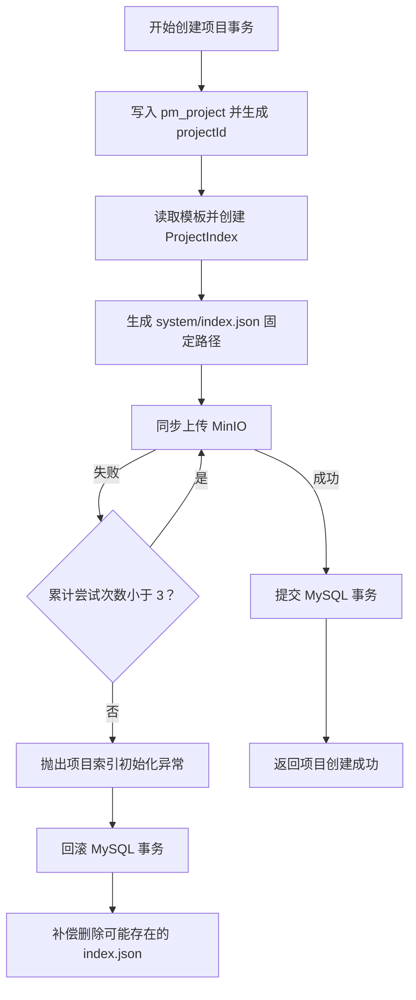
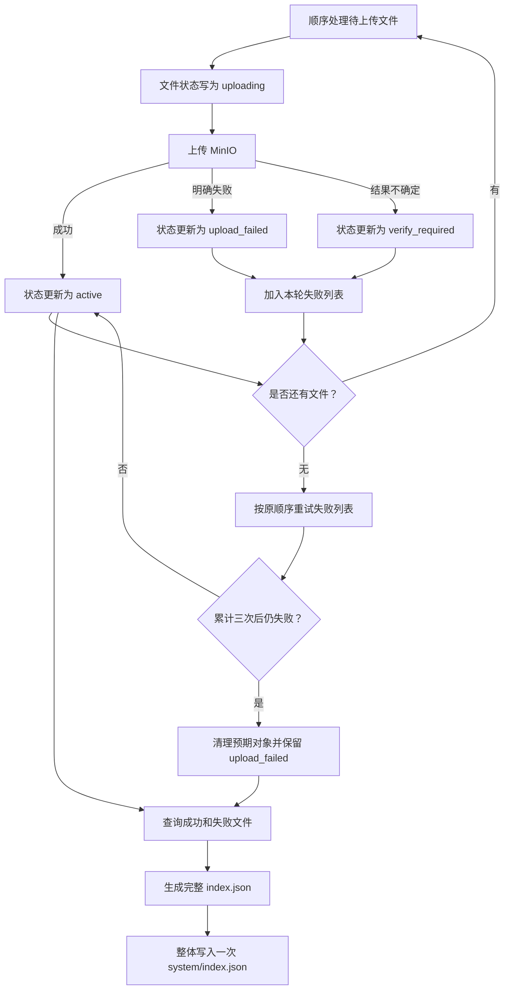

# 项目上下文索引与 MinIO 存储设计

## 1. 背景

PM-Agent 当前已经具备 Java 后端项目文件元信息、MinIO 对象写入、内容哈希、文件状态和乐观锁等基础能力。Agent 服务已经具备项目目录扫描、忽略目录识别和本地 `Project_Index.json` 生成能力，但正式的项目上下文 `index.json` 尚未接入项目创建、文件上传和 MinIO 存储链路。

本文固定第一版项目文件路径、初始索引创建、文件筛选、顺序上传、失败重试、索引写入、文件重命名和项目删除方案，作为后续 Java 后端与 Agent 服务实现依据。

本文中的 `index.json` 是项目上下文总索引，不等同于 Agent 服务当前文件树扫描生成的 `Project_Index.json`。

## 2. 目标

1. 统一 `project`、`user`、`system` 三类文件的 MinIO 路径；
2. 在项目创建时生成并上传初始 `index.json`；
3. 以现有 JSON 示例为基础，固定 `project`、`user`、`system` 结构，不引入 `entries`；
4. 文件筛选阶段只采集统计和候选文件信息，不修改业务数据；
5. 第一版使用顺序上传，完成全部上传与重试后只写一次 `index.json`；
6. 上传失败文件保留数据库状态，并在索引中生成失败清单；
7. 文件重命名时同步迁移 MinIO 对象键；
8. 将 `system` 限定为内部文件命名空间，不提供对外写入接口；
9. 项目删除时硬删除项目全部对象和数据库记录。

## 3. 范围

### 3.1 本期范围

- Bucket 和对象键规范；
- 文件存储名生成与校验；
- `index.json` 模板、数据结构和独立写入组件；
- 项目创建与初始索引上传；
- 文件树筛选统计；
- 项目文件顺序上传和三次重试；
- 上传失败状态和失败清单；
- 文件重命名时的对象复制、数据库更新和旧对象删除；
- `system` 内部权限边界；
- 敏感文件过滤；
- 项目文件和上下文对象硬删除。

### 3.2 本期不做

- 文件并行上传；
- 多实例分布式索引锁；
- RabbitMQ 文件解析生产和消费；
- MQ 重复消费、消息乱序、死信和 outbox；
- LLM 自动补全索引字段；
- 文件分片上传；
- 大文件流式改造；
- `index.json` revision、ETag 和 checksum 同步；
- MinIO JSON 局部更新或条件覆盖；
- 文件历史版本和索引历史版本；
- 项目删除归档。

## 4. 核心设计决策

| 项目 | 决策 |
|---|---|
| Bucket | 固定为 `pm-agent` |
| 对象根前缀 | 保留 `PM-AGENT` |
| business 编码 | MinIO 路径和数据库统一使用小写 `project`、`user`、`system` |
| 普通文件对象名 | `{文件主名}-{uuid16}.{扩展名}` |
| 系统索引路径 | `PM-AGENT/{userId}/{projectId}/system/index.json` |
| 索引结构 | 使用 `project`、`user`、`system`，不使用 `entries` |
| 索引写入者 | 第一版仅 Java 后端可以写入 |
| 上传方式 | 顺序上传，单文件独立记录状态 |
| 失败处理 | 第一轮结束后重试失败文件，累计最多三次 |
| 索引写入时机 | 全部文件及重试处理结束后整体写入一次 |
| 文件重命名 | 保留 UUID，修改文件名部分并迁移 MinIO 对象 |
| 项目删除 | 删除项目根前缀下全部对象，并硬删除数据库记录 |

## 5. MinIO 路径设计

### 5.1 Bucket 与对象键

MinIO SDK 调用时必须分别传递 Bucket 和对象键：

```text
bucket = pm-agent
objectKey = PM-AGENT/1/10/project/README-a1b2c3d4e5f67890.md
```

用于展示和排查的完整路径为：

```text
pm-agent/PM-AGENT/1/10/project/README-a1b2c3d4e5f67890.md
```

不得将 `pm-agent/PM-AGENT/...` 整体作为 MinIO `objectKey` 传入。

### 5.2 对象路径

```text
项目文件：
PM-AGENT/{userId}/{projectId}/project/{文件主名}-{uuid16}.{扩展名}

用户文件：
PM-AGENT/{userId}/{projectId}/user/{文件主名}-{uuid16}.{扩展名}

系统文件：
PM-AGENT/{userId}/{projectId}/system/index.json
PM-AGENT/{userId}/{projectId}/system/file_details/...
PM-AGENT/{userId}/{projectId}/system/project_specification.json
PM-AGENT/{userId}/{projectId}/system/long_term_memory.json
PM-AGENT/{userId}/{projectId}/system/short_term_memory.json
PM-AGENT/{userId}/{projectId}/system/user_habits/...
PM-AGENT/{userId}/{projectId}/system/update_journal.jsonl
```

### 5.3 文件存储名

文件存储名统一使用：

```text
{真实文件主名}-{uuid16}.{原扩展名}
```

示例：

```text
README.md
→ README-a1b2c3d4e5f67890.md
```

规则如下：

1. UUID 使用 16 位十六进制字符串；
2. UUID 在文件首次创建时生成并持久化；
3. 文件内容覆盖时 UUID 不变；
4. 文件重命名时 UUID 不变，只同步修改真实文件名部分；
5. 目录变化但文件名不变时，对象键不变；
6. 文件名执行 Unicode NFC 标准化；
7. 禁止空文件名、`.`、`..`、`/`、`\\` 和控制字符；
8. 允许中文、空格、括号、`-`、`_`、`.`、`+`、`@` 等正常字符；
9. 相对路径继续执行目录穿越、忽略目录、扩展名和 MIME 校验。

### 5.4 路径组件

统一路径组件建议命名为 `FileStorageLocationFactory`，职责如下：

```text
FileStorageLocationFactory
├── buildProjectFile(...)
├── buildUserFile(...)
├── buildSystemFile(...)
└── buildProjectPrefix(...)
```

返回值使用：

```java
public record StorageLocation(
        String bucket,
        String objectKey
) {
    public String fullPath() {
        return bucket + "/" + objectKey;
    }
}
```

普通文件方法接收 `userId`、`projectId`、`business`、真实文件名和 `storageUuid`。系统文件方法接收受控的 `SystemFilePath`，不接受任意用户输入路径。

## 6. `index.json` 设计

### 6.1 模板文件

模板建议放置于：

```text
backend/src/main/resources/templates/project-context/index-template.json
```

模板只保存固定结构，项目字段使用 `null`、空字符串、空数组和零值。每次创建项目时，通过 Jackson 将模板反序列化为新的 Java 对象，再填充当前项目信息，不创建本地临时文件，也不修改模板文件。

### 6.2 初始化索引结构

```json
{
  "project_id": 10,
  "project_name": "PM-Agent",
  "owner_user_id": 1,
  "schema_version": "1.0.0",
  "generated_at": "2026-07-14T10:00:00",
  "updated_at": "2026-07-14T10:00:00",
  "storage": {
    "provider": "minio",
    "bucket": "pm-agent",
    "object_prefix": "PM-AGENT/1/10/",
    "index_path": "system/index.json"
  },
  "summary": {
    "total_nodes": 0,
    "active_files": 0,
    "ignored_nodes": 0,
    "failed_files": 0,
    "pending_analysis_files": 0,
    "detail_files": 0
  },
  "project": [],
  "user": [],
  "upload_failures": [],
  "system": {
    "index": "system/index.json",
    "file_details": "system/file_details/",
    "project_specification": "system/project_specification.json",
    "long_term_memory": "system/long_term_memory.json",
    "short_term_memory": "system/short_term_memory.json",
    "user_habits": "system/user_habits/",
    "update_journal": "system/update_journal.jsonl"
  }
}
```

### 6.3 成功文件对象

`project` 和 `user` 数组使用相同的文件对象结构：

```json
{
  "id": 30,
  "storage_uuid": "a1b2c3d4e5f67890",
  "logical_path": "backend/README.md",
  "file_name": "README.md",
  "storage_name": "README-a1b2c3d4e5f67890.md",
  "minio_path": "project/README-a1b2c3d4e5f67890.md",
  "size_bytes": 4096,
  "content_type": "text/markdown",
  "status": "active",
  "analysis_status": "pending",
  "quick_fingerprint": "qf:sha256:xxx",
  "content_hash": "sha256:xxx",
  "module": null,
  "kind": null,
  "language": "markdown",
  "importance": null,
  "summary": null,
  "keywords": [],
  "detail_ref": null,
  "updated_at": "2026-07-14T10:00:00"
}
```

Java 只填充能够确定的信息。需要后续模型分析的字段保持 `null`、空数组或 `pending`，不得伪造分析结果。

### 6.4 上传失败对象

```json
{
  "file_id": 31,
  "business": "project",
  "logical_path": "backend/src/Broken.java",
  "file_name": "Broken.java",
  "storage_name": "Broken-b1c2d3e4f5a67890.java",
  "status": "upload_failed",
  "attempts": 3,
  "last_error_code": "FILE_STORAGE_ERROR",
  "updated_at": "2026-07-14T10:05:00"
}
```

失败对象写入 `upload_failures`。失败文件不进入 `project` 或 `user` 数组。失败信息只保留错误码和必要摘要，不写入异常堆栈、MinIO 凭证或敏感内容。

## 7. 索引组件设计

建议新增以下内部组件：

| 组件 | 职责 |
|---|---|
| `ProjectIndexTemplateLoader` | 读取并反序列化固定模板 |
| `ProjectIndexFactory` | 创建初始索引，根据扫描结果和数据库文件生成当前索引 |
| `ProjectIndexWriter` | 序列化、校验并整体写入固定 `system/index.json` |
| `ProjectIndexService` | 编排初始化、重建和写入流程 |

核心方法建议为：

```java
ProjectIndex createInitialIndex(Project project);

ProjectIndex buildCurrentIndex(
        Project project,
        ScanSummary summary,
        List<ProjectFile> files
);

void writeIndex(
        Long userId,
        Long projectId,
        ProjectIndex index
);
```

写入规则：

1. 第一版只有 Java 后端可以写入；
2. 不提供公开 Controller；
3. Python 和前端不能直接写 `system/index.json`；
4. 不从 MinIO 下载 JSON 后逐字段追加；
5. 每次在内存中生成完整合法 JSON，然后整体覆盖一次；
6. 同一项目的扫描、上传和索引写入使用进程内项目级互斥；
7. 暂不引入 Redis 分布式锁、revision、ETag 或条件覆盖。

## 8. 项目创建与初始索引事务

### 8.1 事务定义

项目创建采用“数据库事务 + MinIO 同步重试 + 回滚补偿”。MySQL 与 MinIO 无法组成真正的 ACID 分布式事务，因此该流程属于补偿型业务事务。



### 8.2 业务规则

1. `ProjectServiceImpl.createProject()` 作为事务入口；
2. 插入项目后取得自增 `projectId`；
3. 基于模板创建新的索引对象；
4. 同步上传到固定 `system/index.json`；
5. 上传总尝试次数为三次；
6. 三次均失败时抛出异常并回滚项目记录；
7. 固定对象键覆盖具备幂等性，重试不会产生多个初始索引；
8. MinIO 上传成功但数据库提交失败时，通过事务完成回调删除初始索引；
9. 补偿删除执行有限重试；
10. 创建接口只在数据库提交成功后返回成功。

初始索引体积较小，本期接受事务期间等待 MinIO 的取舍，但必须设置较短的 MinIO 请求超时和数据库事务超时。

## 9. 文件筛选设计

筛选阶段只采集信息，不修改数据库、不写 `index.json`、不上传 MinIO：

```text
扫描目录
→ 按规则识别有效文件
→ 被忽略目录记录为一个 ignored node
→ 不进入被忽略目录内部统计
→ 计算允许计算的文件信息
→ 返回 ScanResult
```

统计口径如下：

| 字段 | 含义 |
|---|---|
| `total_nodes` | 实际扫描并记录的节点总数 |
| `eligible_files` | 可以进入上传阶段的文件数量 |
| `ignored_nodes` | 被整体忽略的目录或文件节点数量 |
| `skipped_hash_files` | 允许上传但跳过内容哈希的文件数量 |
| `scan_error_nodes` | 扫描或读取失败的节点数量 |

Python 扫描结果只用于发现和预筛选。Java 后端继续执行路径、固定文件名、扩展名、MIME 和敏感文件的最终权威校验。

## 10. 顺序上传与失败重试

### 10.1 上传流程

第一版不使用线程池，按扫描结果顺序上传文件。



### 10.2 业务规则

1. 每个文件独立保存状态，单文件失败不回滚其他文件；
2. 第一轮先处理全部文件，再统一处理失败列表；
3. 每个文件累计最多尝试三次；
4. 明确失败时保存 `upload_failed`；
5. MinIO 结果不确定时保存 `verify_required` 并进入重试列表；
6. 最终失败后删除预期对象，避免响应丢失造成孤儿对象；
7. 数据库记录继续保留，最终状态为 `upload_failed`；
8. 最终失败文件不进入 `project` 或 `user` 数组；
9. 最终失败文件进入 `upload_failures`；
10. 后续项目更新功能可以查询 `upload_failed` 文件重新上传；
11. 全部上传和重试完成后只生成并上传一次 `index.json`；
12. 最终索引写入失败时不回滚已上传成功的文件，后续可以根据数据库重新生成索引。

## 11. 数据模型调整

第一版不新增文件上传批次表，继续由 `pm_project_file` 保存当前文件状态。

建议使用新的 Flyway migration 增加：

| 字段 | 类型 | 说明 |
|---|---|---|
| `storage_uuid` | `CHAR(16)` | 文件对象名中的稳定随机标识 |
| `upload_attempts` | `INT` | 当前累计上传次数 |
| `last_error_code` | `VARCHAR(64)` | 最后一次错误码 |
| `last_error_message` | `VARCHAR(500)` | 脱敏后的中文错误摘要 |
| `last_failed_at` | `DATETIME` | 最后失败时间 |

建议增加约束：

```text
UNIQUE(project_id, business_code, storage_uuid)
UNIQUE(object_key)
```

`storage_uuid` 创建后不再变化；`object_key` 在文件重命名时允许更新。

文件状态继续使用：

```text
uploading
active
updating
upload_failed
verify_required
missing
deleting
delete_failed
```

## 12. 文件重命名

文件名变化时，MinIO 对象键同步变化，UUID 保持不变：

```text
旧对象：project/OldName-a1b2c3d4e5f67890.java
新对象：project/NewName-a1b2c3d4e5f67890.java
```

MinIO 没有原子重命名，实际执行复制和删除：

```text
文件状态抢占为 updating
→ 复制旧对象到新对象键
→ 更新 relative_path、file_name、storage_name、object_key
→ 删除旧对象
→ 文件状态恢复为 active
→ 重建并整体写入一次 index.json
```

异常规则：

- 复制失败：数据库和旧对象不变；
- 复制成功但数据库更新失败：补偿删除新对象；
- 数据库更新成功但旧对象删除失败：文件设为 `verify_required`，后续按数据库中的新对象键修复；
- 仅目录发生变化且文件名不变：不复制 MinIO，只更新逻辑路径和索引。

`ObjectStorageService` 需要补充 `copyObject()` 能力。

## 13. `system` 内部权限

`system` 只用于系统内部文件：

1. 公开文件上传请求只允许 `project` 和 `user`；
2. `ProjectFileController` 不提供 system 上传、覆盖、读取和删除接口；
3. `ProjectIndexWriter`、后续 `FileDetailWriter` 等内部组件通过内部方法写入 system；
4. 用户输入不能直接指定任意 system 路径；
5. system 路径必须通过 `SystemFilePath` 或安全逻辑路径构造；
6. system 文件读取仍需校验项目归属；
7. Agent 服务不能绕过 Java 直接修改业务数据库。

## 14. 敏感文件规则

以下文件不上传、不计算正文摘要、不进入 Prompt：

```text
.env
.env.*
*.pem
*.key
*.p12
*.jks
私钥文件
证书文件
token 文件
数据库凭证文件
```

`index.json` 最多记录脱敏后的忽略信息：

```json
{
  "logical_path": ".env",
  "status": "ignored",
  "ignore_reason": "sensitive_file"
}
```

疑似 Prompt Injection 的文件内容只作为数据处理，不作为系统指令。

## 15. 项目硬删除

项目删除不保留归档、软删除索引或历史对象：

```text
项目状态设为 deleting
→ 按 PM-AGENT/{userId}/{projectId}/ 前缀列出全部对象
→ 删除 project、user、system 下全部对象
→ 删除 pm_project_file 记录
→ 删除 pm_project 记录
```

删除规则：

1. MinIO 删除不存在对象视为成功；
2. 任一对象删除失败时，项目状态设为 `delete_failed`；
3. 再次删除时按项目根前缀重新执行全量删除；
4. 全部 MinIO 对象删除成功后，数据库执行硬删除；
5. 最终不保留项目文件、用户文件、系统文件、索引、文件详情、项目规范、记忆文件和数据库记录。

## 16. 异常与错误码建议

| 错误码标识 | 触发条件 |
|---|---|
| `PROJECT_INDEX_INIT_FAILED` | 项目创建时初始索引三次上传失败 |
| `PROJECT_INDEX_WRITE_FAILED` | 文件处理完成后索引写入失败 |
| `FILE_STORAGE_ERROR` | MinIO 普通写入、复制或删除失败 |
| `FILE_UPLOAD_RETRY_EXHAUSTED` | 单文件累计三次上传失败 |
| `FILE_RENAME_FAILED` | 文件重命名对象迁移失败 |
| `SYSTEM_FILE_ACCESS_DENIED` | 外部请求尝试访问 system 写入能力 |
| `PROJECT_DELETE_FAILED` | 项目对象未全部删除成功 |

具体数字编码在实现阶段统一加入 `common.errorcode.ErrorCode`，并同步更新接口规范。

## 17. 开发步骤

1. 修订项目上下文 JSON 规范，统一 `project`、`user`、`system` 和小写路径；
2. 新增 `index-template.json` 和对应 Java DTO；
3. 重构文件路径工厂并引入 `StorageLocation`；
4. 新增 Flyway migration，补充 `storage_uuid` 和失败信息字段；
5. 实现 `ProjectIndexTemplateLoader`、`ProjectIndexFactory`、`ProjectIndexWriter` 和 `ProjectIndexService`；
6. 接入项目创建事务、三次初始索引上传和回滚补偿；
7. 对齐 Agent 扫描结果和 Java 文件过滤规则；
8. 实现顺序上传、失败列表和三次重试；
9. 在批量处理结束后生成并写入一次索引；
10. 扩展对象存储复制能力并改造文件重命名流程；
11. 限制 system 对外访问；
12. 实现项目根前缀硬删除；
13. 补充单元测试、集成测试和文档。

## 18. 风险与取舍

### 18.1 外部调用位于项目创建事务中

项目创建事务需要等待 MinIO，可能延长数据库连接和锁占用时间。本期初始索引体积较小，并设置有限重试和短超时，因此接受该取舍。该方案不是分布式事务，必须保留事务回滚后的 MinIO 补偿删除。

### 18.2 索引整体覆盖

MinIO 不支持按 JSON 字段原子修改。本期统一在内存中构建完整索引并整体覆盖。由于本期不做并行上传和多实例写入，使用项目级进程内互斥即可。

### 18.3 文件重命名不是原子操作

MinIO 重命名需要复制新对象再删除旧对象。流程中可能短暂存在两个对象，必须通过文件状态、乐观锁和补偿删除处理异常。

### 18.4 索引写入失败不回滚文件

文件已成功写入 MinIO 并保存数据库状态后，如果最终索引写入失败，不回滚已成功文件。数据库仍保留权威信息，后续可以重新构建索引。

### 18.5 暂不进行版本同步

本期不维护 index revision、ETag 和 checksum，也不解决多实例条件覆盖。引入并行上传、多实例部署或 MQ 分析前必须重新设计索引并发控制。

## 19. 验收标准

1. Bucket 固定为 `pm-agent`；
2. MinIO business 路径和数据库编码统一为小写；
3. 普通文件对象名符合 `{文件主名}-{uuid16}.{扩展名}`；
4. 初始索引固定上传至 `system/index.json`；
5. `index.json` 使用 `project`、`user`、`system`，不存在 `entries`；
6. 项目创建时初始索引最多尝试上传三次；
7. 三次失败后项目数据库事务回滚；
8. 数据库提交失败时补偿删除初始索引；
9. 被忽略目录只统计为一个节点；
10. 文件筛选阶段不修改数据库和 MinIO；
11. 文件按顺序上传，单文件失败不影响其他文件；
12. 上传失败文件在其他文件处理后重试，累计最多三次；
13. 最终失败文件保留 `upload_failed` 状态并进入 `upload_failures`；
14. 批量文件处理结束后只上传一次 `index.json`；
15. 文件改名后 MinIO 对象名同步变化，UUID 保持不变；
16. `system` 没有公开写入接口；
17. 敏感文件不上传、不进入 Prompt；
18. 项目删除后项目根前缀下不存在残留对象，数据库不存在项目和项目文件记录；
19. 所有错误提示使用中文，所有响应继续使用统一 `R<T>` 和 `traceId`。

## 20. 待确认问题

暂无。RabbitMQ、消息一致性、并行上传、文件切片和索引版本同步在后续专项方案中讨论。
