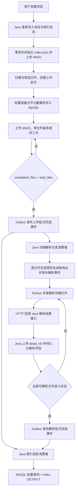

# 项目上下文索引初始化、文件解析与 MinIO 存储设计

## 1. 背景

当前项目已经具备项目创建、项目文件元数据落库、MinIO 文件写入、初始 `index.json` 创建以及 RabbitMQ 基础配置。现有实现仍在单文件上传、覆盖、改名和删除后同步调用 `ProjectIndexService.rebuild()`，会随着文件数量增长产生大量 MySQL 查询和 MinIO 覆盖，并且无法安全承载 Java 与 Python 并行解析。

本方案把 MySQL 定义为文件与解析状态的唯一事实来源，把 MinIO 中的 `system/index.json` 定义为可重建的查询投影。文件上传期间不再重建索引；只有上传批次完成或详细解析批次完成后，才由 Java 索引投影消费者批量生成并整体覆盖一次索引。

实现状态：初始化索引结构、稳定文件元数据、持久化上传批次、解析批次闸门、Transactional Outbox、版本化 TopicExchange、Java→Python 详情任务、Python 完整详情解析、内部 HTTP 回调、Java 详情对象上传和批次级索引回填已经落地。索引队列使用 RabbitMQ `x-single-active-consumer` 保证跨实例单写；数据库 revision/租约仍可作为后续多 Region 部署增强。未传 `ingestBatchId` 的旧单文件接口继续保留即时解析与索引刷新兼容模式，新流程应先创建批次并在上传时携带批次 ID。

## 2. 目标与边界

### 2.1 目标

1. 创建项目时写入 MySQL 项目记录并初始化 `system/index.json`；
2. 初始化索引删除 `ignored_nodes`、`failed_files`、`pending_analysis_files`、`detail_files`，增加 `fail_nodes`；
3. 文件写入 MinIO 前完成稳定标识、对象路径、指纹和详情引用的计算与落库；
4. 单文件上传期间不重建索引，批次完成后最多对 `index.json` 执行一次读取和一次覆盖；
5. 上传批次完成后，并行启动初始索引投影和详细文件解析；
6. Python 只负责解析，Java 负责权限、状态、MySQL、MinIO 和索引写入；
7. RabbitMQ 使用至少一次投递，所有生产和消费过程必须幂等；
8. 优先减少 MinIO I/O、MySQL N+1 查询和跨服务文件搬运，同时保证最终一致性。

### 2.2 不做范围

- 不在 MQ 消息中传输文件二进制或完整解析结果；
- 不允许 Python 直接访问业务数据库或写入 `index.json`；
- 不为 MySQL、MinIO 和 RabbitMQ 引入分布式事务；
- 不在每个详细文件解析完成后立即读写一次完整索引；
- 不把 Java 本机临时文件路径作为跨机器协议；
- 本方案不包含向量化、切片和完整 RAG 链路。

## 3. 核心设计决策

| 项目 | 决策 |
|---|---|
| 文件事实来源 | MySQL `pm_project_file`；完整详情在 MinIO，索引投影字段直接保存在文件行 |
| 索引定位 | MinIO 中的可重建查询投影，不作为上传进度事实来源 |
| 索引写入者 | 仅 Java 索引投影消费者 |
| 批次完成条件 | 持久化的 `completed_files == total_files`，不依赖进程内变量 |
| 单文件上传状态 | `retrying`、`success`、`failed` 三种，单独保存为 `upload_status` |
| 解析状态 | `pending`、`processing`、`retrying`、`success`、`failed` |
| 文件读取方式 | Java 生成短期 MinIO 预签名读取地址，Python 直接读取 MinIO |
| MQ 载荷 | 只传 ID、稳定引用、版本、短期读取地址和 traceId |
| MQ 与数据库一致性 | Transactional Outbox + 发布确认 + 幂等消费 |
| 索引并发 | 每个项目单写者租约 + 单调 revision；每次按 MySQL 最新状态全量投影 |
| 详细结果回传 | Python 通过 HTTP 回调 Java，Java 校验后上传详情文件并落库 |
| 详细结果写索引 | 全部解析进入终态后批量投影一次；需要渐进可见时采用合并刷新 |

## 4. 总体实现流程



上传批次完成事件绑定两个独立队列，因此初始索引投影和详细解析分发会并行执行。两条链路都不能直接修改对方的状态。

## 5. 第一步：项目创建与索引初始化

### 5.1 事务边界

MinIO 调用不得放在数据库事务中。目标流程采用轻量 Saga：

1. 事务一写入 `pm_project`，状态为 `initializing`；
2. 事务提交后，由 Java 在事务外构造初始索引并上传固定对象键；
3. 上传成功后，事务二将项目状态改为 `active`；
4. 连续三次上传失败时，将项目状态改为 `init_failed` 并记录错误，后续可按固定对象键幂等重试；
5. 项目创建接口只有在项目状态变为 `active` 后才返回成功。

固定位置为：

```text
bucket    = pm-agent
objectKey = PM-AGENT/{ownerUserId}/{projectId}/system/index.json
```

固定对象键使初始化重试天然幂等，不会产生多个索引对象。

### 5.2 初始索引结构

```json
{
  "project_id": 10,
  "project_name": "PM-Agent",
  "owner_user_id": 1,
  "schema_version": "1.0.0",
  "generated_at": "2026-07-16T10:00:00",
  "updated_at": "2026-07-16T10:00:00",
  "storage": {
    "provider": "minio",
    "bucket": "pm-agent",
    "object_prefix": "PM-AGENT/1/10/",
    "index_path": "system/index.json"
  },
  "summary": {
    "total_nodes": 0,
    "active_files": 0,
    "fail_nodes": 0
  },
  "project": [],
  "user": [],
  "upload_failures": [],
  "system": {
    "index": "system/index.json",
    "file_details": "system/file_details/",
    "project_specification": "system/project_specification.json",
    "long_term_memory": "system/long_term_memory.json",
    "short_term_memory": "system/short_term_memory.json",
    "user_habits": "system/user_habits/",
    "update_journal": "system/update_journal.jsonl"
  }
}
```

`fail_nodes` 的统一计算口径为：

```text
扫描终态失败节点数
+ 最终上传失败文件数
+ 最终详细解析失败文件数
```

同一个文件只按其当前终态计数一次。初始化阶段三个分量均为零。

## 6. 第二步：筛选、批次建立与元数据准备

### 6.1 `total` 与 `completed` 的持久化

扫描结束后计算符合上传规则的文件数 `total`。进程内可以保留同名变量用于显示进度，但一致性判断必须使用批次表中的 `total_files` 与 `completed_files`。

采用持久化计数的原因：

- Java 重启后仍能恢复上传进度；
- 多线程上传时可以原子累加；
- 重复回调不会造成 `completed` 重复加一；
- `total = 0` 时也可以立即、可靠地触发后续事件。

### 6.2 上传前生成的信息

每个符合上传条件的文件在调用 MinIO 前生成并落库以下信息：

| 字段 | 生成方式 | 是否持久化 |
|---|---|---|
| `id` | 先插入 `pm_project_file`，由 MySQL 自增返回 | 是 |
| `ingest_batch_id` | 当前上传批次 ID | 是 |
| `storage_uuid` | 16 位稳定十六进制标识 | 是 |
| `logical_path` | 规范化后的项目相对路径 | 是 |
| `file_name` | 从逻辑路径提取并执行 Unicode NFC 规范化 | 是 |
| `storage_name` | `{文件主名}-{storage_uuid}.{扩展名}` | 是 |
| `minio_path` | `{business}/{storage_name}` | 是 |
| `size_bytes` | 文件字节数 | 是 |
| `content_type` | 依据内容检测并校验 MIME | 是 |
| `status` | 索引展示字段，映射当前 `upload_status` | 是 |
| `upload_status` | 首次尝试和重试期间为 `retrying` | 是 |
| `analysis_status` | 初始为 `pending` | 是 |
| `quick_fingerprint` | 规范化路径、大小、修改时间的 SHA-256 | 是 |
| `content_hash` | 文件内容 SHA-256 | 是 |
| `detail_ref` | `system/file_details/{storage_name}` | 是 |
| `updated_at` | MySQL 自动填充 | 是 |

`detail_ref` 在详情文件实际生成前就确定。业务方必须同时检查 `analysis_status == success`，不能仅凭 `detail_ref` 判断详情对象已经存在。

### 6.3 批量准备顺序

```text
扫描并筛选
→ 创建 ingest batch，写入 total_files
→ 计算所有文件的稳定元数据
→ 批量插入 pm_project_file，获取文件 ID
→ 开始 MinIO 上传
```

批量插入建议每 200～500 条提交一次，避免单条插入往返和过大的 SQL。

## 7. 第三步：文件上传、重试与完成闸门

### 7.1 单文件状态

上传结果只使用三种 `upload_status`：

| 状态 | 含义 | 是否增加 `completed_files` |
|---|---|---|
| `retrying` | 首次上传中，或失败后仍可继续重试 | 否 |
| `success` | MinIO 上传成功并已落库 | 是，仅首次进入时增加 |
| `failed` | 三次尝试均失败，进入最终失败 | 是，仅首次进入时增加 |

`completed_files` 只在文件第一次进入 `success` 或 `failed` 终态时增加。中间失败不能增加，否则重试会导致 `completed_files > total_files`。

现有文件生命周期字段仍可保留 `active`、`updating`、`deleting` 等状态；它与本流程的 `upload_status` 分开，避免把上传结果和后续文件管理状态混为一体。

### 7.2 原子完成逻辑

每个文件进入终态时，在同一个数据库事务中执行：

1. 条件更新文件：仅允许从 `retrying` 进入 `success` 或 `failed`；
2. 条件更新成功时，对批次 `completed_files + 1`，并同步增加成功或失败计数；
3. 条件更新批次：仅当 `completed_files == total_files` 且批次仍为 `uploading` 时改为 `upload_completed`；
4. 只有抢占批次完成状态成功的事务，才能写入一条上传批次完成 Outbox 事件。

该设计可以保证并发上传下只发布一次完成事件。

### 7.3 上传期间禁止的操作

- 不调用 `ProjectIndexService.rebuild()`；
- 不读取或覆盖 `index.json`；
- 不发送单文件“重建索引”消息；
- 不在数据库事务中调用 MinIO；
- 不在 MQ 中发送文件字节。

## 8. 第四步：上传完成后的初始索引投影

### 8.1 触发方式

上传批次完成 Outbox 事件发布后，Java 索引投影队列收到消息并执行以下流程：

1. 按 `projectId + batchId` 幂等领取索引投影租约；
2. 使用一条批量查询取得项目、上传批次、成功文件、失败文件和已存在的解析结果；
3. 从 MinIO 读取一次 `system/index.json`；
4. 在内存中基于 MySQL 最新状态构造完整索引；
5. 整体覆盖一次 `system/index.json`；
6. 更新 `projected_revision`，确认消息；
7. 若投影期间 `source_revision` 再次增加，立即再投影一次最新版本。

MinIO I/O 上限为两次：

```text
GET system/index.json  × 1
PUT system/index.json  × 1
```

严禁按文件调用 MinIO `stat` 或下载对象。文件信息全部来自 MySQL，查询必须避免 N+1。

### 8.2 文件索引对象

```json
{
  "id": 30,
  "storage_uuid": "a1b2c3d4e5f67890",
  "logical_path": "backend/README.md",
  "file_name": "README.md",
  "storage_name": "README-a1b2c3d4e5f67890.md",
  "minio_path": "project/README-a1b2c3d4e5f67890.md",
  "size_bytes": 4096,
  "content_type": "text/markdown",
  "status": "success",
  "analysis_status": "pending",
  "quick_fingerprint": "qf:sha256:xxx",
  "content_hash": "sha256:xxx",
  "module": null,
  "kind": null,
  "language": null,
  "importance": null,
  "summary": null,
  "keywords": [],
  "detail_ref": "system/file_details/README-a1b2c3d4e5f67890.md",
  "updated_at": "2026-07-16T10:00:00"
}
```

上传失败文件不进入 `project` 或 `user` 数组，仍保留在顶层 `upload_failures` 中。

### 8.3 可选的一次 I/O 优化

如果确认索引中的项目固定字段、`system` 路径和全部文件字段都能从模板与 MySQL 重建，索引投影可以不读取旧索引，直接在内存构造并执行一次 PUT。该模式把每次投影从两次 MinIO I/O 降为一次，是推荐的最终优化；当前流程先保留一次 GET，便于兼容已有索引内容。

## 9. 第五步：详细文件解析

### 9.1 Java 分发

上传批次完成事件同时进入 Java 详细解析分发队列。消费者只查询 `upload_status = success` 的文件，并按分页批量创建解析任务。

每个任务生成以下信息：

| 字段 | 说明 |
|---|---|
| `eventId` | MQ 事件幂等标识 |
| `projectId` / `batchId` / `fileId` | 业务定位 |
| `storageName` | 稳定文件存储名 |
| `logicalPath` | 解析分类上下文 |
| `contentType` / `sizeBytes` | 解析策略选择 |
| `contentHash` | 防止旧解析结果覆盖新内容 |
| `sourceUrl` | Java 生成的短期 MinIO 预签名 GET 地址 |
| `sourceUrlExpiresAt` | 地址失效时间 |
| `detailRef` | 详情文件固定目标路径 |
| `analysisVersion` | 解析器或 Prompt 版本 |
| `traceId` | 全链路追踪标识 |

“临时路径”必须解释为短期受控读取地址，不能传 Java 本机的 `C:\\...`、`/tmp/...` 路径。若消息排队导致地址过期，Python 通过内部 HTTP 接口申请新地址后继续处理。

### 9.2 Python 解析

Python 消费解析事件后：

1. 使用 `sourceUrl` 直接读取 MinIO 文件；
2. 按 `contentType`、扩展名和大小选择解析器；
3. 生成结构化详情并通过 Pydantic 校验；
4. 成功或最终失败都通过 HTTP 回调 Java；
5. 只有 Java 返回 2xx 后才确认 MQ 消息。

Agent 服务需要设置 `PM_AGENT_FILE_DETAIL_CONSUMER_ENABLED=true` 才启动 RabbitMQ 消费；Java 与 Python 的 `PM_AGENT_INTERNAL_SERVICE_TOKEN` 必须一致。`PM_AGENT_FILE_DETAIL_LLM_ENABLED=true` 只控制模型增强，关闭时仍会执行确定性完整解析。

详情文件分为两层语义：

- 顶层投影字段：`module`、`kind`、`language`、`importance`、`summary`、`keywords`，Java 将它们保存到 MySQL，供 `index.json` 一次批量回填；
- 完整详情字段：文件职责、内容切片、实体、关联文件、风险、敏感标记、证据和历史版本，按需从 `detail_ref` 读取。

投影字段不是详情文件的全部内容。完整对象如下：

```json
{
  "id": "file-30",
  "schema_version": "1.0.0",
  "project_id": 10,
  "file_id": 30,
  "storage_uuid": "a1b2c3d4e5f67890",
  "storage_name": "README-a1b2c3d4e5f67890.md",
  "detail_ref": "system/file_details/README-a1b2c3d4e5f67890.md",
  "original_path": "backend/README.md",
  "minio_path": "project/README-a1b2c3d4e5f67890.md",
  "size_bytes": 1024,
  "content_type": "text/markdown",
  "content_hash": "sha256:xxx",
  "analysis_version": "file-detail-v1",
  "generated_at": "2026-07-16T10:10:00",
  "updated_at": "2026-07-16T10:10:00",
  "module": "backend",
  "kind": "documentation",
  "file_type": "doc",
  "language": "markdown",
  "status": "active",
  "importance": "medium",
  "summary": "后端模块说明文档",
  "keywords": ["Spring Boot", "MinIO"],
  "role": "说明后端模块的启动、配置和对象存储约定",
  "content_slices": [
    {
      "slice_id": "storage-convention",
      "type": "doc",
      "summary": "说明 MinIO 文件存储约定",
      "keywords": ["MinIO", "storage_name", "detail_ref"],
      "entities": ["system/file_details"],
      "source_range": {"start_line": 20, "end_line": 45}
    }
  ],
  "related_topics": ["文件存储", "项目上下文"],
  "related_files": [
    {"path": "deploy/docker-compose.yml", "relation": "config_dependency"}
  ],
  "risk_flags": [],
  "sensitive_flags": [],
  "evidence": [
    {"source": "file_content", "quote": "短证据摘要"}
  ],
  "previous_versions": [],
  "parser": {
    "strategy": "deterministic_structure",
    "parser_version": "deterministic-file-detail-v1",
    "sampled": false,
    "parsed_lines": 100
  }
}
```

Python 先执行确定性结构解析，保证模型不可用时仍有完整且可校验的详情；开启 `PM_AGENT_FILE_DETAIL_LLM_ENABLED` 后，再使用现有项目上下文模型增强摘要、职责和语义切片。任何模型结果都必须经过同一 Pydantic 模型校验，身份字段始终以 MQ 任务为准。

### 9.3 Java 接收解析结果

Java HTTP 接口收到解析结果后：

1. 校验内部服务身份、`projectId/fileId`、`contentHash` 和 `analysisVersion`；
2. 使用固定 `detail_ref` 在事务外整体覆盖详情 JSON；
3. 在数据库事务中幂等 upsert 解析结果，更新 `analysis_status`；
4. 文件首次进入 `success` 或 `failed` 解析终态时，原子增加解析批次完成数；
5. 全部成功上传文件进入解析终态后，写入解析批次完成 Outbox 事件。

MinIO 写入成功但 MySQL 更新失败时，Python 使用相同幂等键重试；固定对象键会覆盖同一详情对象。MySQL 中的 `content_hash` 已变化时，Java拒绝旧解析结果，避免过期消息污染新版本。

### 9.4 详细字段回填索引

解析批次完成事件由同一个 Java 索引投影消费者处理。消费者重新读取 MySQL 最新状态，填充 `module`、`kind`、`language`、`importance`、`summary`、`keywords` 与 `analysis_status`。索引是 MySQL 的派生投影时可直接全量构建并执行一次 PUT，无需先 GET；若必须保留索引内的非数据库字段，则退化为一次 GET 加一次 PUT。

不建议每个详情文件完成后立即覆盖完整索引。若产品需要渐进展示，采用“索引脏标记 + 1～3 秒合并窗口 + 每项目单写者”模式，把短时间内的多个完成事件合并为一次投影；批次结束时必须再执行一次最终投影。

## 10. RabbitMQ Topic、Exchange 与 Queue 设计

RabbitMQ 没有 Kafka 式 Topic 对象。本文中的 Topic 对应 `TopicExchange + routing key + queue binding`。

### 10.1 主拓扑

```text
TopicExchange: pm-agent.project-file.events.v1
```

| Routing key | 生产者 | 队列 | 消费者 | 作用 |
|---|---|---|---|---|
| `project.file.upload-batch.completed.v1` | Java Outbox Publisher | `pm-agent.project-index.project.v1` | Java | 上传完成后的初始索引投影 |
| `project.file.upload-batch.completed.v1` | Java Outbox Publisher | `pm-agent.file-detail.dispatch.v1` | Java | 为成功文件生成详细解析任务 |
| `project.file.detail.requested.v1` | Java 详情分发消费者（等待 publisher confirm） | `pm-agent.file-detail.parse.v1` | Python | 读取文件并执行详细解析 |
| `project.file.analysis-batch.completed.v1` | Java Outbox Publisher | `pm-agent.project-index.project.v1` | Java | 详细字段最终回填索引 |

同一个上传批次完成 routing key 绑定两个队列，RabbitMQ 会分别投递一份消息，使初始投影和详情解析并行执行。

### 10.2 重试与死信

当前为三个业务消费者配置独立死信队列：

```text
pm-agent.project-index.project.dlq.v1
pm-agent.file-detail.dispatch.dlq.v1
pm-agent.file-detail.parse.dlq.v1
```

Java 监听器最多尝试三次，首次间隔 30 秒、倍率 2、最大间隔 2 分钟，耗尽后拒绝消息并进入 DLQ。Python 消费失败只 requeue 一次，第二次失败进入详情解析 DLQ；可解析的业务失败会先 HTTP 回调 Java 并正常确认消息。业务失败不能无限 requeue。

### 10.3 通用事件信封

```json
{
  "eventId": "uuid",
  "eventType": "project.file.upload-batch.completed",
  "schemaVersion": "1.0",
  "occurredAt": "2026-07-16T10:05:00Z",
  "traceId": "abc123",
  "projectId": 10,
  "batchId": 100,
  "sourceRevision": 8,
  "payload": {}
}
```

约束：

- `eventId` 全局唯一；
- `projectId` 与 `batchId` 必须进入消息，不允许消费者只凭 `eventId` 反查；
- 消费幂等键使用 `consumerName + eventId`，文件解析再增加 `fileId + contentHash + analysisVersion`；
- 消息只引用业务数据，消费者始终回查 MySQL 最新状态；
- Outbox Publisher 必须启用 publisher confirm，确认成功后才能标记 Outbox 已发布。

## 11. HTTP 位置与接口设计

| 调用方向 | 方法与路径 | 用途 | 关键要求 |
|---|---|---|---|
| 前端/扫描端 → Java | `POST /api/v1/projects/{projectId}/file-ingest-batches` | 使用 `totalFiles` 创建上传批次 | 登录鉴权、`X-Idempotency-Key` |
| 前端/扫描端 → Java | `POST /api/v1/projects/{projectId}/files` | multipart 携带 `ingestBatchId` 上传批次文件 | Java 先落元数据再写 MinIO |
| 前端/扫描端 → Java | `GET /api/v1/projects/{projectId}/file-ingest-batches/{batchId}` | 查询上传和解析进度 | 登录鉴权 |
| Python → Java | `GET /api/v1/agent/projects/{projectId}/files/{fileId}/read-url` | 预签名地址过期时刷新 | 内部服务鉴权、只读、短有效期 |
| Python → MinIO | 预签名 `GET` | 读取待解析文件 | 不经过 Java 转发文件流 |
| Python → Java | `PUT /api/v1/agent/projects/{projectId}/files/{fileId}/analysis-result` | 回传成功或失败的解析结果 | `X-Trace-Id`、`X-Idempotency-Key`、内部服务鉴权 |
| Java → MinIO | SDK `PUT` | 上传详情 JSON 到 `detail_ref` | 固定对象键、`application/json` |

解析结果接口请求体：

```json
{
  "eventId": "uuid",
  "batchId": 100,
  "contentHash": "sha256:xxx",
  "analysisVersion": "file-detail-v1",
  "status": "success",
  "detail": {
    "id": "file-30",
    "project_id": 10,
    "file_id": 30,
    "schema_version": "1.0.0",
    "analysis_version": "file-detail-v1",
    "storage_uuid": "a1b2c3d4e5f67890",
    "storage_name": "README-a1b2c3d4e5f67890.md",
    "detail_ref": "system/file_details/README-a1b2c3d4e5f67890.md",
    "original_path": "backend/README.md",
    "minio_path": "project/README-a1b2c3d4e5f67890.md",
    "size_bytes": 1024,
    "content_type": "text/markdown",
    "content_hash": "sha256:xxx",
    "module": "backend",
    "kind": "documentation",
    "file_type": "doc",
    "language": "markdown",
    "status": "active",
    "importance": "medium",
    "summary": "后端模块说明文档",
    "keywords": ["Spring Boot", "MinIO"],
    "role": "说明后端模块约定",
    "content_slices": [],
    "related_topics": [],
    "related_files": [],
    "risk_flags": [],
    "sensitive_flags": [],
    "evidence": [],
    "previous_versions": [],
    "generated_at": "2026-07-16T10:10:00",
    "updated_at": "2026-07-16T10:10:00",
    "parser": {
      "strategy": "deterministic_structure",
      "parser_version": "deterministic-file-detail-v1",
      "sampled": false,
      "parsed_lines": 100
    }
  },
  "errorCode": null,
  "errorMessage": null
}
```

失败回调的 `status` 为 `failed`，`detail` 为 `null`，错误信息必须脱敏。所有响应继续使用 `R<T>` 并返回 `traceId`。

## 12. 数据模型调整

### 12.1 `pm_project_file`

在现有字段基础上补充：

| 字段 | 类型 | 说明 |
|---|---|---|
| `ingest_batch_id` | `BIGINT` | 首次导入批次 ID |
| `storage_name` | `VARCHAR(255)` | 稳定存储名，便于批量投影 |
| `minio_path` | `VARCHAR(512)` | 项目根前缀内相对对象路径 |
| `upload_status` | `VARCHAR(16)` | `retrying/success/failed` |
| `analysis_status` | `VARCHAR(16)` | `pending/processing/retrying/success/failed` |
| `detail_ref` | `VARCHAR(512)` | `system/file_details/{storage_name}` |
| `analysis_attempts` | `INT` | 详细解析累计尝试次数 |
| `analysis_version` | `VARCHAR(64)` | 当前解析器或 Prompt 版本 |
| `analysis_module/kind/language/importance/summary/keywords` | 多类型 | 六个 `index.json` 投影字段 |
| `upload_completion_recorded` | `BOOLEAN` | 防止上传终态重复累计 |
| `analysis_completion_recorded` | `BOOLEAN` | 防止解析终态重复累计 |

索引建议：

```text
INDEX(project_id, ingest_batch_id, upload_status)
INDEX(project_id, ingest_batch_id, analysis_status)
UNIQUE(project_id, storage_uuid)
UNIQUE(object_key)
```

### 12.2 解析投影存储选择

完整详情对象只保存在 MinIO。六个短投影字段直接放在 `pm_project_file`，索引批量查询不需要额外 join；不把内容切片、证据等完整 JSON 放进文件热表。

### 12.3 `pm_project_file_ingest_batch`

| 字段 | 说明 |
|---|---|
| `id` / `project_id` | 批次标识与项目 |
| `total_files` | 符合上传规则的文件数 |
| `completed_files` | 已进入上传终态的文件数 |
| `succeeded_files` / `failed_files` | 上传结果统计 |
| `analysis_total` | 等于成功上传文件数 |
| `analysis_completed` | 已进入解析终态的文件数 |
| `analysis_succeeded` / `analysis_failed` | 解析结果统计 |
| `status` | `uploading/upload_completed/analyzing/completed` |
| `idempotency_key` | 批次创建幂等键 |

此前删除上传批次表是基于“单文件同步上传”的旧前提。新流程明确以 `total/completed` 为完成闸门，因此需要重新引入职责更小的导入批次表；不恢复旧的逐请求上传明细表。

### 12.4 索引单写者

当前 `pm-agent.project-index.project.v1` 队列启用 `x-single-active-consumer`，同一时刻只有一个 Java 实例写索引。多 Region 无法共享 RabbitMQ 队列时，再引入 `pm_project_index_state` 的 revision 与数据库租约。

### 12.5 `pm_event_outbox`

Outbox 保存 `event_id`、`event_type`、`exchange_name`、`routing_key`、`payload_json`、`status`、`publish_attempts`、`next_retry_at`、`published_at`、错误摘要和时间字段。业务状态变化与 Outbox 插入处于同一 MySQL 事务。

## 13. 数据一致性与并发控制

### 13.1 事实来源

- MySQL 是上传状态、解析状态和结构化字段的唯一事实来源；
- MinIO 原文件和详情文件是按稳定对象键保存的内容对象；
- `index.json` 只做投影，写入失败不回滚已上传文件，可由 MySQL 重建。

### 13.2 防止 MQ 丢消息

上传批次和解析批次的业务事务不直接调用 `RabbitTemplate.convertAndSend()`，而是同时写 Outbox。独立 Publisher 扫描未发布事件、发送 MQ、等待 publisher confirm，再标记已发布。详情分发消费者发布单文件任务时也等待 publisher confirm；若部分发布失败，消费失败重试会重复分发，Python 与 Java 回调通过稳定身份和终态标记消除重复影响。

### 13.3 防止重复消费

- 上传批次完成使用批次状态条件更新，只允许发布一次；
- 索引消费者按 MySQL 最新状态全量构建，重复事件只会覆盖同一固定对象；
- 解析任务使用 `fileId + contentHash + analysisVersion` 幂等；
- HTTP 解析结果使用 `X-Idempotency-Key`，重复成功回调返回原结果；
- 所有 MinIO 写入使用稳定对象键，重复执行只覆盖同一对象。

### 13.4 防止初始投影覆盖详细结果

初始投影与详细解析并行时，详细结果可能先完成。解决方式是：

1. 所有索引事件进入同一 Java 投影消费者；
2. 索引队列启用单活消费者，跨实例串行投影；
3. 投影不信任消息快照，而是查询 MySQL 最新状态；
4. 重复或乱序事件都按数据库当前值全量覆盖固定 `index.json`。

因此即使事件乱序，较晚执行的投影也不会把数据库中已有的详细字段写回 `null`。

### 13.5 崩溃恢复

- Outbox 长时间未发布会按 `next_retry_at` 重试；
- Java 消费者经过三次有界重试后进入各自 DLQ；
- Python 消费失败重投一次，再失败进入 `pm-agent.file-detail.parse.dlq.v1`；
- DLQ 人工重放仍走相同哈希、稳定身份和终态幂等规则。

## 14. 性能优化优先级

| 优先级 | 优化 | 收益 |
|---|---|---|
| P0 | 删除所有单文件 `rebuild()` | 从 O(N) 次完整索引覆盖降为每阶段一次 |
| P0 | 批次计数持久化并原子完成 | 避免轮询全表和进程重启丢进度 |
| P0 | MySQL 批量查询构造索引 | 消除 N+1 查询和 MinIO `stat` |
| P0 | 详细结果完成后合并投影 | 从 2N 次索引 I/O 降为 2 次 |
| P0 | 预签名 URL 让 Python 直读 MinIO | Java 不成为文件流转发瓶颈 |
| P1 | 文件元数据批量插入、Outbox 批量发布 | 降低数据库与 MQ 往返 |
| P1 | Java 上传使用流式接口 | 避免 `MultipartFile.getBytes()` 占用大块堆内存 |
| P1 | Python 设置合理 prefetch 和并发上限 | 控制内存、模型并发和回调压力 |
| P1 | 索引投影可切换为只 PUT | 每次投影由两次 MinIO I/O 降为一次 |
| P2 | 内容哈希命中时跳过原文件与详细解析 | 降低重复上传和模型成本 |

推荐初始并发参数：文件上传并发 4～8、Python 解析并发按 CPU/模型限额配置、MQ prefetch 等于解析并发的 1～2 倍。最终参数以压测结果为准，不在代码中固定为 6。

## 15. 保持不变的存储规则

本次只调整初始化、上传、解析和索引投影流程，以下既有规则继续有效：

1. Bucket 固定为 `pm-agent`，项目对象根前缀固定为 `PM-AGENT/{ownerUserId}/{projectId}/`；
2. 普通文件对象键为 `{business}/{storage_name}`，`business` 只使用 `project/user/system`；
3. `storage_uuid` 在文件首次创建后保持不变，内容覆盖和文件改名都不得重新生成；
4. 仅目录变化时不迁移 MinIO 对象；文件名变化时执行“复制新对象、更新数据库、删除旧对象”，并使用乐观锁和补偿处理异常；
5. `system` 是内部命名空间，公开文件接口不能上传、覆盖、读取、列出或删除系统文件；
6. `.env`、私钥、证书、token 和数据库凭证等敏感文件不上传、不解析、不进入 Prompt；
7. 项目硬删除仍先删除项目根前缀下全部对象，再删除文件与项目记录；失败时保留可重试状态；
8. 所有对象路径必须通过 `FileStorageLocationFactory` 和 `SystemFilePath` 构造，不接受未经校验的用户路径。

## 16. 异常处理

| 场景 | 处理 |
|---|---|
| 初始索引上传失败 | 固定对象键重试三次，项目进入 `init_failed` |
| 单文件上传失败 | 状态保持 `retrying`；三次耗尽后进入 `failed` |
| 批次完成事件重复 | 条件更新和消费幂等直接忽略重复副作用 |
| 初始索引投影失败 | 进入重试队列；文件事实状态不回滚 |
| 预签名地址过期 | Python 调用 Java 刷新地址后继续 |
| Python 解析失败 | 三次内重试，最终通过 HTTP 回传 `failed` |
| 详情对象上传成功但落库失败 | 相同幂等键与固定对象键重试 |
| 旧解析结果到达 | `contentHash` 不匹配时拒绝写入 |
| 最终索引写入失败 | 保留 `source_revision > projected_revision`，重试投影 |
| MQ 重试耗尽 | 进入 DLQ，保留中文脱敏错误与 traceId |

## 17. 实施结果与后续

已完成新版索引、项目初始化事务拆分、文件元数据迁移、批次接口、双终态原子计数、Outbox、TopicExchange、Java 双消费者、Python 解析消费者、完整详情模型、内部回调、详情上传、批次级最终投影、有限重试和 DLQ。

后续部署验收还需要在真实 MySQL、RabbitMQ 和 MinIO 环境执行集成测试、并发故障注入与 DLQ 重放演练，并补充 Outbox 堆积、解析耗时和批次失败率监控。

## 18. 验收标准

1. 初始索引不存在四个废弃 summary 字段，并存在 `fail_nodes = 0`；
2. 每个上传文件在 MinIO 调用前已获得 ID、稳定存储名、路径、哈希、状态和 `detail_ref`；
3. 携带 `ingestBatchId` 的批次上传过程不调用索引重建；兼容单文件模式仍即时刷新；
4. 重试中的失败尝试不增加 `completed_files`；
5. 并发完成多个文件时只发布一次上传批次完成事件；
6. 上传完成事件能分别触发 Java 初始投影和 Java 解析分发；
7. 初始投影只执行一次 MySQL 批量查询和一次索引 PUT；当前索引完全由数据库派生，因此不需要 GET；
8. MQ 消息中没有文件二进制、本机绝对路径或敏感凭证；
9. Python 通过预签名地址读取文件，并通过结构化 HTTP 回调返回结果；
10. 详情对象固定写入 `system/file_details/{storage_name}`；
11. 旧 `contentHash` 的解析结果不能覆盖新文件版本；
12. 全部详细解析完成后，索引最多再执行一次最终 PUT；
13. 初始投影与详细解析乱序时，最终索引仍与 MySQL 最新状态一致；
14. RabbitMQ 重复投递、Java/Python 重启和 HTTP 重试不会生成重复记录或重复对象；
15. 失败消息进入对应 DLQ，并可通过 traceId 定位完整链路。

## 19. 待确认问题

暂无。RabbitMQ 业务接入由本次流程明确授权；详细文件固定沿用 `system/file_details/{storage_name}`，不额外追加 `.json` 后缀。
