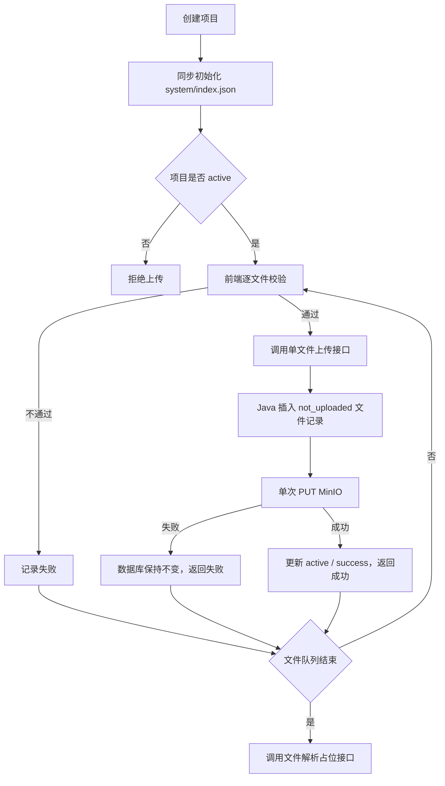

# 索引初始化与单文件上传链路落地说明

## 1. 文档说明

本文档记录项目文件上传链路从批次模式简化为单文件模式后的实际落地结果。业务规则以 [18-项目文件可靠上传模块设计](./18-项目文件可靠上传模块设计.md) 为准，MinIO 与索引细节见 [19-项目上下文索引与MinIO存储设计](./19-项目上下文索引与MinIO存储设计.md)。

## 2. 本次落地范围

| 模块 | 落地内容 |
|---|---|
| 前端 | 逐文件校验、顺序调用单文件接口、收集结果、不自动重试、队列结束后请求解析 |
| Java 接口 | 单文件 Multipart 上传接口和文件解析占位接口 |
| Java 服务 | 文件先落库、单次上传 MinIO、成功更新状态、失败返回结果且不更新数据库 |
| MySQL | 删除批次请求表、物理批次表及 `pm_project_file` 的批次关联字段 |
| MinIO | 保留项目创建时的 `system/index.json` 初始化；单文件上传只写文件对象 |

## 3. 当前流程



## 4. 接口落地

单文件上传：

```http
POST /api/v1/projects/{projectId}/files
Content-Type: multipart/form-data
Authorization: Bearer <token>
X-Idempotency-Key: <文件级幂等键>
```

Multipart 字段：`file`、`relativePath`、`sourceMtimeMs`。

文件解析占位接口：

```http
POST /api/v1/projects/{projectId}/files/parse
Authorization: Bearer <token>
```

解析接口当前只校验项目归属并返回成功，不实现解析逻辑。

## 5. 前端落地

| 文件 | 作用 |
|---|---|
| `frontend/src/modules/project/file-upload.ts` | 单文件路径、大小、目录、后缀和类型校验 |
| `frontend/src/modules/project/api.ts` | 单文件 Multipart 请求与解析请求 |
| `frontend/src/modules/project/types.ts` | 单文件请求和结果类型 |
| `frontend/src/modules/project/mock.ts` | 单文件上传与解析占位 Mock |
| `frontend/src/modules/project/components/project-file-upload-card.vue` | 逐文件处理、结果汇总和最终提示 |

当前交互规则：

- 校验通过后才调用上传接口；
- 文件按选择顺序逐个处理；
- 每个文件只请求一次，不对 HTTP 异常或后端失败自动重试；
- 校验失败和上传失败统一计入待更新文件；
- 队列处理结束后调用解析接口；
- 存在失败文件时只提示用户后续更新项目。

## 6. Java 落地

| 文件 | 作用 |
|---|---|
| `ProjectFileController.java` | 单文件上传入口和解析占位入口 |
| `UploadProjectFileRequest.java` | Multipart 单文件参数 |
| `ProjectFileUploadResponse.java` | 文件级成功或失败结果 |
| `ProjectFileService.java` | 暴露单文件上传服务方法 |
| `ProjectFileServiceImpl.java` | 先落库、单次 PUT、成功更新状态 |

处理顺序固定为：

1. 校验登录用户拥有项目；
2. 规范化相对路径并准备文件元数据；
3. 校验同一项目下路径未被占用；
4. 插入 `status=uploading`、`upload_status=not_uploaded` 的文件记录；
5. 调用一次 MinIO PUT；
6. PUT 失败时不执行数据库更新，返回 `success=false`；
7. PUT 成功时更新为 `status=active`、`upload_status=success`，返回 `success=true`；
8. 整个上传方法不调用索引重建。

已删除旧批次上传的 Controller、Service、DTO、实体、Mapper、枚举、线程池配置和测试。

## 7. 数据库落地

Flyway 已重构为唯一的 `V1__init_phase1_schema.sql`：

- 直接创建 `pm_user`、`pm_project` 和 `pm_project_file`；
- `pm_project_file` 只保留单文件上传、文件更新和上传错误记录所需字段；
- 解析状态、解析结果、详情引用等字段已从上传实体和表中移除；
- 不创建上传请求根表、物理批次表、任务旧表或 Outbox 表；
- 不插入默认用户、示例项目或示例任务；
- 旧 V2～V13 脚本全部删除。

该改动是初始化基线重构，不是对已执行旧迁移数据库的在线升级。开发环境需要重建空 schema，生产或共享数据库需要单独迁移。

## 8. 索引边界

- 项目创建时仍同步初始化 `system/index.json`；
- 单文件上传成功或失败都不改写 `index.json`；
- 文件解析接口暂不改写 `index.json`；
- 已有文件覆盖、重命名和删除的索引行为不在本次简化范围内。

## 9. RabbitMQ 与 Agent

当前上传链路和解析占位接口都不发布 RabbitMQ 消息、不写 Outbox、不调用 Python Agent。后续实现文件解析时再单独设计任务协议、幂等、失败恢复和状态更新。

## 10. 测试覆盖

当前补充并验证：

- 首次插入时状态为 `uploading / not_uploaded`；
- MinIO 成功后返回 `active / success`；
- MinIO 失败后返回文件级失败，且不执行数据库更新；
- 单文件上传不触发索引重建；
- 删除批次代码后 Java 模块可以完整编译；
- 前端单文件类型和调用链通过 TypeScript 检查。

## 11. 验收标准

1. 代码中不再存在旧批次上传业务引用。
2. 前端只调用单文件上传接口且不自动重试。
3. 后端严格先落库再写 MinIO。
4. 失败记录保持初始状态。
5. 上传接口不更新索引。
6. 项目初始化索引不受影响。
7. 解析接口存在但无解析业务实现。
8. 上传模型和 `index.json` 文件条目不包含解析字段。

## 12. 待确认问题

暂无。
