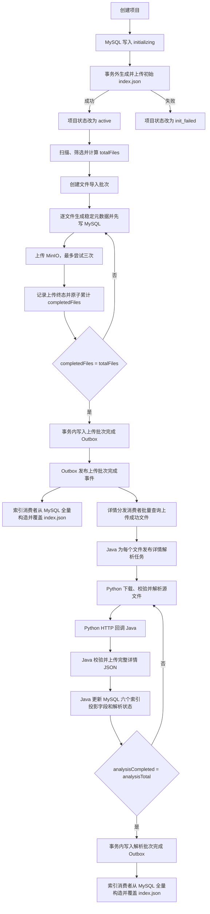

# 索引初始化与重建流程改造说明

## 1. 文档说明

本文档说明本次项目上下文索引初始化、批次上传、文件详情解析及索引重建流程的实际落地结果，供后端、Agent 服务、联调、测试和部署人员使用。

| 项目 | 内容 |
|---|---|
| 变更范围 | Java 后端、Python Agent 服务、MySQL、MinIO、RabbitMQ、项目文档 |
| 实现状态 | 业务代码、数据库迁移和自动化测试已完成 |
| 文档基准日期 | 2026-07-17 |
| 关联设计 | [19-项目上下文索引与MinIO存储设计](./19-项目上下文索引与MinIO存储设计.md) |
| 详情结构规范 | [项目上下文JSON文件规范](../agent-service/docs/项目上下文JSON文件规范.md) |

## 2. 改造背景

原流程在单个文件上传、覆盖、改名或删除后立即重建 `system/index.json`。文件数量增加后，会产生频繁的 MySQL 查询和 MinIO 覆盖，并且无法为“全部上传完成后再统一解析”的批次流程提供可靠完成闸门。

本次改造将职责调整为：

- MySQL 保存项目文件、上传状态、解析状态、批次进度和索引投影字段，是业务事实来源；
- MinIO 保存源文件、完整详情 JSON 和可重新生成的 `system/index.json`；
- Java 负责权限、状态、MySQL、MinIO、MQ 事件及索引写入；
- Python 负责读取源文件、生成完整详情文档，并通过内部 HTTP 回调 Java；
- RabbitMQ 负责解耦上传批次完成、文件详情解析和索引重建；
- Transactional Outbox 保证批次终态与 MQ 完成事件最终一致。

## 3. 改造目标与边界

### 3.1 已实现目标

1. 项目创建时先写入 `initializing` 状态，再在数据库事务外初始化 MinIO 索引，成功后转为 `active`，失败后转为 `init_failed`。
2. 初始索引不再包含 `failed_files`、`pending_analysis_files`、`detail_files`、`ignored_nodes`，统一使用 `summary.fail_nodes` 表达失败节点数量。
3. 上传前生成并持久化稳定文件身份、对象路径、指纹、哈希、解析版本及详情引用。
4. 使用持久化导入批次代替仅存在于进程内的 `total`、`completed` 变量。
5. 批次上传期间不重建索引；全部文件进入上传终态后才发送完成事件。
6. 上传批次完成后并行执行初始索引投影和详情解析任务分发。
7. Python 生成完整详情文档，六个字段只作为 `index.json` 的索引投影，不代表详情文件的全部内容。
8. 全部解析任务进入终态后统一重建一次索引。
9. 使用幂等键、文件终态标记、内容哈希校验、Publisher Confirm、重试和死信队列保证最终一致性。

### 3.2 本次不包含

- 不实现向量化、Embedding、向量数据库和完整 RAG 链路；
- 不允许 Python 直接访问业务数据库或直接写 `index.json`；
- 不在 MQ 消息中传输源文件二进制或完整详情 JSON；
- 不引入跨 MySQL、MinIO、RabbitMQ 的分布式事务；
- 不包含生产环境 RabbitMQ、MinIO 和跨服务 HTTP 的实际部署验收。

## 4. 最终总体流程



批次上传完成事件绑定到两个独立队列，因此初始索引生成和详情解析分发可以并行执行。索引重建以 MySQL 最新记录为准，当前实现直接整体覆盖固定对象，不需要先读取旧索引，每次重建只产生一次 MinIO `PUT`。

## 5. 各步骤生成的信息

### 5.1 项目创建与索引初始化

项目创建阶段生成以下信息：

| 信息 | 位置 | 说明 |
|---|---|---|
| `project_id` | MySQL | 项目主键 |
| `owner_user_id` | MySQL、索引 | 项目所有者 |
| `status` | MySQL | `initializing`、`active` 或 `init_failed` |
| `schema_version` | 索引模板 | 当前为 `1.0.0` |
| MinIO 项目前缀 | 运行时生成 | `PM-AGENT/{ownerUserId}/{projectId}/` |
| 索引对象键 | MinIO | `system/index.json` |

初始索引由 Java `ProjectIndexFactory` 完整构造，模板文件只保存 `schema_version`。初始结构示例如下：

```json
{
  "project_id": 10,
  "project_name": "PM-Agent",
  "owner_user_id": 1,
  "schema_version": "1.0.0",
  "generated_at": "2026-07-17T10:00:00",
  "updated_at": "2026-07-17T10:00:00",
  "storage": {
    "provider": "minio",
    "bucket": "pm-agent",
    "object_prefix": "PM-AGENT/1/10/",
    "index_path": "system/index.json"
  },
  "summary": {
    "total_nodes": 0,
    "active_files": 0,
    "fail_nodes": 0
  },
  "project": [],
  "user": [],
  "upload_failures": [],
  "system": {
    "index": "system/index.json",
    "file_details": "system/file_details/",
    "project_specification": "system/project_specification.json",
    "long_term_memory": "system/long_term_memory.json",
    "short_term_memory": "system/short_term_memory.json",
    "user_habits": "system/user_habits/",
    "update_journal": "system/update_journal.jsonl"
  }
}
```

### 5.2 文件筛选与导入批次

扫描和筛选完成后，由调用方计算符合上传规则的文件数量 `totalFiles`，再创建 `pm_project_file_ingest_batch` 记录。

批次生成以下信息：

| 字段 | 说明 |
|---|---|
| `id` | 导入批次 ID，后续作为 `ingestBatchId` 传入文件上传接口 |
| `project_id` | 所属项目 |
| `idempotency_key` | 防止重复创建批次 |
| `total_files` | 符合上传规则的文件总数 |
| `completed_files` | 已进入上传终态的文件数 |
| `succeeded_files` | 上传成功文件数 |
| `failed_files` | 最终上传失败文件数 |
| `analysis_total` | 需要解析的文件数，上传批次完成时取 `succeeded_files` |
| `analysis_completed` | 已进入解析终态的文件数 |
| `analysis_succeeded` | 解析成功文件数 |
| `analysis_failed` | 最终解析失败文件数 |
| `status` | `uploading`、`upload_completed`、`analyzing`、`completed` |

`totalFiles = 0` 时，批次直接进入 `upload_completed` 并写入上传完成 Outbox，不会永久停留在上传中。

### 5.3 文件上传前的稳定元数据

每个文件在写入 MinIO 前先插入 `pm_project_file`，生成或计算以下信息：

| 字段 | 生成方式或用途 |
|---|---|
| `id` | MySQL 自增主键 |
| `ingest_batch_id` | 当前文件导入批次 ID |
| `storage_uuid` | 项目内稳定存储标识 |
| `logical_path` | 规范化后的项目相对路径，对应实体中的 `relative_path` |
| `file_name` | 从逻辑路径提取的文件名 |
| `storage_name` | 文件名和 `storage_uuid` 组合得到的对象存储名 |
| `object_key` | MinIO 完整对象键 |
| `minio_path` | 项目根目录下的 MinIO 相对路径 |
| `size_bytes` | 文件字节数 |
| `content_type` | 校验后的内容类型 |
| `status` | 文件生命周期状态 |
| `upload_status` | `retrying`、`success` 或 `failed` |
| `analysis_status` | 初始为 `pending` |
| `quick_fingerprint` | 路径、大小、修改时间形成的快速指纹 |
| `content_hash` | 文件内容 SHA-256 |
| `analysis_version` | 当前详情解析版本，默认 `file-detail-v1` |
| `detail_ref` | `system/file_details/{storage_name}` |
| `updated_at` | MySQL 自动维护的更新时间 |

`detail_ref` 不追加额外 `.json` 后缀，和稳定的 `storage_name` 保持一一对应。

### 5.4 上传、重试与上传完成闸门

文件上传最多尝试三次：

| `upload_status` | 含义 | 是否累计 `completed_files` |
|---|---|---|
| `retrying` | 正在上传或失败后仍可重试 | 否 |
| `success` | MinIO 写入成功并完成数据库更新 | 是，仅首次进入终态时累计 |
| `failed` | 三次尝试均失败 | 是，仅首次进入终态时累计 |

文件表的 `upload_completion_recorded` 防止同一文件被重复计数。最后一个文件进入终态时，服务在同一数据库事务内：

1. 将批次从 `uploading` 更新为 `upload_completed`；
2. 将 `analysis_total` 设置为 `succeeded_files`；
3. 向 `pm_event_outbox` 写入上传批次完成事件。

上传批次期间不执行 `ProjectIndexService.rebuild()`。

### 5.5 初始索引投影

索引消费者收到上传批次完成事件后，按项目查询 MySQL 中的最新文件记录，完整生成 `index.json` 并覆盖固定对象键。

每个文件索引项包含：

```json
{
  "id": 30,
  "storage_uuid": "a1b2c3d4e5f67890",
  "logical_path": "backend/README.md",
  "file_name": "README.md",
  "storage_name": "README-a1b2c3d4e5f67890.md",
  "minio_path": "project/README-a1b2c3d4e5f67890.md",
  "size_bytes": 4096,
  "content_type": "text/markdown",
  "status": "active",
  "analysis_status": "pending",
  "quick_fingerprint": "qf:sha256:aaaaaaaaaaaaaaaaaaaaaaaaaaaaaaaaaaaaaaaaaaaaaaaaaaaaaaaaaaaaaaaa",
  "content_hash": "sha256:aaaaaaaaaaaaaaaaaaaaaaaaaaaaaaaaaaaaaaaaaaaaaaaaaaaaaaaaaaaaaaaa",
  "module": null,
  "kind": null,
  "language": "markdown",
  "importance": null,
  "summary": null,
  "keywords": [],
  "detail_ref": "system/file_details/README-a1b2c3d4e5f67890.md",
  "updated_at": "2026-07-17T10:05:00"
}
```

初始投影发生时，详情尚未完成的字段可以为 `null` 或空数组。`summary.fail_nodes` 统一统计扫描失败、最终上传失败和最终详情解析失败。

### 5.6 详情解析任务分发

详情分发消费者在上传批次完成后执行：

1. 将批次从 `upload_completed` 更新为 `analyzing`；
2. 批量将成功文件的解析状态更新为 `processing`；
3. 一次查询获得当前批次中上传成功且未进入解析终态的文件；
4. 为每个文件生成短期 MinIO 预签名读取地址；
5. 发布单文件详情解析事件。

单文件事件只携带身份、路径、哈希、短期地址和回调地址，不传输文件内容：

```json
{
  "eventId": "6f2528b5-6960-4a57-aac8-e507bbecf905",
  "batchId": 20,
  "projectId": 10,
  "fileId": 30,
  "storageUuid": "a1b2c3d4e5f67890",
  "storageName": "README-a1b2c3d4e5f67890.md",
  "logicalPath": "backend/README.md",
  "minioPath": "project/README-a1b2c3d4e5f67890.md",
  "sizeBytes": 4096,
  "contentType": "text/markdown",
  "contentHash": "sha256:aaaaaaaaaaaaaaaaaaaaaaaaaaaaaaaaaaaaaaaaaaaaaaaaaaaaaaaaaaaaaaaa",
  "sourceUrl": "https://minio.example/presigned-source",
  "readUrlRefreshUrl": "http://backend:8080/api/v1/agent/projects/10/files/30/read-url",
  "existingDetailUrl": null,
  "detailRef": "system/file_details/README-a1b2c3d4e5f67890.md",
  "analysisVersion": "file-detail-v1",
  "callbackUrl": "http://backend:8080/api/v1/agent/projects/10/files/30/analysis-result",
  "traceId": "trace-xxx",
  "occurredAt": "2026-07-17T10:06:00"
}
```

重新解析已有详情时，可以携带 `existingDetailUrl`，Python 会读取旧详情并生成 `previous_versions`。

### 5.7 Python 完整详情解析

Python 消费者执行以下步骤：

1. 使用 `sourceUrl` 下载源文件；
2. 预签名 URL 返回 `401` 或 `403` 时，通过 `readUrlRefreshUrl` 获取新地址后重试；
3. 校验文件大小和 `content_hash`；
4. 拒绝二进制内容，并按 UTF-8、GB18030 等顺序解码文本；
5. 使用确定性解析器生成完整详情基线；
6. 配置开启时，调用现有项目上下文模型增强语义字段；
7. 模型不可用或结构校验失败时自动回退确定性结果；
8. 无论成功或失败，都通过 HTTP 回调 Java；
9. 只有 Java 接受回调后，Python 才确认 MQ 消息。

确定性解析器当前生成：

- 模块、文件类别、文件类型、语言、重要程度、摘要和关键词；
- 代码实体或 Markdown 标题；
- 内容切片及源代码行范围；
- 相关主题和可识别的相对依赖文件；
- TODO、动态代码执行、Prompt 注入等风险标记；
- 私钥、硬编码密钥候选等敏感标记；
- 证据摘要、历史版本和解析器元数据。

检测到敏感内容时，不在详情文件中保存原文切片和证据内容，只保留敏感标记。

### 5.8 Java 回调落库与最终索引重建

Java 收到 Python 回调后校验：

- `X-Idempotency-Key` 必须等于 `eventId`；
- 项目、文件和批次必须匹配；
- 文件必须仍处于活动状态；
- 回调 `contentHash` 必须和 MySQL 当前文件版本一致；
- `storageUuid`、`storageName`、`originalPath`、`minioPath`、`detailRef` 必须匹配；
- `analysisVersion` 必须匹配当前解析任务；
- `importance`、`status` 和内容切片行范围必须合法。

成功结果的处理顺序为：

1. Java 将完整详情文档上传到 `detail_ref`；
2. 更新 `analysis_status=success`；
3. 将六个索引投影字段写入 `pm_project_file`；
4. 清理上次解析错误并记录 `analyzed_at`；
5. 使用 `analysis_completion_recorded` 防止重复累计解析进度；
6. 全部解析进入终态后，写入解析批次完成 Outbox；
7. 索引消费者从 MySQL 最新状态完整覆盖一次 `index.json`。

失败结果不上传详情文件，只记录 `analysis_status=failed`、错误码、脱敏错误摘要和解析次数，同样参与批次终态计数。

## 6. 完整详情 JSON 与索引投影

### 6.1 设计原则

`module`、`kind`、`language`、`importance`、`summary`、`keywords` 的作用是让 Java 不读取完整详情文件即可重建 `index.json`。它们只是完整详情文档中的六个投影字段，不是详情文件的全部字段。

| 存储位置 | 保存内容 | 主要用途 |
|---|---|---|
| MySQL `pm_project_file` | 文件状态、解析状态、六个投影字段 | 状态判断、批量查询、索引重建 |
| MinIO `system/file_details/{storage_name}` | 完整详情 JSON | 后续检索、语义理解、风险分析和版本追踪 |
| MinIO `system/index.json` | 文件元数据和六个投影字段 | 项目级快速导航和上下文入口 |

### 6.2 完整详情示例

```json
{
  "id": "file-30",
  "project_id": 10,
  "file_id": 30,
  "schema_version": "1.0.0",
  "analysis_version": "file-detail-v1",
  "generated_at": "2026-07-17T10:10:00",
  "updated_at": "2026-07-17T10:10:00",
  "storage_uuid": "a1b2c3d4e5f67890",
  "storage_name": "README-a1b2c3d4e5f67890.md",
  "detail_ref": "system/file_details/README-a1b2c3d4e5f67890.md",
  "original_path": "backend/README.md",
  "minio_path": "project/README-a1b2c3d4e5f67890.md",
  "size_bytes": 4096,
  "content_type": "text/markdown",
  "content_hash": "sha256:aaaaaaaaaaaaaaaaaaaaaaaaaaaaaaaaaaaaaaaaaaaaaaaaaaaaaaaaaaaaaaaa",
  "module": "backend",
  "kind": "documentation",
  "file_type": "doc",
  "language": "markdown",
  "status": "active",
  "importance": "medium",
  "summary": "backend 模块的说明文档 README.md，主要使用 markdown 表达。",
  "keywords": ["README", "backend", "documentation", "markdown"],
  "role": "该文件在 backend 模块中承担 documentation 职责，为后续检索提供结构、实体与风险线索：README.md。",
  "content_slices": [
    {
      "slice_id": "overview",
      "type": "doc",
      "summary": "定义或说明 Overview 的关键片段。",
      "keywords": ["Overview", "README", "backend"],
      "entities": ["Overview"],
      "source_range": {
        "start_line": 1,
        "end_line": 20
      }
    }
  ],
  "related_topics": ["README", "backend", "documentation"],
  "related_files": [
    {
      "path": "../deploy/README.md",
      "relation": "doc_reference"
    }
  ],
  "risk_flags": [],
  "sensitive_flags": [],
  "evidence": [
    {
      "source": "file_content",
      "quote": "PM-Agent backend"
    }
  ],
  "previous_versions": [],
  "parser": {
    "strategy": "deterministic_structure",
    "parser_version": "deterministic-file-detail-v1",
    "sampled": false,
    "parsed_lines": 120
  }
}
```

完整详情通过 Java DTO 和 Python Pydantic 模型双重结构校验；Python 模型同时拒绝未知字段，避免无约束结构进入 MinIO 或索引。

## 7. 数据库变更

### 7.1 Flyway 迁移

| 迁移 | 作用 |
|---|---|
| `V8__add_project_file_analysis_projection.sql` | 增加稳定存储名、MinIO 路径、上传与解析状态、详情引用、六个投影字段、错误和解析统计 |
| `V9__add_project_file_ingest_batch.sql` | 增加导入批次、文件批次关联和上传/解析终态幂等标记 |
| `V10__add_event_outbox.sql` | 增加事务消息 Outbox 表 |
| `V11__extend_project_initialization_status.sql` | 增加 `initializing` 和 `init_failed` 项目状态 |

### 7.2 `pm_project_file` 主要新增字段

```text
ingest_batch_id
storage_name
minio_path
upload_status
analysis_status
analysis_version
detail_ref
analysis_module
analysis_kind
analysis_language
analysis_importance
analysis_summary
analysis_keywords
analysis_attempts
analysis_error_code
analysis_error_message
analyzed_at
upload_completion_recorded
analysis_completion_recorded
```

新增约束包括：

- 项目内 `storage_uuid` 唯一；
- 项目和业务类型下 `storage_name` 唯一；
- 项目内 `detail_ref` 唯一；
- 上传状态、解析状态、批次状态和计数字段均有数据库检查约束；
- 批次计数必须满足成功数与失败数之和等于完成数。

### 7.3 `pm_event_outbox`

Outbox 保存 `event_id`、事件类型、交换机、Routing Key、JSON 载荷、发布状态、尝试次数、下次重试时间和最后错误。发布器默认每秒扫描最多 100 条待发布记录，收到 RabbitMQ Broker Confirm 后才将事件标记为 `published`。

## 8. HTTP 接口

### 8.1 创建文件导入批次

```http
POST /api/v1/projects/{projectId}/file-ingest-batches
Authorization: Bearer <token>
X-Trace-Id: <trace-id>
X-Idempotency-Key: <1-64字符幂等键>
Content-Type: application/json

{
  "totalFiles": 120
}
```

`totalFiles` 允许为 `0`，单批次最大值为 `100000`。

### 8.2 查询批次进度

```http
GET /api/v1/projects/{projectId}/file-ingest-batches/{batchId}
Authorization: Bearer <token>
X-Trace-Id: <trace-id>
```

响应包含上传和解析阶段的总数、完成数、成功数、失败数及批次状态。

### 8.3 上传单个批次文件

```http
POST /api/v1/projects/{projectId}/files
Authorization: Bearer <token>
X-Trace-Id: <trace-id>
X-Idempotency-Key: <幂等键>
Content-Type: multipart/form-data
```

Multipart 字段：

| 字段 | 必填 | 说明 |
|---|---|---|
| `ingestBatchId` | 新批次流程必填 | 创建批次后获得的批次 ID |
| `businessCode` | 是 | 文件业务类型 |
| `relativePath` | 是 | 项目相对路径 |
| `sourceMtimeMs` | 是 | 源文件修改时间戳 |
| `file` | 是 | 文件内容 |

### 8.4 Python 刷新源文件读取地址

```http
GET /api/v1/agent/projects/{projectId}/files/{fileId}/read-url
X-Internal-Service-Token: <internal-token>
X-Trace-Id: <trace-id>
```

该接口只供 Python Agent 服务调用，返回新的短期 MinIO 预签名读取地址和过期时间。

### 8.5 Python 回传解析结果

```http
PUT /api/v1/agent/projects/{projectId}/files/{fileId}/analysis-result
X-Internal-Service-Token: <internal-token>
X-Idempotency-Key: <eventId>
X-Trace-Id: <trace-id>
Content-Type: application/json
```

成功结果携带完整 `detail`；失败结果只携带 `errorCode` 和脱敏后的 `errorMessage`。成功和失败均必须携带 `eventId`、`batchId`、`contentHash`、`analysisVersion` 与 `status`。

所有接口继续使用统一 `R<T>` 响应，返回 `code`、`message`、`data` 和 `traceId`。

## 9. RabbitMQ Topic 设计

### 9.1 交换机

```text
pm-agent.project-file.events.v1
```

交换机类型为持久化 `TopicExchange`，Routing Key 和队列均带版本号，后续不兼容升级时创建新版本而不是原地修改消息结构。

### 9.2 Routing Key 与队列

| Routing Key | 队列 | 生产者 | 消费者 | 用途 |
|---|---|---|---|---|
| `project.file.upload-batch.completed.v1` | `pm-agent.project-index.project.v1` | Java Outbox | Java `ProjectIndexBatchConsumer` | 上传完成后生成初始索引投影 |
| `project.file.upload-batch.completed.v1` | `pm-agent.file-detail.dispatch.v1` | Java Outbox | Java `FileDetailDispatchConsumer` | 批量生成详情解析任务 |
| `project.file.detail.requested.v1` | `pm-agent.file-detail.parse.v1` | Java `FileDetailTaskPublisher` | Python 文件详情消费者 | 解析单个成功上传文件 |
| `project.file.analysis-batch.completed.v1` | `pm-agent.project-index.project.v1` | Java Outbox | Java `ProjectIndexBatchConsumer` | 全部解析终态后回填最终索引 |

### 9.3 死信队列

| 业务队列 | 死信队列 |
|---|---|
| `pm-agent.project-index.project.v1` | `pm-agent.project-index.project.dlq.v1` |
| `pm-agent.file-detail.dispatch.v1` | `pm-agent.file-detail.dispatch.dlq.v1` |
| `pm-agent.file-detail.parse.v1` | `pm-agent.file-detail.parse.dlq.v1` |

Java Listener 最多尝试三次，间隔依次按 30 秒、倍增退避并限制在 2 分钟内，最终失败后进入对应死信队列。Python 消费者第一次失败时重新入队，重投后仍失败则拒绝并进入详情解析死信队列。

### 9.4 索引单写

`pm-agent.project-index.project.v1` 启用 RabbitMQ `x-single-active-consumer`，确保同一队列在多个 Java 实例间只有一个活动消费者。每个 Java 进程内部仍按 `projectId` 使用互斥锁，避免同一项目并发覆盖索引。

## 10. 一致性与幂等设计

| 风险 | 处理方式 |
|---|---|
| 批次状态已提交但 MQ 消息丢失 | 状态变更和 Outbox 写入处于同一 MySQL 事务 |
| Outbox 重复发布 | `event_id` 在 Outbox 中唯一；索引消费者按最新 MySQL 状态全量投影，详情重复任务由回调校验和终态标记兜底 |
| Publisher 未确认 | 等待 Broker Confirm，未确认则保留 `pending` 并退避重试 |
| 单文件上传结果重复上报 | `upload_completion_recorded` 条件更新 |
| 单文件解析结果重复回调 | 要求事件 ID 等于 HTTP 幂等键，`analysis_completion_recorded` 条件更新保证批次计数不重复；同一固定详情对象允许幂等覆盖 |
| 文件已被覆盖但旧解析晚到 | 回调前比较当前 `content_hash`，旧结果被拒绝 |
| 预签名 URL 过期 | Python 调用 Java 内部接口刷新读取地址 |
| Python 模型输出不符合结构 | Pydantic 校验失败后回退确定性解析 |
| Python 直接篡改业务状态 | Python 无数据库写权限，所有状态和 MinIO 详情写入由 Java 完成 |
| 多实例同时写索引 | 索引队列单活消费者加项目级进程内锁 |

## 11. 性能优化结果

1. 批次上传期间不重建索引，将原来的“每文件一次”降为上传批次完成和解析批次完成各一次。
2. 索引以 MySQL 为事实来源，当前实现不读取旧索引，单次重建只执行一次 MinIO `PUT`。
3. 索引消费者一次查询项目文件后在内存中构建完整 JSON，不按文件调用 MinIO `stat` 或下载对象。
4. 详情分发先批量更新解析状态，再批量查询需要解析的文件，避免解析状态逐文件查询。
5. Python 使用 `prefetch_count` 控制并发和内存占用，默认同时预取 4 条消息。
6. Python 确定性解析最多分析 200000 个字符，模型增强最多输入 12000 个字符，超限时在解析器元数据中标记 `sampled=true`。
7. Outbox 每次最多领取 100 条事件，发布失败采用有上限的指数退避，避免故障期间持续打满 RabbitMQ。
8. 六个索引投影字段存入 MySQL，重建索引时无需逐个读取完整详情 JSON。

## 12. 兼容行为

文件上传接口中的 `ingestBatchId` 当前保持可选：

- 传入 `ingestBatchId`：进入新的批次流程，上传期间不重建索引；
- 未传入 `ingestBatchId`：保留旧单文件兼容模式，上传后立即发布详情任务并重建索引；
- 文件覆盖、移动、删除等非批次操作仍沿用当前即时更新行为；
- 文件内容或路径变化后会解除旧批次关联，避免把新的解析结果错误计入已完成批次。

新客户端应统一先创建导入批次，并在所有上传请求中携带批次 ID。

## 13. 配置项

### 13.1 Java 后端

| 环境变量 | 默认值 | 说明 |
|---|---|---|
| `PM_AGENT_INTERNAL_SERVICE_TOKEN` | `pm-agent-dev-internal-token` | Java 与 Python 内部接口令牌，生产环境必须覆盖 |
| `PM_AGENT_BACKEND_INTERNAL_BASE_URL` | `http://localhost:8080` | Java 提供给 Python 的内部回调基础地址 |
| `PM_AGENT_FILE_DETAIL_ANALYSIS_VERSION` | `file-detail-v1` | 当前详情解析版本 |
| `MINIO_READ_URL_EXPIRY_SECONDS` | `300` | MinIO 读取地址有效期 |
| `PM_AGENT_RABBITMQ_HOST` | 按配置文件 | RabbitMQ 主机 |
| `PM_AGENT_RABBITMQ_PORT` | `5672` | RabbitMQ 端口 |
| `PM_AGENT_RABBITMQ_USERNAME` | `pm-agent` | RabbitMQ 用户名 |
| `PM_AGENT_RABBITMQ_PASSWORD` | `pm-agent-dev` | RabbitMQ 密码 |
| `PM_AGENT_RABBITMQ_VHOST` | `pm-agent` | RabbitMQ Virtual Host |

Outbox 扫描周期可通过 Spring 属性 `pm-agent.messaging.outbox-poll-interval-ms` 调整，默认 1000 毫秒。

### 13.2 Python Agent 服务

| 环境变量 | 默认值 | 说明 |
|---|---|---|
| `PM_AGENT_FILE_DETAIL_CONSUMER_ENABLED` | `false` | 是否启动详情解析消费者 |
| `PM_AGENT_FILE_DETAIL_LLM_ENABLED` | `false` | 是否启用模型增强 |
| `PM_AGENT_INTERNAL_SERVICE_TOKEN` | `pm-agent-dev-internal-token` | 必须与 Java 配置一致 |
| `PM_AGENT_FILE_DETAIL_PREFETCH_COUNT` | `4` | RabbitMQ 预取数量 |
| `PM_AGENT_FILE_DETAIL_MAX_SOURCE_BYTES` | `52428800` | 单文件解析最大字节数 |
| `PM_AGENT_FILE_DETAIL_REQUEST_TIMEOUT_SECONDS` | `30` | 下载和回调 HTTP 超时 |
| `PM_AGENT_RABBITMQ_URL` | 根据 RabbitMQ 分项配置生成 | 可直接覆盖完整 AMQP 地址 |

启用消费者前需要安装项目声明的 `aio-pika>=9.5.0` 依赖。

## 14. 主要代码位置

### 14.1 Java 后端

| 目录或文件 | 作用 |
|---|---|
| `backend/src/main/java/com/ning/pm/file/batch/` | 导入批次、完成闸门、索引消费和详情任务分发 |
| `backend/src/main/java/com/ning/pm/file/analysis/` | 完整详情 DTO、内部 HTTP、结果校验和详情上传 |
| `backend/src/main/java/com/ning/pm/infrastructure/messaging/outbox/` | Transactional Outbox 持久化与确认发布 |
| `backend/src/main/java/com/ning/pm/infrastructure/messaging/rabbitmq/FileMessageTopology.java` | Topic、队列、绑定和死信拓扑 |
| `backend/src/main/java/com/ning/pm/project/context/ProjectIndexFactory.java` | 初始索引和当前索引完整构建 |
| `backend/src/main/java/com/ning/pm/project/service/impl/ProjectServiceImpl.java` | 项目初始化事务边界 |
| `backend/src/main/resources/db/migration/V8__add_project_file_analysis_projection.sql` | 文件解析投影迁移 |
| `backend/src/main/resources/db/migration/V9__add_project_file_ingest_batch.sql` | 批次迁移 |
| `backend/src/main/resources/db/migration/V10__add_event_outbox.sql` | Outbox 迁移 |
| `backend/src/main/resources/db/migration/V11__extend_project_initialization_status.sql` | 项目初始化状态迁移 |

### 14.2 Python Agent 服务

| 目录或文件 | 作用 |
|---|---|
| `agent-service/app/project/context/detail_analysis/schemas.py` | MQ 事件、完整详情和回调 Pydantic 模型 |
| `agent-service/app/project/context/detail_analysis/parser.py` | 确定性详情解析器 |
| `agent-service/app/project/context/detail_analysis/enricher.py` | 可选模型增强和自动回退 |
| `agent-service/app/project/context/detail_analysis/service.py` | 下载、哈希校验、解析和 Java 回调 |
| `agent-service/app/project/context/detail_analysis/consumer.py` | RabbitMQ 消费、确认、重投和死信处理 |
| `agent-service/app/project/inner_prompts/project_file_detail.py` | 完整详情结构 Prompt |
| `agent-service/app/main.py` | 根据配置启动和关闭详情消费者 |

## 15. 验证结果与验收标准

### 15.1 已完成自动化验证

| 验证项 | 结果 |
|---|---|
| Java `mvn -q clean test` | 54 个测试通过，0 失败，0 错误 |
| Python 详情解析定向测试 | 4 个测试通过 |
| Python 相关模块 `compileall` | 通过 |
| `git diff --check` | 通过，仅存在 Windows 换行符提示 |

自动化测试覆盖了详情成功回调、过期哈希拒绝、失败回调、上传与解析批次完成、重复终态计数、空批次和索引投影等核心场景。

### 15.2 部署联调验收标准

1. 创建项目后，MySQL 状态最终为 `active`，MinIO 固定位置存在合法初始 `index.json`。
2. 创建 `totalFiles=N` 的批次后，N 个文件均进入上传终态时只产生一条上传完成 Outbox。
3. 批次上传期间不发生索引重建；上传完成后索引仅整体覆盖一次。
4. 上传成功文件各产生一条详情解析事件，上传失败文件不进入 Python 解析。
5. Python 消费者能处理预签名 URL 过期、哈希不匹配、文本解码和解析失败。
6. 完整详情文件包含本文定义的全部字段，六个投影字段正确回写 MySQL 和 `index.json`。
7. 重复回调不重复增加批次计数，旧内容哈希回调不能覆盖新版本。
8. 全部详情进入终态后只产生一条解析完成 Outbox，并整体覆盖一次最终索引。
9. 暂停 RabbitMQ 后，Outbox 保持 `pending`；恢复后能够继续发布并转为 `published`。
10. 消费者连续失败后消息进入对应 DLQ，业务线程不会无限重试。

## 16. 风险与后续优化

| 项目 | 当前处理 | 后续建议 |
|---|---|---|
| 单项目超大索引 | 从 MySQL 全量构建并整体覆盖 | 索引明显超过单对象适用规模后再评估分片，不提前复杂化 |
| 多 Region 索引写入 | 单 RabbitMQ 集群下使用单活消费者 | 多 Region 无法共享队列时再增加数据库 revision 或租约 |
| DLQ 恢复 | 已完成死信路由 | 部署阶段补充人工审核和受控重放工具 |
| Python 并发 | 默认预取 4 条 | 根据 CPU、内存、文件大小和模型吞吐压测后调整 |
| 完整详情质量 | 确定性解析保证基线，可选模型增强 | 使用真实项目样本建立质量回归集 |
| 批次长期未完成 | 可查询持久化进度 | 后续增加超时扫描和补偿任务 |

## 17. 待确认问题

1. 生产环境 Java 内部基础地址和内部服务令牌由哪一套密钥管理及部署配置负责下发。
2. 详情解析 DLQ 的审核、重放权限和操作入口由运维脚本还是后台管理功能承载。
3. 生产环境 Python 消费者初始副本数、`prefetch_count` 和单文件上限需要在真实文件集压测后确认。
