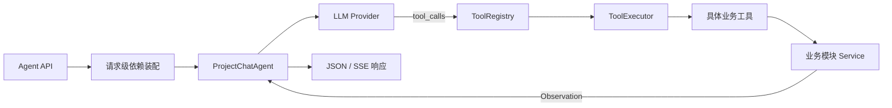

# 模型原生工具调用代码审阅顺序

## 1. 背景

PM-Agent 已将原有演示工具链路替换为模型原生工具调用、请求级工具注册表、安全执行器和真实项目只读工具。本指南用于按照稳定的依赖顺序审阅当前实现，避免只按文件名或 Git diff 顺序阅读而遗漏身份、协议和业务边界。

长期架构规则以 [`06-Agent设计.md`](./06-Agent设计.md) 为准，接口字段和事件协议以 [`05-接口规范.md`](./05-接口规范.md) 为准。

## 2. 审阅目标

完成审阅后，应能够确认：

- 客户端不能伪造工具调用或工具结果；
- 工具执行身份来自 Bearer JWT，而不是模型生成参数；
- 工具注册表只暴露当前请求允许调用的工具；
- Provider 正确解析非流式和流式 `tool_calls`；
- 工具通过公开业务 Service 执行，不接收 Session 或 Repository；
- Agent 工具循环具有明确的步骤、次数和 Provider 能力限制；
- JSON 与 SSE 输出不会直接泄露完整业务工具结果；
- 单元测试覆盖协议、执行器、安全边界和完整工具循环。

## 3. `tools` 目录边界

| 目录 | 状态 | 职责 |
|---|---|---|
| [`app/agents/tools/`](../agent-service/app/agents/tools/) | 正式运行目录 | 工具抽象、执行上下文、注册表、执行器和具体业务工具 |
| [`app/agents/tools/project/`](../agent-service/app/agents/tools/project/) | 正式业务工具目录 | 项目模块工具，目前提供 `get_current_project` |
| `app/llm/tools/` | 已废弃 | 原演示工具目录，源文件已删除；LLM 层不承载业务工具 |
| `app/tools/` | 已废弃 | 原兼容转发目录，源文件已删除；不得在此新增工具 |
| [`tests/unit/agents/tools/`](../agent-service/tests/unit/agents/tools/) | 测试目录 | 验证工具参数、注册、执行和错误 Observation |

以后新增工具统一放入 `app/agents/tools/<业务模块>/`，并在请求级依赖中显式注册。

## 4. 运行链路

## 5. 功能代码审阅顺序

### 5.1 接口和请求安全边界

1. [`app/streaming/payloads/request.py`](../agent-service/app/streaming/payloads/request.py)
   - 检查工具调用 ID 是否保持字符串类型；
   - 检查客户端提交 `assistant.tool_calls` 或 `tool` 消息时是否被拒绝；
   - 检查对话上下文和模型 Provider 字段。
2. [`app/api/v1/agent.py`](../agent-service/app/api/v1/agent.py)
   - 检查 Bearer JWT 用户与请求用户的一致性；
   - 检查工具执行是否使用 `principal.user_id`；
   - 检查流式业务异常和系统异常是否统一转换为 `error` 事件。
3. [`app/core/errors/codes.py`](../agent-service/app/core/errors/codes.py)
   - 检查 `40001`～`40006` 的含义及使用位置。

### 5.2 请求级依赖装配

4. [`app/modules/project/dependencies.py`](../agent-service/app/modules/project/dependencies.py)
   - 检查 `ProjectService` 的请求级构造方式；
   - 确认数据库 Session 只进入 Repository，不进入 Agent 工具。
5. [`app/modules/project/api.py`](../agent-service/app/modules/project/api.py)
   - 检查项目 API 是否复用统一的 `get_project_service`。
6. [`app/agents/dependencies.py`](../agent-service/app/agents/dependencies.py)
   - 检查工具、注册表、执行器和 Agent 是否在同一请求范围装配；
   - 确认只注册经过安全审查的真实工具。

### 5.3 Agent 主编排

7. [`app/llm/orchestration/project_chat_agent.py`](../agent-service/app/llm/orchestration/project_chat_agent.py)
   - 先审阅非流式 `chat()`，再审阅流式 `stream_chat()`；
   - 检查 assistant 工具决策、tool Observation 和最终回答的消息顺序；
   - 检查最多 5 个模型步骤和 8 次工具调用的限制；
   - 检查非流式与流式 Provider 能力门禁；
   - 检查工具完整输出是否只回传模型。
8. [`app/llm/prompts/project_chat.py`](../agent-service/app/llm/prompts/project_chat.py)
   - 检查系统 Prompt 是否要求业务数据只能通过工具获取；
   - 检查历史工具参数是否按模型协议序列化。

### 5.4 模型统一契约和 Provider 适配

9. [`app/llm/contracts.py`](../agent-service/app/llm/contracts.py)
   - 依次审阅 Provider 能力、工具调用、完整 assistant 轮次、流式增量和聚合器；
   - 检查流式参数是否按 `index` 正确合并。
10. [`app/llm/base.py`](../agent-service/app/llm/base.py)
    - 检查新增完整轮次接口是否兼容既有纯文本客户端。
11. [`app/llm/clients/openai_compatible.py`](../agent-service/app/llm/clients/openai_compatible.py)
    - 检查 `tools`、`tool_choice` 和流式 usage 请求体；
    - 检查非流式 `tool_calls` 与流式工具参数分片解析；
    - 检查 `reasoning_content` 是否能够回传下一轮模型请求。
12. [`app/llm/clients/deepseek_client.py`](../agent-service/app/llm/clients/deepseek_client.py)
    - 检查原生工具、流式工具和推理内容回传能力声明。

### 5.5 工具框架

13. [`app/agents/tools/schemas.py`](../agent-service/app/agents/tools/schemas.py)
    - 检查可信执行上下文和统一 Observation 结构。
14. [`app/agents/tools/base.py`](../agent-service/app/agents/tools/base.py)
    - 检查工具名称、描述、输入输出模型、操作类型、确认门禁和超时声明。
15. [`app/agents/tools/registry.py`](../agent-service/app/agents/tools/registry.py)
    - 检查工具名称格式、重复注册和模型函数定义生成。
16. [`app/agents/tools/executor.py`](../agent-service/app/agents/tools/executor.py)
    - 检查 JSON 解析、Pydantic 输入校验、确认门禁和超时；
    - 检查业务异常、输出校验异常和未知异常的安全收敛；
    - 确认非法参数不会进入业务 Service。

### 5.6 真实项目工具

17. [`app/agents/tools/project/get_current_project.py`](../agent-service/app/agents/tools/project/get_current_project.py)
    - 检查模型不能传入用户 ID 或项目 ID；
    - 检查项目 ID 来自可信对话上下文；
    - 检查工具只调用 `ProjectService.get_owned`。
18. [`app/modules/project/service.py`](../agent-service/app/modules/project/service.py)
    - 关联审阅 `get_owned` 的资源归属校验。该文件是既有业务依赖，不是本次工具框架新增文件。

### 5.7 响应协议

19. [`app/streaming/payloads/response.py`](../agent-service/app/streaming/payloads/response.py)
    - 检查非流式工具记录和流式工具事件字段；
    - 确认客户端只收到安全摘要、错误标识和耗时。
20. [`app/streaming/payloads/__init__.py`](../agent-service/app/streaming/payloads/__init__.py)
    - 检查新增响应模型是否通过稳定入口导出。
21. [`app/streaming/events.py`](../agent-service/app/streaming/events.py)
    - 关联检查 `tool_call`、`tool_result`、`error` 和 `done` 事件定义。
22. [`app/streaming/sse.py`](../agent-service/app/streaming/sse.py)
    - 关联检查 Pydantic 模型、字典和字符串的 SSE 序列化方式。

## 6. 测试审阅顺序

1. [`tests/unit/llm/test_contracts.py`](../agent-service/tests/unit/llm/test_contracts.py)：流式工具参数聚合。
2. [`tests/unit/llm/test_openai_compatible.py`](../agent-service/tests/unit/llm/test_openai_compatible.py)：模型请求体和 Provider 响应解析。
3. [`tests/unit/agents/tools/test_executor.py`](../agent-service/tests/unit/agents/tools/test_executor.py)：工具成功、非法参数和未注册工具。
4. [`tests/unit/agents/test_request_validation.py`](../agent-service/tests/unit/agents/test_request_validation.py)：客户端伪造工具历史拦截。
5. [`tests/unit/agents/test_project_chat_agent.py`](../agent-service/tests/unit/agents/test_project_chat_agent.py)：非流式、流式完整链路和 Provider 能力门禁。

## 7. 文档审阅顺序

1. [`00-术语表.md`](./00-术语表.md)：确认“工具注册表”等术语。
2. [`05-接口规范.md`](./05-接口规范.md)：确认 Agent 请求、JSON/SSE 响应和错误码。
3. [`06-Agent设计.md`](./06-Agent设计.md)：确认运行边界、组件职责和未实现范围。
4. [`14-Agent服务代码结构说明.md`](./14-Agent服务代码结构说明.md)：确认目录职责和扩展位置。
5. [`agent-service/docs/接入层开发步骤.md`](../agent-service/docs/接入层开发步骤.md)：确认后续开发优先级。

## 8. 删除项审阅

以下文件已删除，无法通过当前文件跳转，应在 Git diff 中确认旧演示链路已经完整退出：

- `agent-service/app/llm/tools/__init__.py`
- `agent-service/app/llm/tools/demo_project_tool.py`
- `agent-service/app/tools/demo_project_tool.py`

审阅时还应搜索 `DemoProjectTool`、`demo_project_tool` 和 `use_tool_demo`，确认运行代码与当前文档中不存在残留引用。

## 9. 验收标准

- 能够从 API 入口追踪到模型调用、工具执行、业务 Service 和最终响应；
- 工具身份、参数、输出和异常边界均有对应测试；
- 正式运行代码只使用 `app/agents/tools/`；
- 被删除的 Demo 工具不存在有效导入；
- 全量后端测试和静态检查通过。

## 10. 待确认问题

暂无。写工具、人工确认和 Agent Trace 持久化进入开发后，需要单独补充对应审阅章节。
