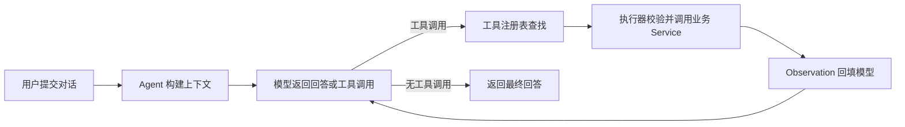

# 项目补全计划

## 1. 背景

PM-Agent 当前已经完成 Python 模块化单体迁移，并建立了认证、项目、项目文件、文件解析和 Agent 模型原生工具调用的基础链路。项目已经具备继续向可用产品推进的技术基线，但用户可见的 Agent 对话入口、Agent Trace、核心项目管理业务模块和写工具安全链路仍未形成完整闭环。

本计划以当前代码为基线，明确已完成能力、待补全范围和后续开发顺序。第一项开发任务调整为补全“模型判断—工具调用—业务 Service 执行—结果回填—再次判断—最终回答”闭环，先稳定工具协议、真实业务数据查询和安全 Observation 回填，再建设用户入口、Trace 和其他上下文 JSON。

## 2. 补全目标

项目补全以“可运行、可验证、可追踪、可继续扩展”为目标：

1. Agent 能够基于真实业务 Service 完成工具选择、执行、结果校验和安全 Observation 回填，并形成有限、可终止的模型—工具循环；
2. 用户能够在项目页面进入 Agent 对话，并看到模型回答和工具执行状态；
3. 每次模型调用和工具调用均可通过 Trace 追踪，写操作具备人工确认和幂等保护；
4. 任务、需求、迭代、风险和报告逐步从展示或规划状态转为真实前后端业务能力；
5. 项目文件更新、解析、索引和项目规范能够在真实中间件环境中稳定重建；
6. 在对话链路稳定后，继续补全短期记忆、长期记忆、用户习惯和更新日志等上下文 JSON。

## 3. 范围

### 3.1 本期范围

- 模型原生工具调用、真实业务只读工具和安全 Observation 数据回填；
- Agent 前端对话入口与 JSON/SSE 事件消费；
- Agent Trace 数据模型、持久化和基础查询；
- 任务模块真实前后端垂直切片；
- 业务只读工具扩展；
- 写工具的人工确认、幂等和审计基础；
- 项目文件更新、解析和项目规范的真实环境联调；
- 后端契约测试、前端构建检查和关键链路端到端验收；
- 现有设计文档和接口文档同步更新。

### 3.2 暂缓范围

- 除 `system/index.json`、`system/file_details/*.json` 和 `system/project_specification.json` 外的上下文 JSON 更新链路；
- 对话历史召回、长期记忆召回和完整会话管理；
- 完整 RAG 产品化和向量数据库；
- 多 Agent 协作、通用工作流引擎和并行工具执行；
- 未经人工确认的高风险写操作；
- RabbitMQ 或其他新增运行时中间件。

## 4. 当前开发进度

### 4.1 架构基线

当前在线架构已经收敛为：

```text
Vue 3 → FastAPI 模块化单体 → MySQL / Redis / MinIO / LLM
```

- Python 是业务表的唯一写入者；
- Alembic 是数据库结构的唯一迁移工具；
- Agent 工具通过业务模块公开 Service 执行，不直接访问 Session 或 Repository；
- MinIO 和 LLM 调用位于数据库事务之外；
- 前端统一通过 `src/api/http.ts` 处理认证和 `X-Trace-Id`。

### 4.2 能力完成情况

| 能力 | 当前状态 | 已完成内容 | 主要缺口 |
|---|---|---|---|
| Python 在线基座 | 已完成基础实现 | FastAPI 模块化单体、统一响应、错误处理、日志、Trace 中间件和 Alembic 基线 | 真实环境迁移、备份、恢复和部署演练仍需补充 |
| 认证与用户 | 已完成基础实现 | 注册、登录、注销、当前用户查询、资料与密码修改，Bearer JWT 与 Redis 会话校验 | 缺少完整接口级集成测试和安全回归清单 |
| 项目模块 | 已完成基础实现 | 项目创建、列表、详情、删除和资源归属校验 | 项目成员、角色与协作能力尚未实现 |
| 项目文件管理 | 主链路已完成 | 单文件上传、覆盖、移动、列表、读取地址、删除、幂等和乐观锁 | 需要在真实 MySQL、Redis、MinIO 环境完成失败恢复和并发验证 |
| 项目更新 | 主链路已完成 | 前端校验并计算完整 SHA-256 清单，后端基于 MySQL 权威快照规划新增、修改、移动、删除、拒绝和歧义项，再复用单文件接口执行更新 | 缺少独立前端单元测试和大目录哈希、进度反馈优化 |
| 文件解析与索引 | 主链路已完成 | 进程内读取 MinIO，模型输入前执行敏感内容阻断或脱敏，由服务端组装身份字段并落库详情投影；规范发布成功后再完整重建 `system/index.json`，接口返回文件级部分失败 | 需要补充真实模型失败、对象缺失、并发变化和重复重建的集成验证 |
| 项目规范 | 主链路已完成 | 项目创建时生成空规范，后续聚合全部有效详情中的结构化规则候选，使用稳定来源引用合并 `system/project_specification.json`，来源失效或版本变化时进入待复核 | 模型输出失败恢复和较大项目规则冲突效果仍需验证 |
| Agent 接入层 | 后端最小闭环已完成 | JSON/SSE、模型原生工具调用、请求级工具注册表、安全执行器、有限模型—工具循环 | 真实 Provider 下的工具调用、结果回填和失败路径端到端验证不足 |
| Agent 工具 | 部分完成 | 已提供 `get_current_project`、`list_current_project_files` 和 `list_owned_projects` 三个只读工具，并通过公开业务 Service 校验用户与项目边界 | 项目规范摘要数据尚未形成稳定的查询与回填闭环 |
| Agent Trace | 未完成 | 已有 `traceId` 传递、日志和响应事件 | 尚无 Trace 数据表、Repository、Service、查询接口和前端展示 |
| 核心业务模块 | 部分完成 | 前端已有任务看板页面和 Mock 数据 | 任务后端以及需求、迭代、风险、报告模块尚未形成真实业务闭环 |
| Agent 前端 | 未完成 | 已有统一 HTTP 客户端和项目页面，可作为接入基础 | 缺少对话页面、消息状态、POST SSE 解析、工具状态展示和错误恢复 |
| 其他上下文 JSON | 暂缓 | 已保留相关 Prompt、结构说明和扩展位置 | 尚未接入稳定的触发、更新、持久化和回放链路 |
| RAG 与记忆 | 预留 | 已有目录骨架和设计资料 | 当前不进入产品化开发 |

### 4.3 当前验证基线

截至本次文件同步与解析链路实现完成时：

- 后端测试共 150 项，全部通过；
- 前端 TypeScript 类型检查通过；
- 前端生产构建通过，共转换 2919 个模块；当前仅有既存的单个产物超过 500 kB 提示，需要后续按页面拆包优化；
- 当前测试以单元测试为主，真实 MySQL、Redis、MinIO 和 DeepSeek 联调尚不能视为已完成。

## 5. 当前可用链路

### 5.1 项目文件链路


该链路已经具备代码实现。`sync/plan` 只负责只读规划，不新增一套批量写协议；实际变更仍复用经过幂等、乐观锁和归属校验的单文件接口。下一阶段重点是补齐真实环境验收、异常恢复和大目录操作反馈。

### 5.2 Agent 模型—工具循环



该链路的后端骨架已经完成，但当前仅有一个只读工具，工具结果回填仍缺少多类真实业务数据和完整失败路径验证。因此，下一步先补全工具调用与安全 Observation 回填，再建设用户可直接使用的前端入口和持久化 Trace，不继续扩展大量上下文 JSON。

## 6. 差距与优先级判断

### 6.1 当前最大差距

按照最小闭环衡量，后端“模型判断—工具执行—Observation 回填—最终回答”已经存在，缺失最大的部分是：

1. **工具调用和数据回填不足**：当前只有一个真实只读工具，尚未用项目文件、项目规范等真实数据验证成功、失败和多轮 Observation 回填；
2. **用户入口缺失**：前端没有 Agent 对话页面和流式事件消费，后端能力无法形成用户可验收功能；
3. **过程追踪缺失**：Agent Trace 尚未持久化，模型和工具循环不能稳定复盘；
4. **业务数据不足**：任务、风险等 Agent 核心数据来源尚未落地；
5. **写操作安全链路缺失**：人工确认、幂等和审计未完成，暂时不能注册写工具；
6. **端到端验证不足**：当前测试以单元测试为主，尚未覆盖真实 Provider 与中间件组合。

### 6.2 优先级原则

1. 先补全工具调用和安全 Observation 数据回填，再冻结前端消费的工具事件协议；
2. 先完成可验证的只读工具闭环，再建设用户可见入口；
3. 先补 Trace，再开发写工具；
4. 先完成任务真实业务模块，再注册任务工具；
5. 先完成一条端到端可验收链路，再扩展 Provider、JSON 和 RAG；
6. 新功能优先复用现有 Service、统一响应和工具执行器，不新增重复协议。

## 7. 分阶段开发计划

### 7.1 P0：补全工具调用和数据回填闭环

目标是先稳定模型原生工具调用协议，让真实业务数据能够经过受控工具执行并以安全 Observation 回填模型，支持模型继续判断并生成最终回答。

本计划中的“数据回填”专指工具执行结果回填模型上下文，不代表模型或工具绕过业务 Service 直接写回数据库。

开发内容：

- 统一 `X-Trace-Id`、Agent 请求 `trace_id`、SSE 事件和工具执行上下文的追踪标识；
- 明确 `conversation_id`、可信用户身份和项目上下文的生成与校验规则；
- 完善工具成功、业务失败、参数失败、超时和输出校验失败时的结构化 Observation；
- 保留完整工具结果供模型继续判断，对客户端仅返回安全摘要，不暴露敏感业务数据；
- 维护当前项目、当前项目文件列表和用户项目列表三个只读工具，继续优先补充项目规范摘要只读工具；
- 所有工具继续通过公开业务 Service 查询数据，并在 Service 层执行用户和项目归属校验；
- 验证模型连续调用工具、Observation 回填、再次判断和最终回答的消息顺序；
- 覆盖未注册工具、非法参数、工具超时、业务异常、模型空回答和循环上限场景；
- 使用真实 DeepSeek 配置分别完成 JSON 与 SSE 工具调用端到端验证。

完成标准：

- Agent 至少能够查询当前项目、项目文件列表和项目规范摘要；
- 每次工具执行结果都能以结构化 Observation 回填模型，并触发后续判断或最终回答；
- 工具失败时不伪造成功，模型能够基于安全错误信息向用户解释失败；
- JSON 与 SSE 模式的工具调用顺序、状态和最终结果语义一致；
- 模型不能通过参数切换用户或项目，工具不能绕过业务 Service 访问数据；
- 相关单元测试、契约测试和一次真实 Provider 验证全部通过。

### 7.2 P0：稳定现有基线

目标是确认当前已实现能力在规定运行环境中可重复运行。

开发内容：

- 使用 Node.js 20、pnpm 9 完成前端类型检查和生产构建；
- 使用 MySQL、Redis、MinIO 执行认证、项目、文件上传和项目更新联调；
- 验证文件覆盖、移动、删除后 `index.json` 和 `project_specification.json` 能正确重建；
- 补充关键 API 契约测试和项目更新前端单元测试；
- 整理现有注释和格式差异，保持代码审查基线干净。

完成标准：

- 当前主链路在干净环境可启动；
- 后端全量测试通过；
- 前端类型检查和生产构建通过；
- 项目文件链路和 Agent 只读工具链路均有一次真实端到端验证记录。

### 7.3 P0：完成 Agent 前端闭环

目标是让用户能够在项目上下文中直接使用 Agent。

开发内容：

- 新增 `frontend/src/modules/agent/`，包含 API、类型、状态、页面和组件；
- 在项目详情页提供明确的 Agent 入口；
- 使用支持 POST、Bearer JWT 和流读取的请求方式消费 SSE；
- 按 `meta`、`tool_call`、`tool_result`、`token`、`error`、`done` 维护消息状态；
- 展示工具执行中、成功、失败和最终回答，不显示完整敏感工具出参；
- 支持取消请求、重复提交保护和失败后重新发送；
- 当前只提交用户与普通助手消息，不回传服务端产生的工具消息。

完成标准：

- 用户可以从项目详情进入 Agent 对话；
- 可以看到当前项目、项目文件或项目规范工具的开始、完成和最终回答；
- JSON 与 SSE 两种模式均可验证；
- 错误、断流和工具失败不会让页面停留在错误的执行中状态。

### 7.4 P1：补全 Agent Trace

目标是在开发写工具前建立可追踪基础。

开发内容：

- 设计 Agent Trace、模型轮次和工具调用数据结构；
- 新增 Alembic revision、Repository、Service 和只读查询接口；
- 记录用户、项目、会话、轮次、Provider、模型、token 用量、工具状态、耗时和错误标识；
- 默认不保存 Prompt 原文、完整工具输出、JWT 和敏感文件正文；
- 将应用日志、响应 `traceId` 和 Trace 记录关联；
- 提供最小 Trace 详情页或开发态查看入口。

完成标准：

- 任一次 Agent 请求均可通过 `traceId` 找到完整模型—工具执行顺序；
- 工具失败、模型失败和循环上限均有稳定状态；
- 敏感信息脱敏规则有测试覆盖。

### 7.5 P1：完成任务业务垂直切片

目标是为 Agent 提供首个具有项目管理价值的真实业务数据源。

开发内容：

- 补充任务表、状态与必要索引，并新增 Alembic revision；
- 实现任务 API、Schema、Domain、Repository、Service 和 Errors；
- 支持任务创建、查询、修改、状态流转和项目归属校验；
- 将前端任务看板从 Mock 切换到真实 API；
- 补充领域不变量、权限、并发和接口契约测试；
- 完成任务模块设计文档和接口文档。

完成标准：

- 用户可在项目下创建、查看和推进任务；
- 刷新页面后任务数据保持一致；
- 非项目所有者无法访问或修改任务；
- 前后端关键路径不再依赖 Mock。

### 7.6 P1：继续扩展只读业务工具

目标是让 Agent 能够回答真实项目管理问题。

建议按以下顺序增加工具：

1. 查询项目任务列表和任务状态；
2. 查询逾期、阻塞或即将到期的任务；
3. 在风险模块完成后查询风险；
4. 在报告模块完成后查询报告来源数据。

每个工具必须满足：

- 在请求级工具注册表中显式注册；
- 输入输出使用 Pydantic 模型；
- 只调用目标模块公开 Service；
- 用户和项目身份来自可信执行上下文；
- 异常转换为安全 Observation；
- 工具执行和 Agent 循环都有单元测试。

### 7.7 P2：实现人工确认与写工具

目标是在 Trace 和真实业务模块稳定后提供受控执行能力。

开发内容：

- 设计有过期时间、单次使用的人工确认凭证；
- 建立写工具幂等键、权限校验和业务审计规则；
- 先选择低风险写操作进行验证，例如创建任务草稿或修改普通任务字段；
- 对删除、权限变更、对外通知等高风险动作继续保持禁用；
- 覆盖用户拒绝、确认过期、重复确认、并发执行和业务失败场景。

完成标准：

- 未确认或确认凭证无效时，写工具不能调用业务 Service；
- 同一确认和幂等键不会重复执行；
- 写入结果可以同时从业务数据、Trace 和审计记录验证。

### 7.8 P2：继续补全上下文 JSON

恢复条件：

- Agent 前端闭环已验收；
- Agent Trace 已持久化；
- 对话请求和响应契约基本稳定；
- 至少一个任务只读工具可用；
- 项目文件解析和项目规范重建通过真实环境验证。

恢复后建议按以下顺序开发：

1. `short_term_memory.json`：只记录当前任务窗口内的短期上下文；
2. `update_journal.jsonl`：记录上下文更新动作，提供可回放依据；
3. `long_term_memory.json`：从稳定结论中提炼长期项目记忆；
4. `user_habits/*.json`：只记录用户明确、稳定且可解释的偏好；
5. `project.md` 阅读稿和用户编辑内化链路。

该阶段应复用现有结构化 JSON 生成器、Pydantic 校验、对象存储路径工厂和稳定合并模式，不为每个 JSON 文件复制一套模型客户端和存储编排。

### 7.9 P3：需求、迭代、风险、报告与受控检索

在任务闭环和 Agent 工具链稳定后，按业务依赖逐步补充：

1. 需求与任务拆解；
2. 迭代规划和任务归属；
3. 风险识别、确认和处理；
4. 周报、迭代报告和风险摘要；
5. 基于真实检索评估的受控 RAG。

除非现有 MySQL、Redis、MinIO 和模型能力无法满足已验证需求，否则不新增运行时依赖。

## 8. 代码架构要求

后续开发继续遵守以下边界：

```text
Agent API
  → ProjectChatAgent
  → ToolRegistry / ToolExecutor
  → 业务工具
  → app/modules/<module>/service.py
  → Repository / Infrastructure
```

- API 层不直接访问数据库、MinIO、Redis 或 LLM；
- Repository 不调用其他 Repository 或外部基础设施；
- 跨模块协作通过公开 Service；
- Agent 工具不接收 SQLAlchemy Session、Repository 或 JWT；
- ORM 模型不直接作为 API 或工具输出；
- 写工具必须具备权限、幂等、Trace 和人工确认；
- 数据库变更只新增 Alembic revision，不修改已应用迁移；
- 新业务模块先补最小设计文档，再开始编码。

## 9. 风险与取舍

| 风险 | 影响 | 当前取舍 |
|---|---|---|
| 工具协议未稳定就开发前端 | 工具事件和消息状态变化会造成前端返工 | 先补全工具调用和数据回填，再冻结前端消费协议 |
| 过早扩展上下文 JSON | 对话契约和触发规则变化会导致重复返工 | 暂缓其他 JSON，先稳定工具闭环、Agent 前端和 Trace |
| 先做写工具、后补 Trace | 无法可靠确认执行过程和责任边界 | Trace 完成前只注册只读工具 |
| 前端继续依赖 Mock | 页面存在但无法形成真实业务闭环 | 任务模块优先完成真实垂直切片 |
| 只依赖单元测试 | 无法发现中间件、网络和 Provider 协议问题 | P0 增加真实环境端到端验收 |
| 一次实现全部业务模块 | 范围过大，难以形成稳定交付点 | 按任务、需求、迭代、风险、报告顺序推进 |
| 过早引入 RAG 或新中间件 | 增加部署和运维成本 | 以现有架构完成最小闭环后再评估 |

## 10. 总体验收标准

项目完成当前补全阶段时，应满足：

- 用户可以完成注册、登录、创建项目、上传或更新项目文件并触发解析；
- `file_details`、`index.json` 和 `project_specification.json` 可以稳定生成和重建；
- 用户可以从项目页面发起 Agent 对话，并看到工具执行状态和最终回答；
- Agent 至少能够查询当前项目、项目文件、项目规范和任务；
- 工具结果能够以结构化 Observation 回填模型，失败时不会被模型或前端显示为成功；
- Agent Trace 能够完整记录一次模型—工具循环且不保存敏感原文；
- 任务前后端使用真实数据，不依赖 Mock；
- 任一写工具都不能绕过人工确认、权限和幂等门禁；
- 后端测试、前端类型检查和生产构建全部通过；
- 关键链路在真实 MySQL、Redis、MinIO 和模型环境中通过端到端验收；
- 接口、Agent、数据模型和模块设计文档与代码保持一致。

## 11. 推荐执行顺序

```text
补全工具调用和安全 Observation 数据回填
  → 稳定当前基线
  → Agent 前端闭环
  → Agent Trace
  → 任务真实业务闭环
  → 任务及后续业务只读工具
  → 人工确认与低风险写工具
  → 其他上下文 JSON
  → 需求 / 迭代 / 风险 / 报告
  → 受控 RAG 与生产增强
```

最近一个开发周期首先执行“补全工具调用和安全 Observation 数据回填”。该任务验收通过后，再依次进入稳定当前基线、完成 Agent 前端闭环和设计并落地 Agent Trace；工具协议稳定前不并行扩展前端工具状态协议、其他上下文 JSON 或写工具。

## 12. 待确认问题

1. Agent 对话入口默认嵌入项目详情页，是否还需要独立的 `/projects/:id/agent` 路由；
2. Agent Trace 的默认保留周期和管理端查询范围，需要在数据模型设计前确认；
3. 首个写工具默认选择“创建任务草稿”，最终范围需在人工确认方案完成后确认。
