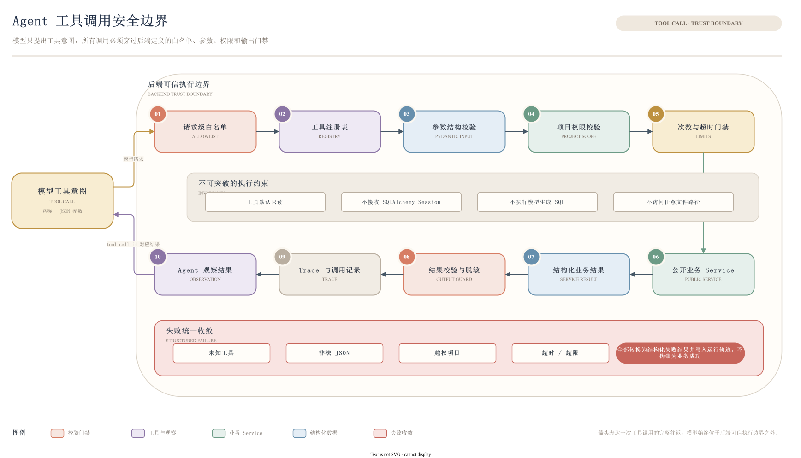

# Agent 与多维分析

## Agent 的职责

PM-Agent 负责读取当前项目资料、理解复合问题、选择只读工具、核对证据并生成分析结果。它可以回答“当前做到哪里”“下一阶段优先做什么”“哪些规则可能被违反”“这个结论来自哪里”等问题，但不会直接修改代码、执行模型生成的 SQL，或把风险建议自动写成正式风险。

## 多维请求理解

单个问题可能同时包含多个目标。系统先将输入转换为受限 `RequestPlan`，再进入 Agent 循环。

| 维度 | 关注内容 | 典型输出 |
|---|---|---|
| 进度 `progress` | 当前阶段、已完成能力、缺口 | 当前进度说明与证据 |
| 规划 `planning` | 下一阶段目标、依赖与优先级 | 任务草案，不直接创建任务 |
| 风险 `risk` | 阻塞、延期、质量和一致性风险 | 风险分析与待核实项 |
| 约束 `constraint_check` | 技术、代码、文档和风险规则 | 规则与实现证据对照 |
| 溯源 `source_trace` | 结论、规则或历史变化的来源 | 文件路径、哈希、行号或消息来源 |
| 上下文更新 `context_update` | 新规则、目标变化、纠正和偏好 | 自动更新结果或待确认草稿 |
| 表达 `presentation` | 本轮详细度、格式、语气 | 简洁、平衡、详细、表格或列表 |

请求理解器还会将复合问题拆为最多 8 个请求单元，标记动作、主题、时间范围、依赖关系、置信度和对应原话。后端拒绝未知动作、循环依赖、任意目标路径和未定义字段。

## 分析动作

当前执行协议支持七类动作：

| 动作 | 用途 |
|---|---|
| `answer_project_question` | 回答当前项目的一般问题 |
| `analyze_project_progress` | 分析阶段、已完成内容和缺口 |
| `draft_next_stage_tasks` | 生成下一阶段工作草案 |
| `analyze_project_risks` | 识别有证据的风险与待核实风险 |
| `check_project_constraints` | 将项目规则与当前文件实现进行核对 |
| `trace_information_source` | 查找结论对应的文件、规则、记忆或更新记录 |
| `explain_project_history` | 解释项目目标、阶段和关键变化 |

同一轮可以包含多个动作。例如“检查当前进度，确认是否违反技术约束，并给出下一步”会分别召回项目记忆、规则与原文件证据，再按依赖顺序组织结果。

## 工具调用

Agent 当前注册八个只读工具：

| 工具 | 作用 |
|---|---|
| `get_current_project` | 读取当前项目元数据 |
| `list_current_project_files` | 列出当前项目文件与解析状态 |
| `list_owned_projects` | 列出当前用户可访问的项目 |
| `retrieve_project_context` | 按问题意图召回项目上下文 |
| `list_context_entries` | 读取当前有效规则、记忆、词条与偏好投影 |
| `get_context_changes` | 查询上下文变更与纠正来源 |
| `get_project_report` | 读取已有的开发或风险报告 |
| `read_project_file_evidence` | 按文件 ID 和行范围读取当前脱敏原文 |

工具并非每轮全部暴露。后端根据请求动作生成白名单，例如风险分析可使用上下文召回、文件列表和原文证据，而普通问答不会获得与问题无关的工具。

模型不能获得 SQLAlchemy Session，也没有公开的任意工具执行接口。未知工具、非法 JSON、越权项目、任意路径和超时调用都会转为结构化失败结果并写入运行轨迹。

## 有限 Agent 循环

为控制成本和防止无限工具循环，单次问答具有固定边界：

- 最多 **5 轮**模型决策。
- 最多 **8 次**工具调用。
- 最多 **3 次**差异化上下文召回。
- 每次调用前重新检查模型上下文预算。
- 工具失败会显式回填，不被伪装为成功事实。

如果达到限制，后端返回可识别错误；不会继续隐藏调用，也不会用无来源内容补齐答案。

## 上下文更新

请求理解器可以识别四类跨轮信息：项目约束、长期记忆、短期记忆和项目级用户偏好。模型只提出候选信号，最终写入由后端专用更新器决定。

助手回复、失败工具结果和含糊推断不会直接成为项目事实。用户确认草稿时仍要再次检查来源、目标分区和当前对象版本。

## 报告与可追溯性

报告通过显式业务接口生成，当前支持开发报告和风险报告：

1. 服务端从当前文件和有效上下文中分批取证。
2. 每个证据分配独立 ID，并保留文件版本或消息来源。
3. LLM 只能使用本轮证据 ID 形成结构化结论。
4. 服务端渲染 Markdown 引用并检查来源版本。
5. 生成期间来源变化、引用无效或纠正后仍不合法时，报告不会保存。

每次会话问答、上下文更新和报告生成都可以关联运行记录，包含状态、工具轨迹、失败原因、耗时与模型用量，用于复核“系统实际读取了什么、调用了什么、最终为何得到该结果”。

## JSON 与 SSE 状态

当前持久化会话接口使用 JSON 响应，并保存完整会话与运行状态。服务层已经实现 `token`、`tool_call`、`tool_result`、`done` 等 SSE 事件的编排与校验，但尚未接入持久化会话公开路由，因此 README 不将流式会话列为当前已开放功能。

## 相关文档

- [返回阅读指南](README.md)
- [系统架构](系统架构.md)
- [资料与上下文](资料与上下文.md)
- [运行与验证](运行与验证.md)
